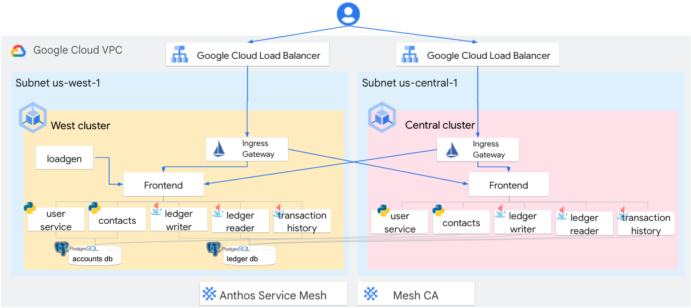
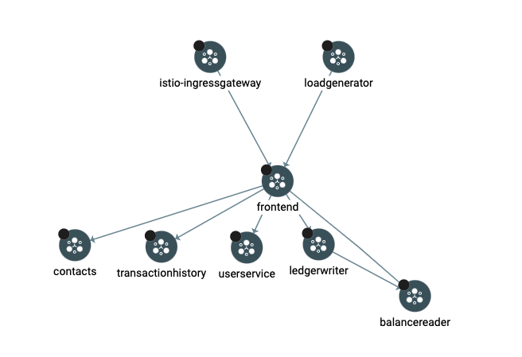
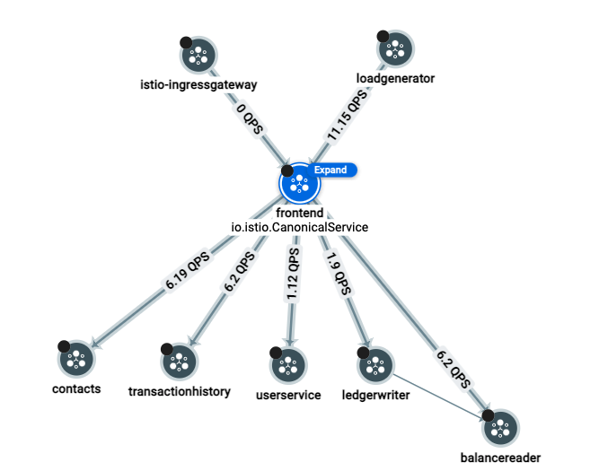
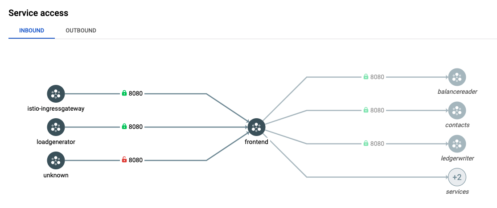

# Anthos Service Mesh Walkthrough

### 1. Explore the app deployed in Anthos clusters

1. On the Navigation menu, click Kubernetes Engine > Clusters, and verify that two Anthos clusters are registered.

2. In the navigation pane, click Workloads, and verify that every microservice is deployed on both GKE clusters except from the two databases, accounts-db and ledger-db, which are only running in gke-region1.

3. In the navigation pane, click Gateways, Services & Ingress, and verify that every microservice is deployed on both GKE clusters, including the two databases, accounts-db and ledger-db, which are needed for traffic routing.
   istio-ingressgateway is also in the list and should be available in both clusters.

4. To open websites, click on the IP addresses for each of the instances of istio-ingressgateway.
   This will open the sign-in page for each website.

5. Click Sign In to sign in with an existing test user.

6. Deposit funds or send a payment, which will create a new transaction on the shared database.

7. Refresh the pages and confirm that both Transaction History and Current Balance are the same across clusters.

### 2. Force cross-cluster traffic routing

1. In the Google Cloud Console, return to Kubernetes Engine > Workloads.

2. To open the dashboard, click on the frontend deployment in the gke-region2 cluster.

3. On the Actions dropdown, select Scale > Edit replicas.

4. Enter 0 replicas, and click Scale.

5. Return to the istio-ingressgateways IP addresses that you opened before.
   The application should continue to work.

6. Return to your frontend deployment and scale it back to 1 replica.

### 3. Observe distributed services

1. To return to the home page of the Anthos Service Mesh dashboard, on the Navigation menu, click Anthos > Service Mesh.

2. Under Topology View. A chart that represents your service mesh is displayed.

3. Click on the frontend workload node, and note the services called by that workload.

4. Under List View. A list of distributed services in your mesh across your two clusters is displayed.

5. Click on the frontend service. This displays an overview of the inbound and outbound services it is communicating with. Also, you can see the golden signals: latency, traffic, errors, and saturation.

6. Click Metrics. This displays a default dashboard that is automatically created for each service on a mesh. It provides breakdown metrics on requests per second, error rates, latencies, and more.

7. Click Health. Here you can create Service Level Objectives (SLOs) to make sure that your metrics are always within certain parameters, so that you can monitor and alert when certain thresholds are surpassed.

8. Click Create SLO.

9. Select Latency as the metric, and click Continue.

10. Set the latency threshold to 350 ms, and click Continue.

11. Set the Period length to Calendar day, and set the Goal to 99.5%.

12. Click Continue.

13. Review the details and check the JSON object in case you might want to automate this operation in the future, and then click Create SLO.

### 4. Verify service mesh security

- From the frontend service ASM Dashboard, open the Security tab. The following diagram is displayed:

