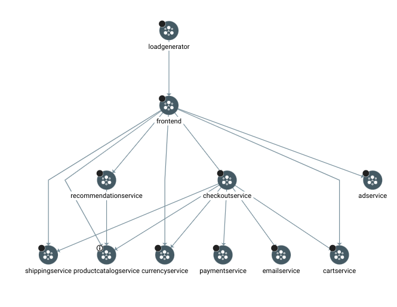
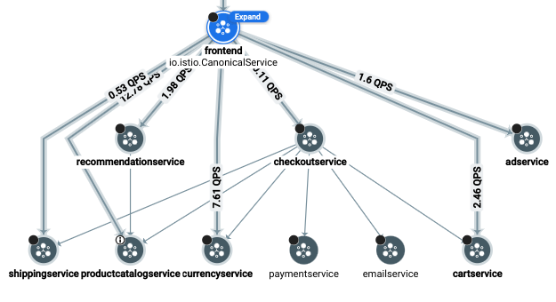

# Observing Anthos Services

### 1. Install Cloud Service Mesh with tracing enabled

#### Configure cluster access for kubectl and verify the cluster

To set environment variables for use in scripts, in Cloud Shell, run the following commands:

1. Set the Name environment variable.

```bash
CLUSTER_NAME=gke
```

2. Set the Zone and Region environment variables.

```bash
CLUSTER_ZONE="Zone added at lab start"
CLUSTER_REGION="Region added at lab start"
```

3. Set the Project ID environment variable.

```bash
PROJECT_ID="PROJECT ID added at lab start"
```

4. Set the Project Number environment variable.

```bash
PROJECT_NUMBER=$(gcloud projects describe ${PROJECT_ID} \
  --format="value(projectNumber)")
```

5. Set the Fleet Project ID environment variable.

```bash
FLEET_PROJECT_ID="${PROJECT_ID}"
```

6. Set the IDNS environment variable.

```bash
IDNS="${PROJECT_ID}.svc.id.goog"
```

7. Set the output directory.

```bash
DIR_PATH=.
```

8. Verify the environment variables are set correctly.

```bash
printf '\nCLUSTER_NAME:'$CLUSTER_NAME'\nCLUSTER_ZONE:'$CLUSTER_ZONE'\nPROJECT_ID:'$PROJECT_ID'\nPROJECT_NUMBER:'$PROJECT_NUMBER'\nFLEET PROJECT_ID:'$FLEET_PROJECT_ID'\nIDNS:'$IDNS'\nDIR_PATH:'$DIR_PATH'\n'
```

- Output:

9. Configure kubectl to manage your GKE cluster:

```bash
 gcloud container clusters get-credentials $CLUSTER_NAME \
     --zone $CLUSTER_ZONE --project $PROJECT_ID
```

10. Review your kubectl configuration:

```bash
kubectl config view
```

- output

11. Check that your cluster is running:

```bash
gcloud container clusters list
```

- Output:

#### Enable GKE Enterprise

12. Enable GKE Enterprise from the command line. This also automatically enables the Fleet (GKE Hub) API.

```bash
gcloud services enable --project="${PROJECT_ID}" \
anthos.googleapis.com
```

13. Register the GKE cluster called gke to the Fleet in the project.

```bash
gcloud container clusters update gke --enable-fleet --region "${CLUSTER_ZONE}"
```

14. Verify that the cluster got registered in your fleet successfully.

```bash
gcloud container fleet memberships list --project "${PROJECT_ID}"
```

#### Install Cloud Service Mesh

15. Enable Cloud Service Mesh on the fleet project.

```bash
gcloud container fleet mesh enable --project "${PROJECT_ID}"
```

16. Enable automatic management of the Cloud Service Mesh control plane.

```bash
gcloud container fleet mesh update \
  --management automatic \
  --memberships gke \
  --project "${PROJECT_ID}" \
  --location "$CLUSTER_REGION"
```

17. Verify that the control plane is being managed.

```bash
gcloud container fleet mesh describe --project "${PROJECT_ID}"
```

Wait until the controlPlaneManagement appears changes the state from PROVISIONING to REVISION_READY. This might take several minutes.

- Output:

18. Enable Cloud Service Mesh to send telemetry to Cloud Trace.

```bash
cat <<EOF | kubectl apply -n istio-system -f -
apiVersion: telemetry.istio.io/v1alpha1
kind: Telemetry
metadata:
   name: enable-cloud-trace
   namespace: istio-system
spec:
   tracing:
   - providers:
     - name: stackdriver
EOF
```

19. Verify the config map has been enabled:

```bash
kubectl get configmap
```

- Output:

### 2. Install the microservices-demo application on the cluster

#### Configure the mesh data plane

1. Enable Istio sidecar injection:

```bash
kubectl label namespace default istio.io/rev- istio-injection=enabled --overwrite
```

- Output:
  > namespace/default labeled

2. To enable Google to manage your data plane so that the sidecar proxies will be automatically updated for you, annotate the namespace:

```bash
kubectl annotate --overwrite namespace default \
  mesh.cloud.google.com/proxy='{"managed":"true"}'
```

- Output:

#### Install the Online Boutique application on the GKE cluster

1. Deploy the application:

```bash
kubectl apply -f https://raw.githubusercontent.com/GoogleCloudPlatform/microservices-demo/master/release/kubernetes-manifests.yaml
kubectl patch deployments/productcatalogservice -p '{"spec":{"template":{"metadata":{"labels":{"version":"v1"}}}}}'
```

2. To be able to access the application from outside the cluster, install the ingress Gateway:

```bash
git clone https://github.com/GoogleCloudPlatform/anthos-service-mesh-packages
kubectl apply -f anthos-service-mesh-packages/samples/gateways/istio-ingressgateway
```

3. Install the required custom resource definitions

```bash
kubectl apply -k "github.com/kubernetes-sigs/gateway-api/config/crd/experimental?ref=v0.6.0"
kubectl kustomize "https://github.com/GoogleCloudPlatform/gke-networking-recipes.git/gateway-api/config/mesh/crd" | kubectl apply -f -
```

4. Configure the Gateway:

```bash
kubectl apply -f https://raw.githubusercontent.com/GoogleCloudPlatform/microservices-demo/master/release/istio-manifests.yaml
```

5. Return to Kubernetes click on Workloads and then under Networking click Gateways,Services & Ingress pages, and verify that the new deployments and services have been created on the gke cluster.

> Note: You can filter these pages by cluster, object type, and namespace to make it easier to parse the information presented.

6. Take a couple of minutes to investigate the demo application using the console and UI.

> Note: When the workloads show an OK status, use the IP address associated with the frontend-external service (for either cluster) to do one of the following:
>
> - Look on the Services & Ingress page within the console.

7. Explore the cluster using Cloud Shell.

8. View the deployment using Cloud Shell

```bash
kubectl get deployments
```

- Output:

9. View the services using Cloud Shell

```bash
kubectl get services
```

- Output:

10. Open a new tab and enter the IP address for the frontend-external service.

11. Click through various pages to get a sense of the application.

### 3. Review Google Cloud's operations suite functionality

1. In the Google Cloud Console, on the Navigation menu, click Trace.

2. A trace graph displays service requests made within the demo application.

3. Click on a dot that displays higher up in the graph (representing a higher overall) request time.

Review the [Cloud Trace documentation](https://cloud.google.com/trace/docs/viewing-details) for more details on understanding trace information.

### 4. Deploy a canary release that has high latency

1. In Cloud Shell, clone the repository that has the configuration files you need for this part of the lab:

```bash
git clone https://github.com/GoogleCloudPlatform/istio-samples.git \
  ~/istio-samples
```

2. Create the new destination rule on the gke cluster:

```bash
kubectl apply -f ~/istio-samples/istio-canary-gke/canary/destinationrule.yaml
```

3. Create the new product catalog on the gke cluster:

```bash
kubectl apply -f ~/istio-samples/istio-canary-gke/canary/productcatalog-v2.yaml
```

4. Create a traffic split on the gke cluster:

```bash
kubectl apply -f ~/istio-samples/istio-canary-gke/canary/vs-split-traffic.yaml
```

### 5. Define your service level objective

When you are not using Cloud Service Mesh, you can define SLOs with the [Service Monitoring](https://cloud.google.com/monitoring/service-monitoring) API. When you are using Cloud Service Mesh, as with the gke cluster, you can define and monitor SLOs via the Cloud Service Mesh dashboard.

1. In the Google Cloud Console, on the Navigation menu, click Kubernetes Engine to open the GKE Dashboard.

Notice that there is one cluster registered in the fleet.

2. On the side pannel, under Features click Service Mesh to go to the Cloud Service Mesh dashboard.

A summary of service performance, including SLO information, is displayed. You will define a new SLO for the product catalog service.

3. In the Services list, click productcatalogservice.

4. In the menu pane, click Health.

5. Click +CreateSLO.

6. In the Set your SLI slideout, for metric, select Latency.

7. Select Request-based as the method of evaluation.

8. Click Continue.

9. Set Latency Threshold to 1000, and click Continue.

10. Set Period type to Calendar.

11. Set Period length to Calendar day.

12. Set Performance goal to 99.5%.

The Preview graph shows how your goal is reflected against real historical data.

13. Click Continue.

14. Review Display name: 99.5% - Latency - Calendar day.

You can adjust this as needed.

The autogenerated JSON document is also displayed. You could use the APIs instead to automate the creation of SLOs in the future.

15. To create the SLO, click +CreateSLO.

### 6. Diagnose the problem

#### Use service metrics to see where the problem is

1. Click on your SLO entry in the SLO list.

This displays an expanded view. Your SLO will probably show that you are already out of error budget. If not, wait 3-5 minutes and refresh the page. Eventually, you will exhaust your error budget, because too many of the requests to this service will hit the new backend, which has high latency.

2. In the menu pane, click Metrics.

Scroll down to the Latency section of the Metrics view and note that the service latency increased a few minutes earlier, around the time you deployed the canary version of the service.

3. From the Breakdown By dropdown, select Source service.

Which pods are showing high latency and causing the overall failure to hit your SLO?

4. To return to the Service Mesh page, in the menu pane, click Service Mesh.

One SLO is flagged as out of error budget, and a warning indicator is displayed next to the problem service in the Services listing.

#### Use Cloud Trace to better understand where the delay is

1. In the Google Cloud Console, on the Navigation menu, click Trace > Trace explorer.

2. Click on a dot that charts at around 3000ms; it should represent one of the requests to the product catalog service.

Note that all the time seems to be spent within the catalog service itself. Although calls are made to other services, they all appear to return very quickly, and something within the product catalog service is taking a long time.

### 7. Roll back the release and verify an improvement

1. In Cloud Shell, back out the destination rule canary release:

```bash
kubectl delete -f ~/istio-samples/istio-canary-gke/canary/destinationrule.yaml
```

2. In Cloud Shell, back out the product catalog canary release:

```bash
kubectl delete -f ~/istio-samples/istio-canary-gke/canary/productcatalog-v2.yaml
```

3. In Cloud Shell, back out the traffic split canary release:

```bash
kubectl delete -f ~/istio-samples/istio-canary-gke/canary/vs-split-traffic.yaml
```

4. In the Google Cloud Console, on the Navigation menu, click Anthos > Service Mesh.

5. Click on productcatalogservice, and then in the menu pane, click Health.

Note the current compliance percentage.

6. Click Metrics.

On the latency chart, all the latency series show a dip that corresponds to when you rolled back the bad version of the workload.

7. Return to the Health page.

8. Compare the current compliance metric with the one you saw earlier. It should be higher now, reflecting the fact that you are no longer seeing high-latency requests.

### 8. Visualize your mesh with the Cloud Service Mesh dashboard

1. On the Navigation menu, click Kuberenetes Engine > Service Mesh.

2. View the Topology on the right side.

A chart representing your service mesh is displayed.



> If you don't see a full topology chart like this, it's possible that not all the topology data has been collected. It can take 10+ minutes for this data to be reflected in the chart. You can proceed to the next section and return later to see the chart.

3. Click on the frontend workload node and note the services called by that workload.



> Take a couple of minutes to explore further and better understand the architecture of the application. You can rearrange nodes, drill down into workloads to see constituent deployments and pods, change time spans, etc.
