# How to Set Up Coolify in GCP VM Engine and Have the Power to Do Anything in the Cloud

## Table of Contents
- Requirements For Self-Hosting Coolify
- Set Up an GCP VM Engine For Coolify
- Security Group of GCP VM Engine
- Install Coolify In GCP VM Engine
- Access Coolify From Anywhere Using The Public IP
- How to Deploy A Website Via Coolify
- Conclusion

## Server Requirements
- A VPS (Virtual Private Server)
- A Dedicated Server
- A Virtual Machine (VM)
- A Raspberry Pi (see our Raspberry Pi OS Setup Guide)
- Or any other server with SSH access

## Supported Operating System
- Debian-based (for example, Debian, Ubuntu)
- Redhat-based (for example, CentOS, Fedora, Redhat, AlmaLinux, Rocky, Asahi)
- SUSE-based (for example, SLES, SUSE, openSUSE)
- Arch Linux
- Alpine Linux
- Raspberry Pi OS 64-bit (Raspbian)

## Supported Architectures
Coolify runs on 64-bit systems:
- AMD64
- ARM64

## Minimum Hardware Requirements
- CPU: 2 cores
- Memory (RAM): 2 GB
- Storage: 30 GB of free space

I recommend that you check the [official documents](https://coolify.io/docs/get-started/introduction), as there might be an update regarding the specifications, and you do not want to miss that part!

## Set Up an GCP VM Engine Instance for Coolify

## Security Group of GCP VM Engine
Add a new rule. The type will be “Custom TCP”. The port will be “8000”. The source will be “Anywhere-IPv4”.

## Install Coolify in GCP VM Engine
There are many ways to install Coolify directly on our VM Engine. But I usually follow the recommended [installation script of Coolify](https://coolify.io/docs/get-started/installation).

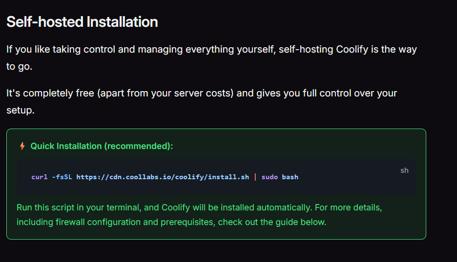

Depending on your VM Engine specification, it might take several minutes. Be patient and let it do its job until it reaches the “Congratulations!” screen.

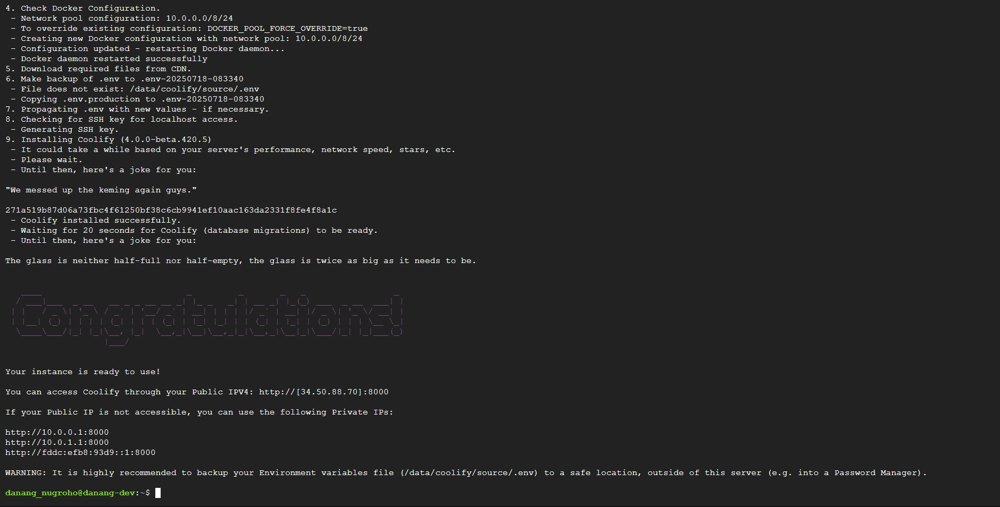

## Access Coolify from Anywhere Using the Public IP
After the installation, open a new tab and use that public IP with an ending :8000 port. It will take you to the Coolify account registration page for the first time.

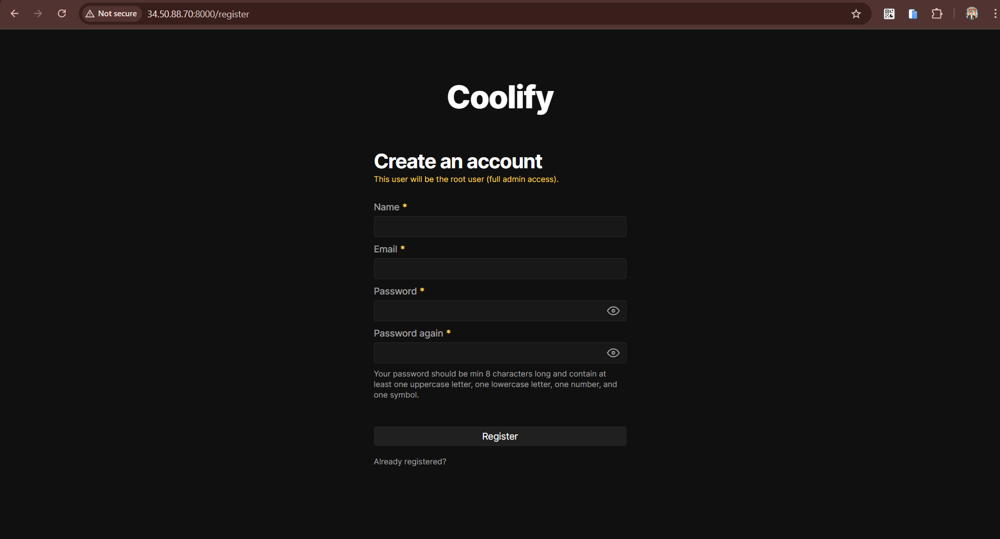

Register your account. The first one becomes the admin by default. But you can change the role afterwards anytime you want.

You can follow their instructions during the onboarding. But for now, I am simply skipping it.

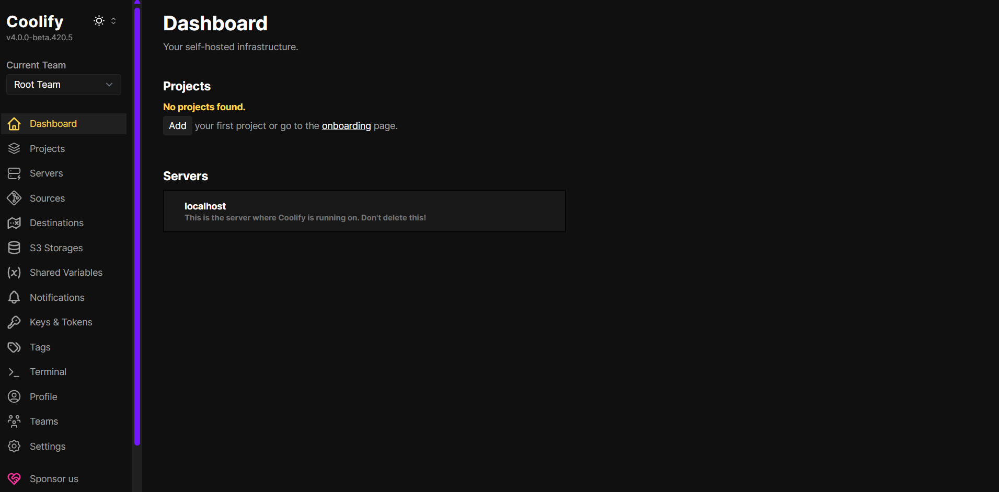

Your coolify is now completely ready to go!

## How to Deploy a Website Via Coolify

1. Go to ”Project” and click on “+Add”.

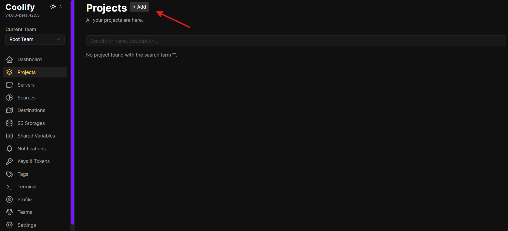

2. Give it a name and a suitable description.

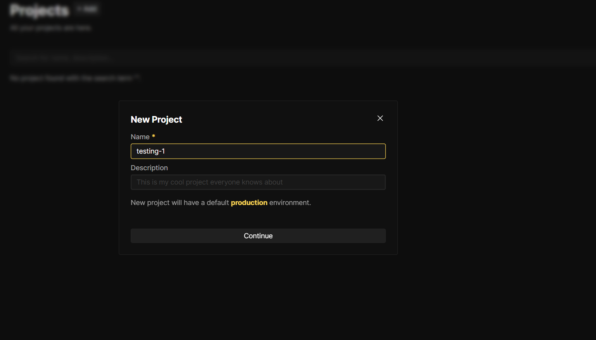

3. Use one of public repositories from GitHub for this trial.

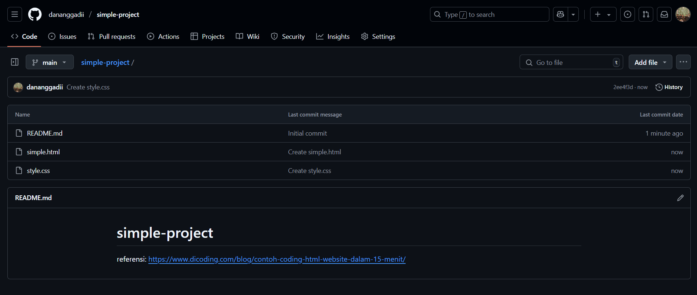

4. Now, click on Production.

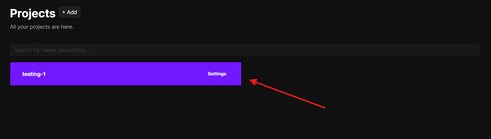

5. Now, we need to add a resource from which it will pull the data.

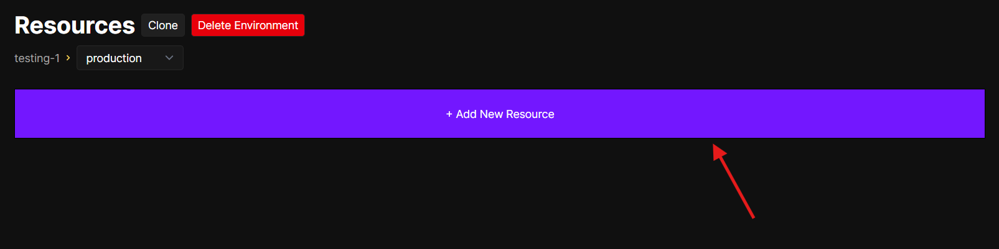

6. As this repository is already public, I will select “Public Repository” as my project source.

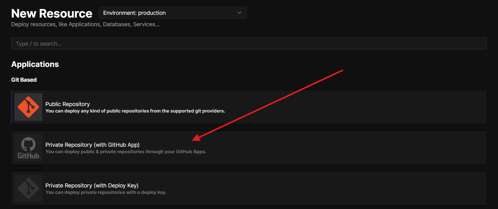

7. Now, provide the public repo URL in the Repository URL field. Then click on “Check repository”.

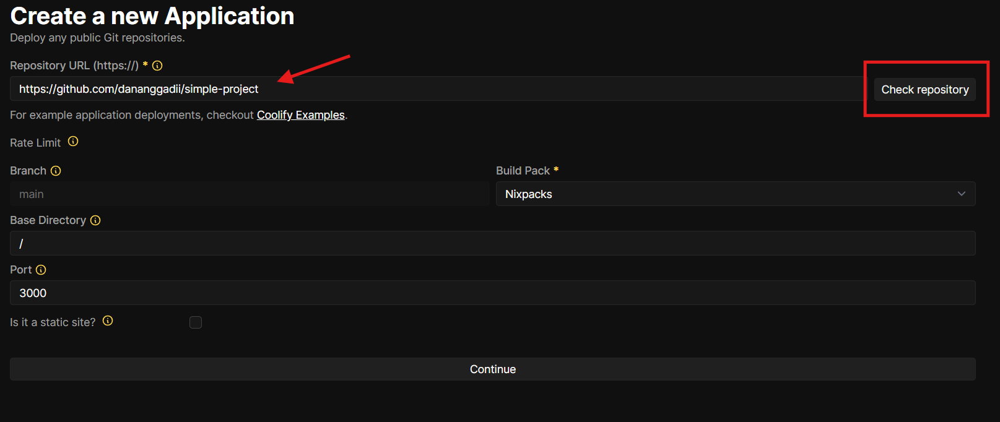

8. It will show you the project's basic configuration. Check to ensure that everything is correct. As this is just a static website, I will change the build pack to “Static” and click on “Continue.”

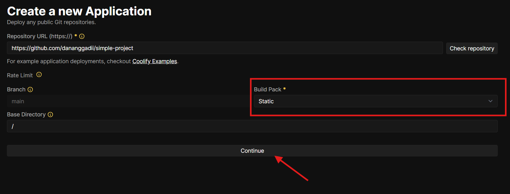

9. Now, deploy the application by clicking on the “Deploy” button.

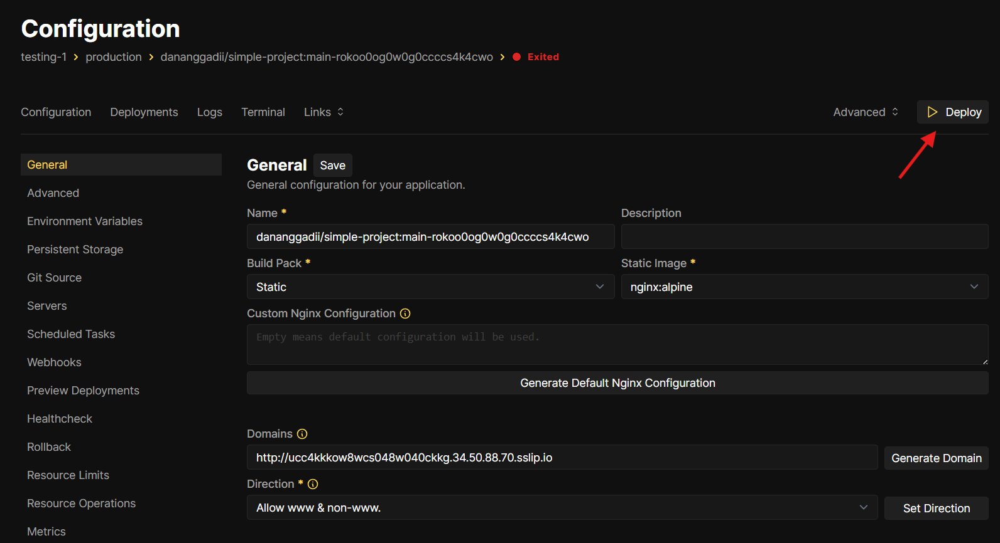
 
10. You can enable/disable the debug log as well.

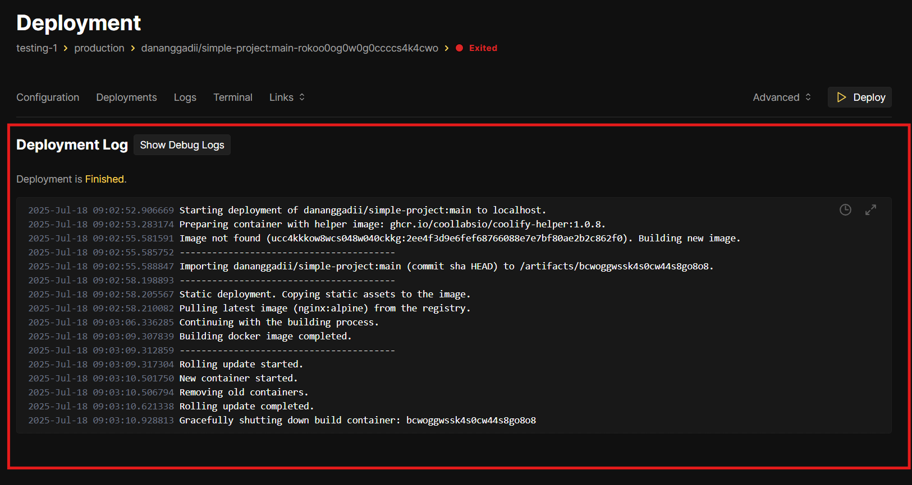

11. After the deployment is finished successfully, you can find the website's autogenerated URL from the Links tab.

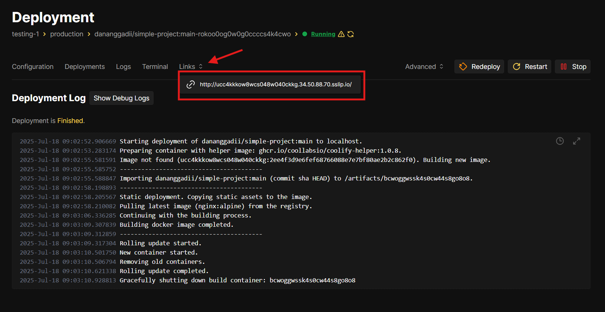

12. The site will appear just fine!

