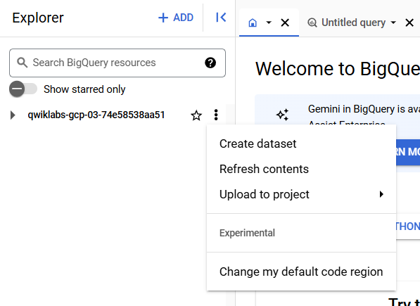
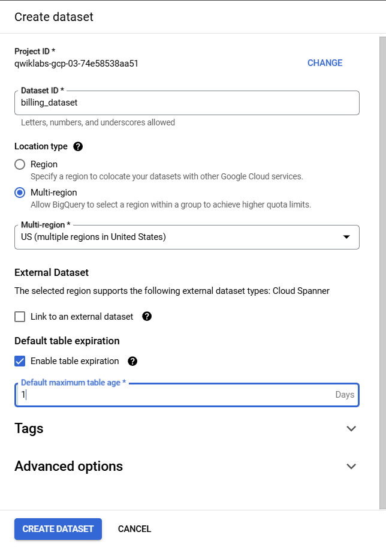
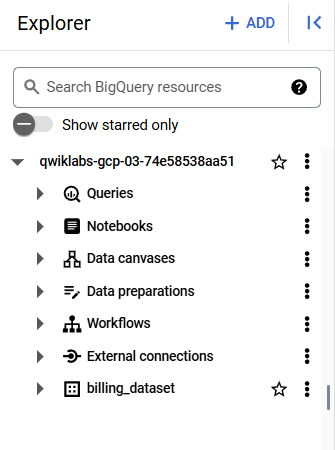
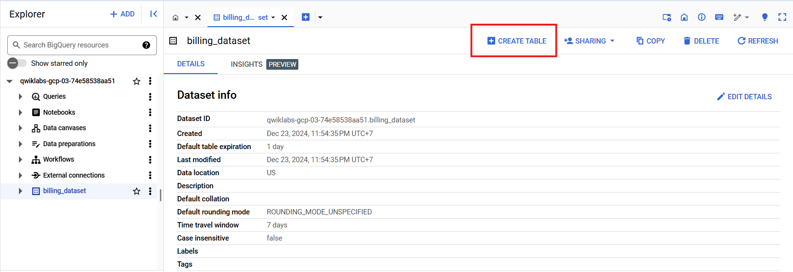
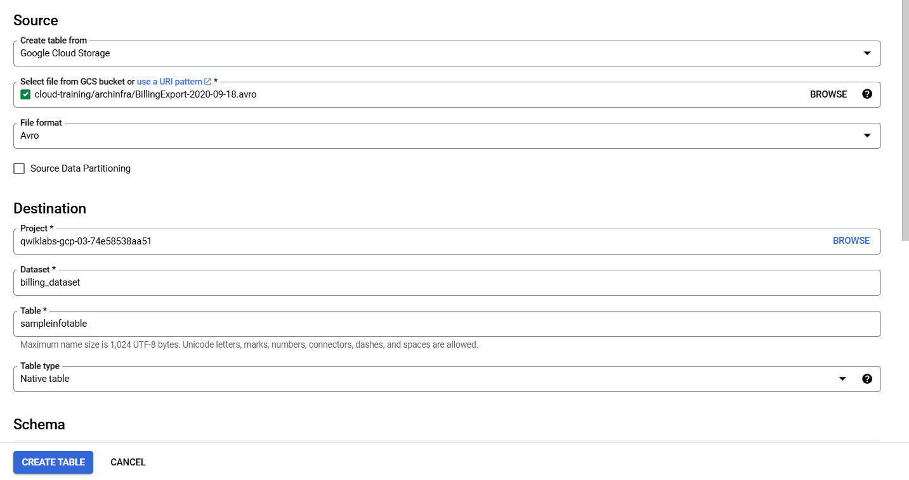
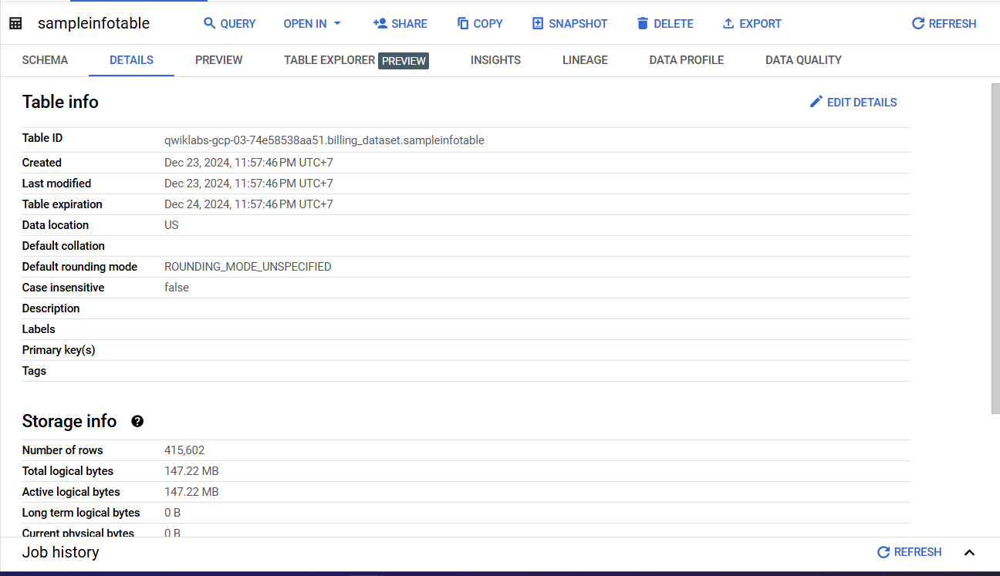
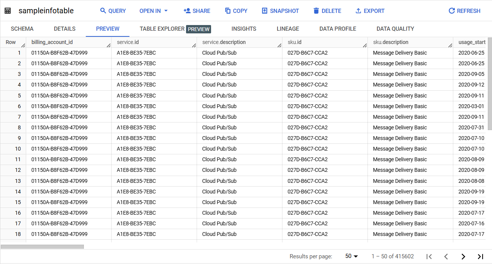
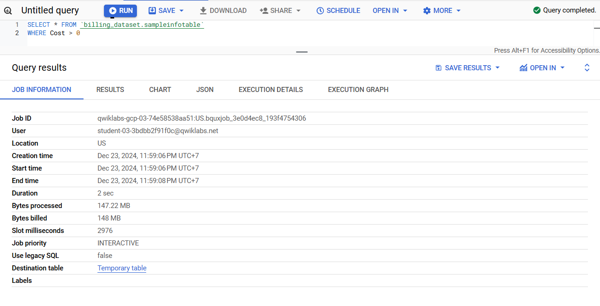

# Examining Billing data with BigQuery

### 1. Use BigQuery to import data

Sign in to BigQuery and create a dataset

1. In the Cloud Console, on the Navigation menu, click BigQuery.

2. If prompted, click Done.

3. Click on the View actions icon next to your project ID (starts with qwiklabs-gcp) and click Create dataset.



> Note: You can export billing data directly to BigQuery as outlined in the [Export Cloud Billing data to BigQuery Guide](https://cloud.google.com/billing/docs/how-to/export-data-bigquery). However, for the purposes of this lab, a sample billing file has been prepared for you. It is located in a Cloud Storage bucket where it is accessible to your student account. You will import this billing information into a BigQuery table and examine it.

4. Specify the following:

| Property                                                   | Value                              |
| ---------------------------------------------------------- | ---------------------------------- |
| Dataset ID:                                                | billing_dataset                    |
| Data location:                                             | US                                 |
| Default maximum table age (check Enable table expiration): | 1 days (Default maximum table age) |

5. Click Create Dataset. You should see billing_dataset in the left panel.





Create a table and import

1. Click on the View actions icon next to your billing_dataset dataset, and click Open and then click Create Table to create a new table.



2. For Source, specify the following, and leave the remaining settings as their defaults:

| Property                    | Value                |
| --------------------------- | -------------------- |
| Create table from:          | Google Cloud Storage |
| Select file from GCS bucket | `Bucket name`        |
| File format                 | Avro                 |

3. For Destination, specify the following, and leave the remaining settings as their defaults:

| Property   | Value           |
| ---------- | --------------- |
| Table name | sampleinfotable |
| Table type | Native table    |

4. Click Create Table. After the job is completed, the table appears below the dataset in the left pane.



### 2. Examine the table

1. Click sampleinfotable.

2. Click Details. As you can see in Number of Rows



3. Click Preview tab.



### 3. Compose a simple query

1. Click Compose New Query.

2. Paste the following in Query Editor:

```sql
SELECT * FROM `billing_dataset.sampleinfotable`
WHERE Cost > 0
```

3. Click Run.



### 4. Analyze a large billing dataset with SQL

1. For New Query, paste the following in Query Editor:

```sql
SELECT
  billing_account_id,
  project.id,
  project.name,
  service.description,
  currency,
  currency_conversion_rate,
  cost,
  usage.amount,
  usage.pricing_unit
FROM
  `billing_dataset.sampleinfotable`
```

2. Click Run. Verify that the resulting table has 415602 lines of billing data.

3. To find the latest 100 records where there were charges (cost > 0), for New Query, paste the following in Query Editor:

```sql
SELECT
  service.description,
  sku.description,
  location.country,
  cost,
  project.id,
  project.name,
  currency,
  currency_conversion_rate,
  usage.amount,
  usage.unit
FROM
  `billing_dataset.sampleinfotable`
WHERE
  Cost > 0
ORDER BY usage_end_time DESC
LIMIT 100
```

4. Click Run.

5. To find all charges that were more than 10 dollars, for Compose New Query, paste the following in Query Editor:

```sql
SELECT
  service.description,
  sku.description,
  location.country,
  cost,
  project.id,
  project.name,
  currency,
  currency_conversion_rate,
  usage.amount,
  usage.unit
FROM
  `billing_dataset.sampleinfotable`
WHERE
  cost > 10
```

6. Click Run.

7. To find the product with the most records in the billing data, for New Query, paste the following in Query Editor:

```sql
SELECT
  service.description,
  COUNT(*) AS billing_records
FROM
  `billing_dataset.sampleinfotable`
GROUP BY
  service.description
ORDER BY billing_records DESC
```

8. Click Run.

9. To find the most frequently used product costing more than 1 dollar, for New Query, paste the following in Query Editor:

```sql
SELECT
  service.description,
  COUNT(*) AS billing_records
FROM
  `billing_dataset.sampleinfotable`
WHERE
  cost > 1
GROUP BY
  service.description
ORDER BY
  billing_records DESC
```

10. Click Run.

11. To find the most commonly charged unit of measure, for Compose New Query, paste the following in Query Editor:

```sql
SELECT
  usage.unit,
  COUNT(*) AS billing_records
FROM
  `billing_dataset.sampleinfotable`
WHERE cost > 0
GROUP BY
  usage.unit
ORDER BY
  billing_records DESC
```

12. Click Run.

13. To find the product with the highest aggregate cost, for New Query, paste the following in Query Editor:

```sql
SELECT
  service.description,
  ROUND(SUM(cost),2) AS total_cost
FROM
  `billing_dataset.sampleinfotable`
GROUP BY
  service.description
ORDER BY
  total_cost DESC
```

14. Click Run.
