# Implementing Cloud SQL

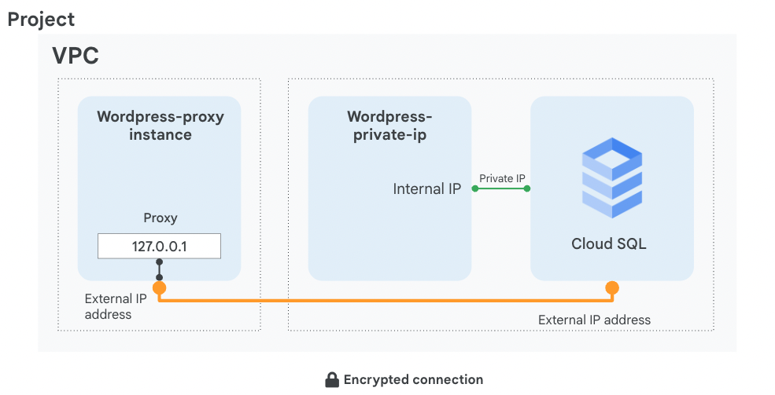

### 1. Create a Cloud SQL database

1. On the Navigation menu, click SQL.

2. Click Create instance.

3. Click Choose MySQL.

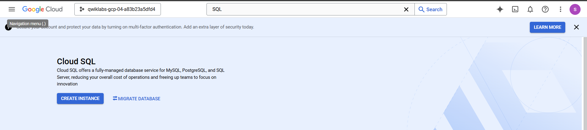

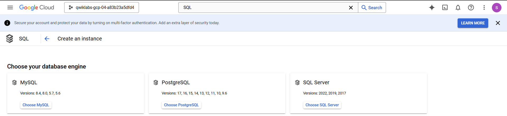

4. Specify the following, and leave the remaining settings as their defaults:

| Property                   | Value           |
| -------------------------- | --------------- |
| Instance ID                | wordpress-db    |
| Root password              | type a password |
| Choose a Cloud SQL edition | Enterprise      |
| Region                     | Lab Region      |
| Zone                       | Any             |
| Database Version           | MySQL 5.7       |

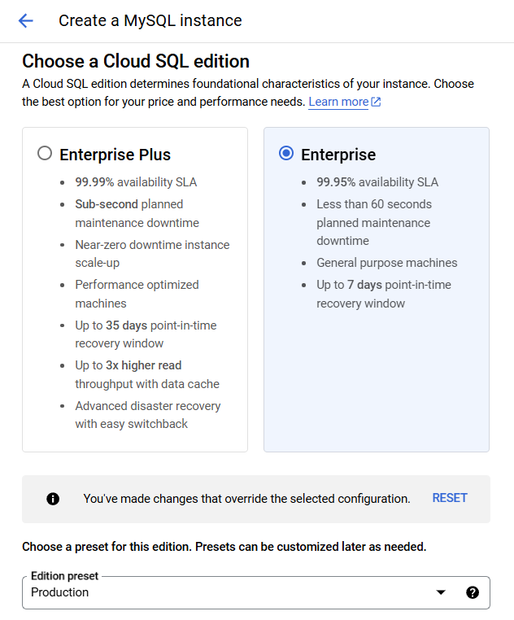

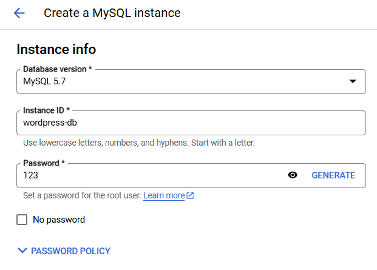

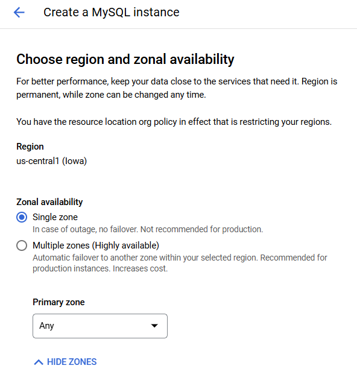

> Note: Note the root password; it will be used in a later step and referred to as [ROOT_PASSWORD].

5. Expand Show configuration options.

6. Expand the Machine configuartion section.

7. Provision the right amount of vCPU and memory. To choose a Machine configuration, click the dropdown menu, and then explore your options.

8. For this lab, select Dedicated core from the dropdown menu, and then select 1 vCPU, 3.75 GB.

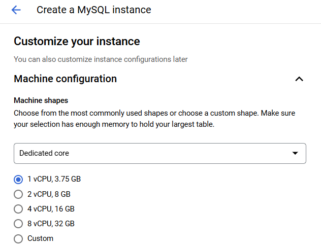

9. Next, expand the Storage section and then choose Storage type and Storage capacity.

10. Click each of the capacity options to see how it affects the throughput. Reset the option to 10GB.

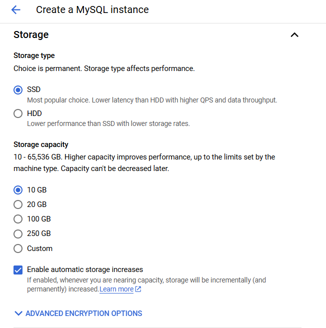

11. Expand the Connections section.

12. Select Private IP.

13. In the Network dropdown, select default.

14. Click the Set up Connection button that appears.

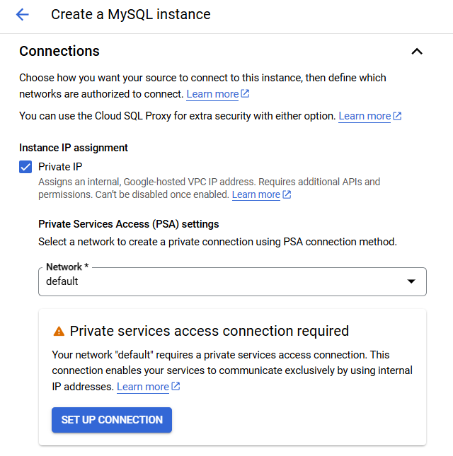

15. In the panel to the right, click Enable API, click Use an automatically allocated IP range, click Continue, and then click Create Connection.

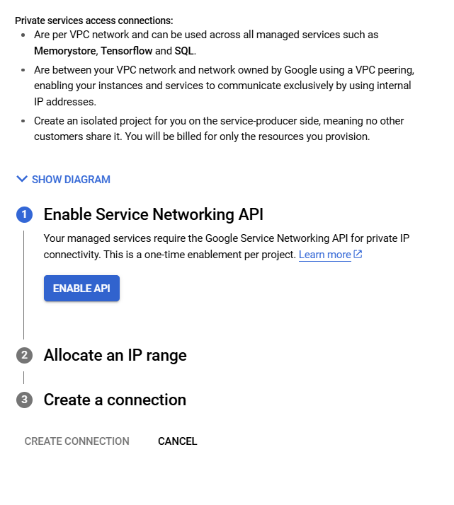

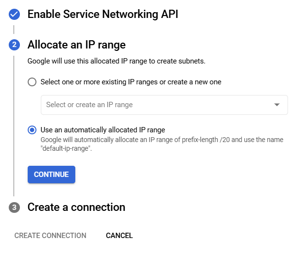

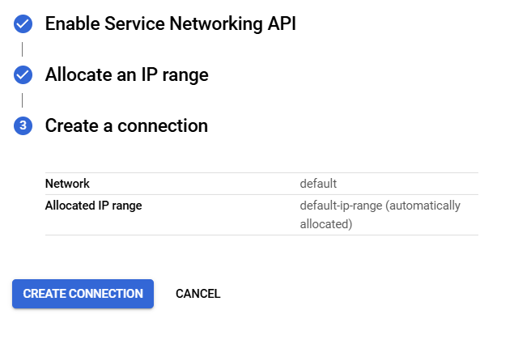

16. Click Create Instance at the bottom of the page to create the database instance.

### 2. Configure a proxy on a virtual machine

1. On the Navigation menu click Compute Engine.

2. Click SSH next to wordpress-proxy.

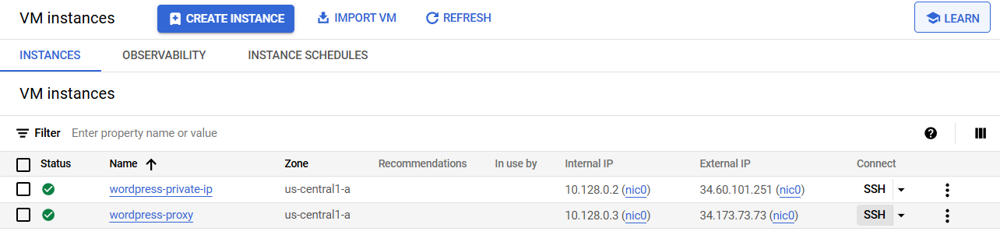

3. Download the Cloud SQL Proxy and make it executable:

```bash
wget https://dl.google.com/cloudsql/cloud_sql_proxy.linux.amd64 -O cloud_sql_proxy && chmod +x cloud_sql_proxy
```

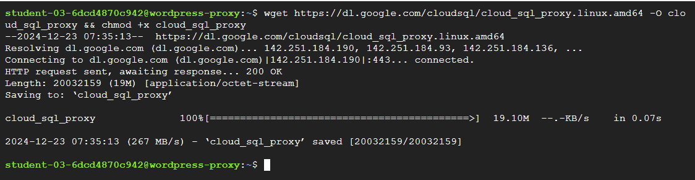

4. On the Navigation menu, click SQL.

5. Click on the wordpress-db instance and wait for a green checkmark next to its name, which indicates that it is operational (this could take a couple of minutes).

6. Note the connection name it will be used later and referred to as [SQL_CONNECTION_NAME].

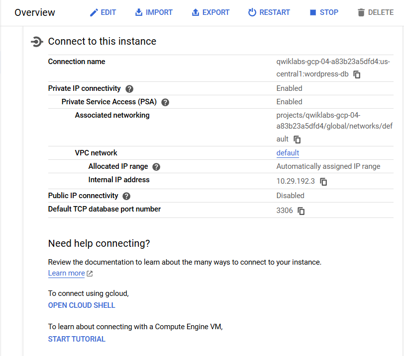

7. In addition, for the application to work, you need to create a table. Click Databases.

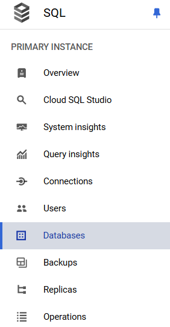

8. Click Create database, type `wordpress`, which is the name the application expects, and then click Create.

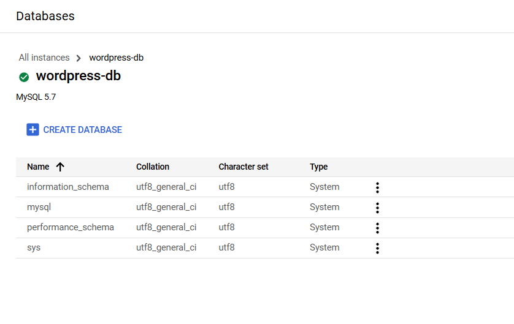

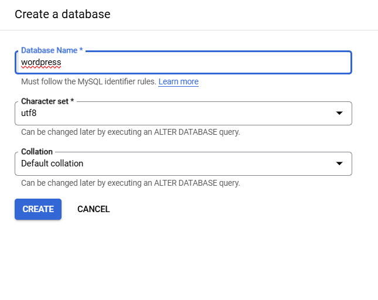

9. Return to the SSH window and save the connection name in an environment variable, replacing [SQL_CONNECTION_NAME] with the unique name you copied in a previous step:

```bash
export SQL_CONNECTION=[SQL_CONNECTION_NAME]
```

10. To verify that the environment variable is set, run:

```bash
echo $SQL_CONNECTION
```

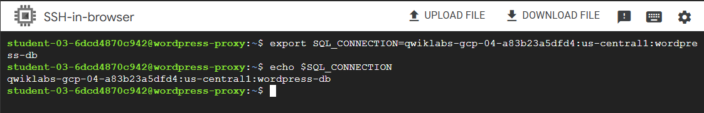

11. To activate the proxy connection to your Cloud SQL database and send the process to the background, run the following command:

```bash
./cloud_sql_proxy -instances=$SQL_CONNECTION=tcp:3306 &
```

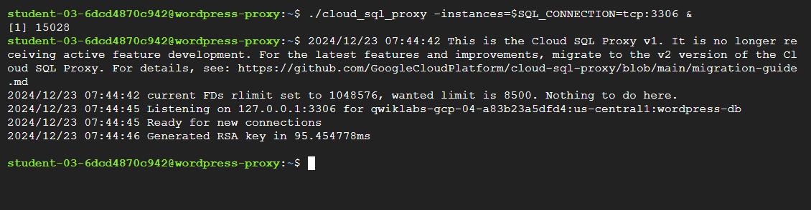

12. Press ENTER.

### 3. Connect an application to the Cloud SQL instance

1. Configure the Wordpress application. To find the external IP address of your virtual machine, query its metadata:

```bash
curl -H "Metadata-Flavor: Google" http://169.254.169.254/computeMetadata/v1/instance/network-interfaces/0/access-configs/0/external-ip && echo
```

2. Go to the wordpress-proxy external IP address in your browser and configure the Wordpress application.


3. Click Let's Go.

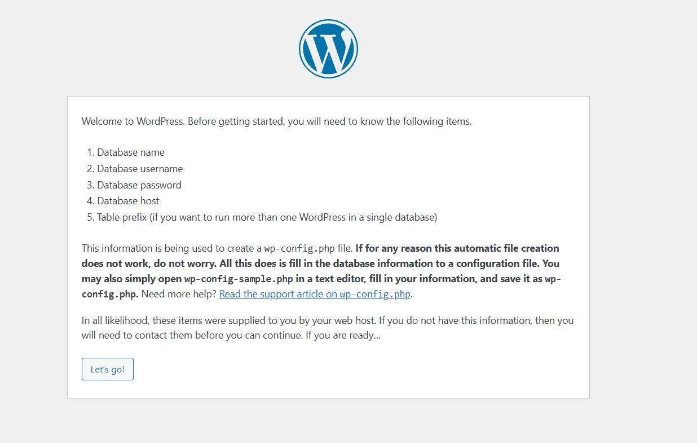

4. Specify the following, replacing [ROOT_PASSWORD] with the password you configured upon machine creation, and leave the remaining settings as their defaults:

| Property      | Value           |
| ------------- | --------------- |
| Database Name | wordpress       |
| Username      | root            |
| Password      | [ROOT_PASSWORD] |
| Database Host | 127.0.0.1       |

> Note: You are using 127.0.0.1, localhost as the Database IP because the proxy you initiated listens on this address and redirects that traffic to your SQL server securely.

5. Click Submit.

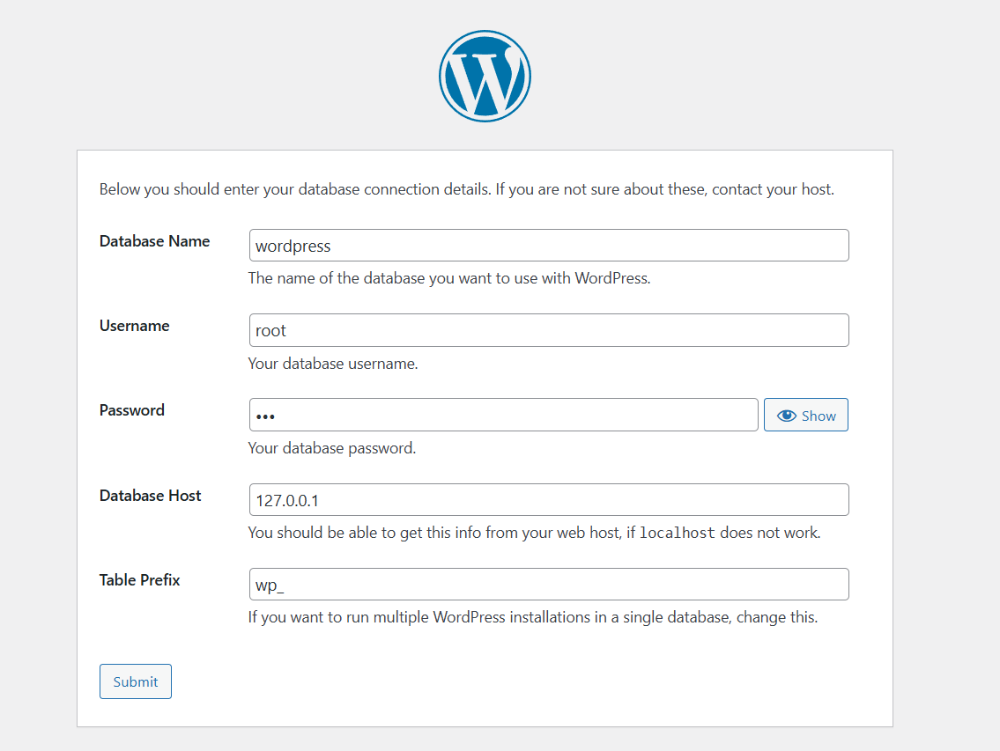

6. When a connection has been made, click Run the installation to instantiate Wordpress and its database in your Cloud SQL. This might take a few moments to complete.

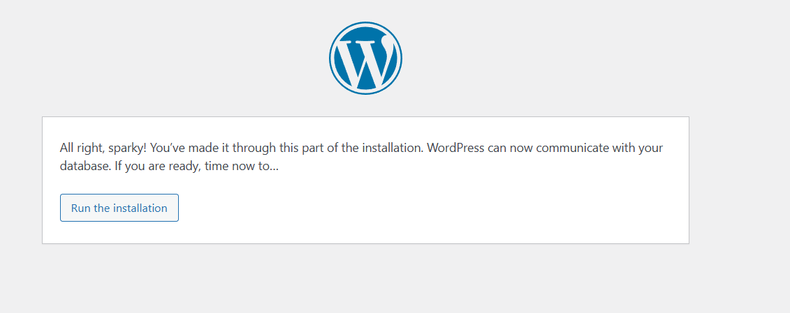

7. Populate your demo site's information with random information and click Install Wordpress. You won't have to remember or use these details.

> Note: Installing Wordpress might take up to 3 minutes, because it propagates all its data to your SQL Server.

8. When a 'Success!' window appears, remove the text after the IP address in your web browser's address bar and press ENTER.

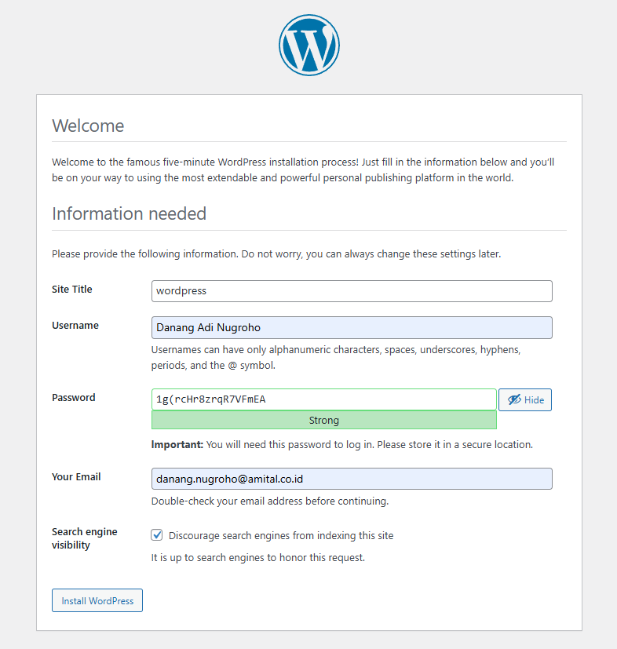

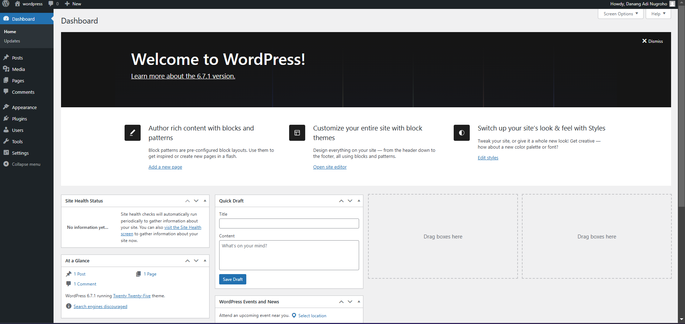

### 4. Connect to Cloud SQL via internal IP

1. In the Cloud Console, on the Navigation menu, click SQL.

2. Click wordpress-db.

3. Note the Private IP address of the Cloud SQL server; it will be referred to as [SQL_PRIVATE_IP].

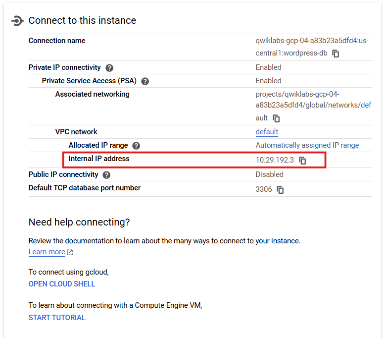

4. On the Navigation menu, click Compute Engine.

> Note: Notice that wordpress-private-ip is located at `REGION`, where your Cloud SQL is located, which enables you to leverage a more secure connection.

5. Copy the external IP address of wordpress-private-ip, paste it in a browser window, and press ENTER.

6. Click Let's Go.

7. Specify the following, and leave the remaining settings as their defaults:

| Property      | Value                                                                       |
| ------------- | --------------------------------------------------------------------------- |
| Database Name | wordpress                                                                   |
| Username      | root                                                                        |
| Password      | type the [ROOT_PASSWORD] configured when the Cloud SQL instance was created |
| Database Host | [SQL_PRIVATE_IP]                                                            |

8. Click Submit.

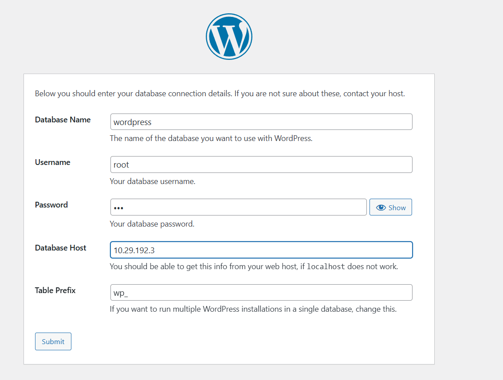

9. Click Run the installation.

10. In your web browser's address bar, remove the text after the IP address and press ENTER.

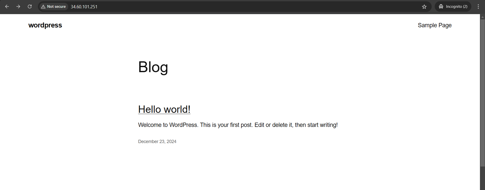
