# Cloud Storage

### 1. Preparation

Create a Cloud Storage bucket

1. On the Navigation menu (Navigation menu icon), click Cloud Storage > Buckets.

2. Click Create.

3. Specify the following, and leave the remaining settings as their defaults:

| Property                                        | Value                                                                               |
| ----------------------------------------------- | ----------------------------------------------------------------------------------- |
| Name                                            | Enter a globally unique name                                                        |
| Location                                        | type Region                                                                         |
| Region                                          | REGION                                                                              |
| Enforce public access prevention on this bucket | unchecked                                                                           |
| Access control                                  | Fine-grained (object-level permission in addition to your bucket-level permissions) |

4. Make a note of the bucket name. It will be used later in this lab and referred to as [BUCKET_NAME_1].

5. Click Create.

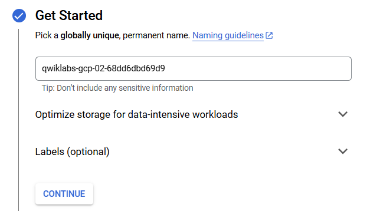

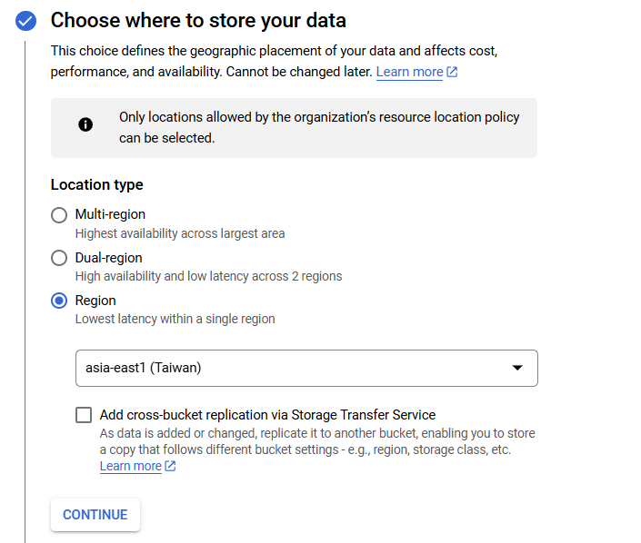

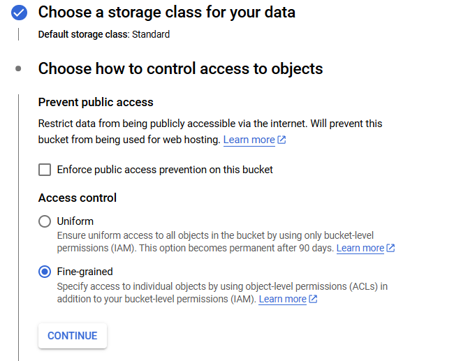

Download a sample file using CURL and make two copies

1. In the Cloud Console, click Activate Cloud Shell (Cloud Shell).

2. If prompted, click Continue.

3. Store [BUCKET_NAME_1] in an environment variable:

```bash
export BUCKET_NAME_1=<enter bucket name 1 here>
```

4. Verify it with echo:

```bash
echo $BUCKET_NAME_1
```

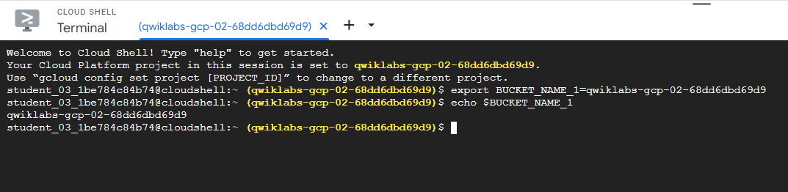

5. Run the following command to download a sample file (this sample file is a publicly available Hadoop documentation HTML file):

```bash
curl \
https://hadoop.apache.org/docs/current/\
hadoop-project-dist/hadoop-common/\
ClusterSetup.html > setup.html
```

6. To make copies of the file, run the following commands:

```bash
cp setup.html setup2.html
cp setup.html setup3.html
```

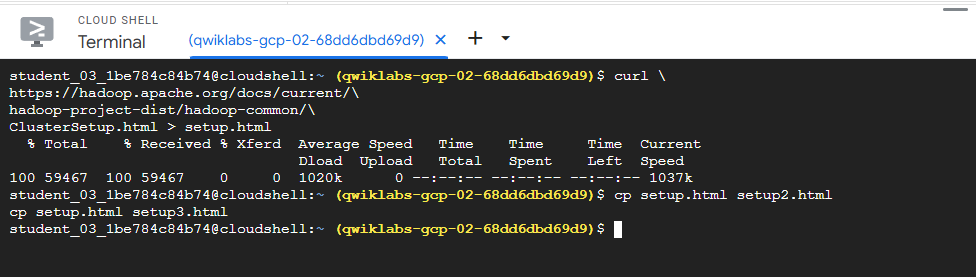

### 2. Access control lists (ACLs)

Copy the file to the bucket and configure the access control list

1. Run the following command to copy the first file to the bucket:

```bash
gcloud storage cp setup.html gs://$BUCKET_NAME_1/
```

2. To get the default access list that's been assigned to setup.html, run the following command:

```bash
gsutil acl get gs://$BUCKET_NAME_1/setup.html  > acl.txt
cat acl.txt
```

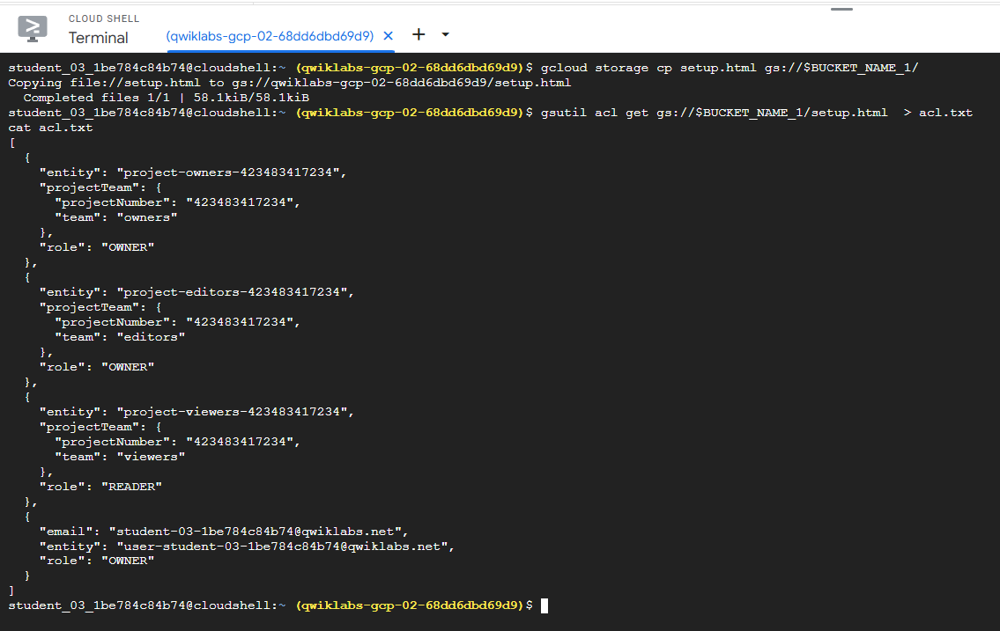

3. To set the access list to private and verify the results, run the following commands:

```bash
gsutil acl set private gs://$BUCKET_NAME_1/setup.html
gsutil acl get gs://$BUCKET_NAME_1/setup.html  > acl2.txt
cat acl2.txt
```

4. To update the access list to make the file publicly readable, run the following commands:

```bash
gsutil acl ch -u AllUsers:R gs://$BUCKET_NAME_1/setup.html
gsutil acl get gs://$BUCKET_NAME_1/setup.html  > acl3.txt
cat acl3.txt
```

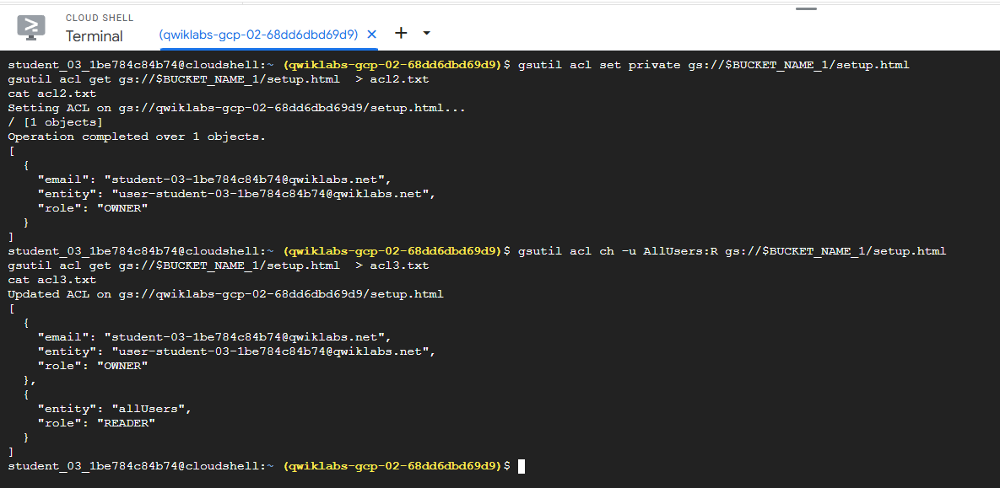

Examine the file in the Cloud Console

1. In the Cloud Console, on the Navigation menu (Navigation menu icon), click Cloud Storage > Buckets.

2. Click [BUCKET_NAME_1].

3. Verify that for file setup.html, Public access has a Public link available.

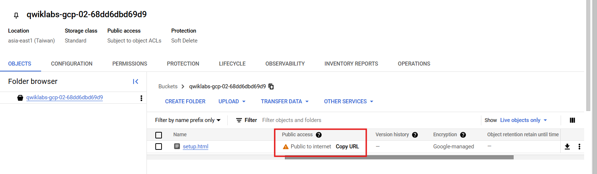

Delete the local file and copy back from Cloud Storage

1. Return to Cloud Shell. If necessary, click Activate Cloud Shell (Cloud Shell).

2. Run the following command to delete the setup file:

```bash
rm setup.html
```

3. To verify that the file has been deleted, run the following command:

```bash
ls
```

4. To copy the file from the bucket again, run the following command:

```bash
gcloud storage cp gs://$BUCKET_NAME_1/setup.html setup.html
```

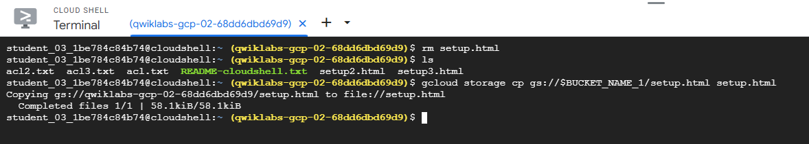

### 3. Customer-supplied encryption keys (CSEK)

Generate a CSEK key

1. Run the following command to create a key:

```bash
python3 -c 'import base64; import os; print(base64.encodebytes(os.urandom(32)))'
```

2. Result (this is example output):

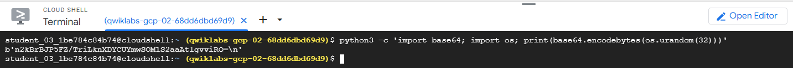

3. Copy the value of the generated key excluding b' and \n' from the command output. Key should be in form of ``

Modify the boto file

1. To view and open the boto file, run the following commands:

```bash
ls -al
nano .boto
```

> Note: If the .boto file is empty, close the nano editor with Ctrl+X and generate a new .boto file using the `gsutil config -n` command. Then, try opening the file again with the above commands.
> If the .boto file is still empty, you might have to locate it using the `gsutil version -l` command.

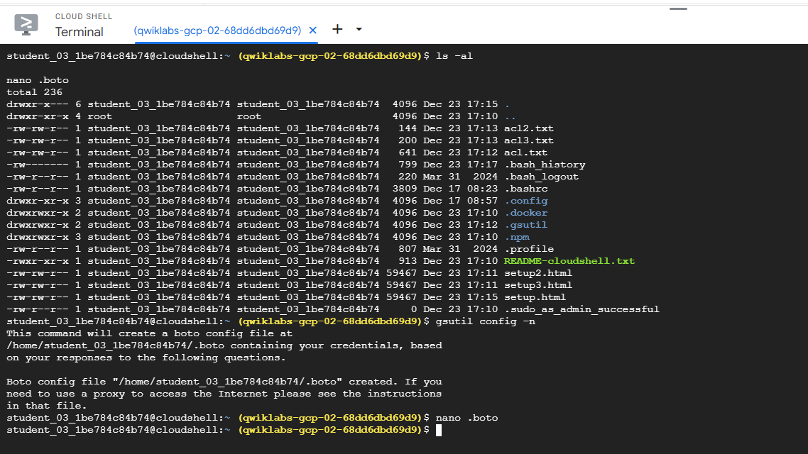

2. Locate the line with `#encryption_key=`

3. Uncomment the line by removing the # character, and paste the key you generated earlier at the end.

Example (this is an example):

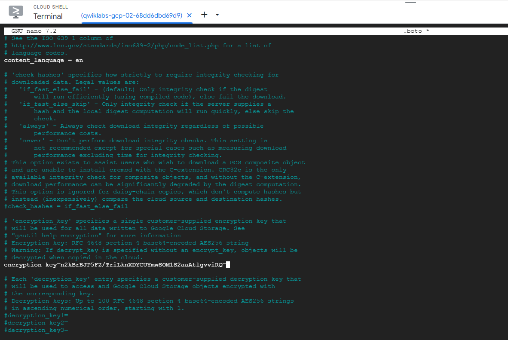

4. Press Ctrl+O, ENTER to save the boto file, and then press Ctrl+X to exit nano.

Upload the remaining setup files (encrypted) and verify in the Cloud Console

1. To upload the remaining setup.html files, run the following commands:

```bash
gsutil cp setup2.html gs://$BUCKET_NAME_1/
gsutil cp setup3.html gs://$BUCKET_NAME_1/
```

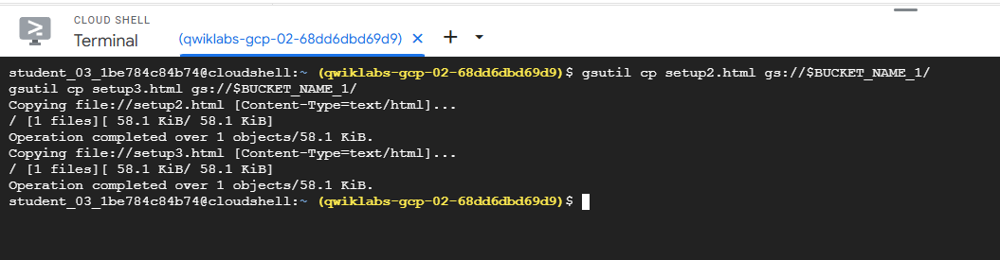

2. Return to the Cloud Console.

3. Click [BUCKET_NAME_1]. Both setup2.html and setup3.html files show that they are customer-encrypted.

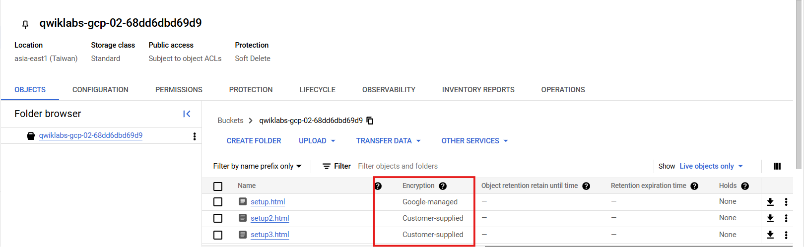

Delete local files, copy new files, and verify encryption

1. To delete your local files, run the following command in Cloud Shell:

```bash
rm setup*
```

2. To copy the files from the bucket again, run the following command:

```bash
gsutil cp gs://$BUCKET_NAME_1/setup* ./
```

3. To cat the encrypted files to see whether they made it back, run the following commands:

```bash
cat setup.html
cat setup2.html
cat setup3.html
```

### 4. Rotate CSEK keys

Move the current CSEK encrypt key to decrypt key

1. Run the following command to open the .boto file:

```bash
nano .boto
```

2. Comment out the current encryption_key line by adding the # character to the beginning of the line.

3. Uncomment decryption_key1 by removing the # character, and copy the current key from the encryption_key line to the decryption_key1 line.

4. Result (this is example output):

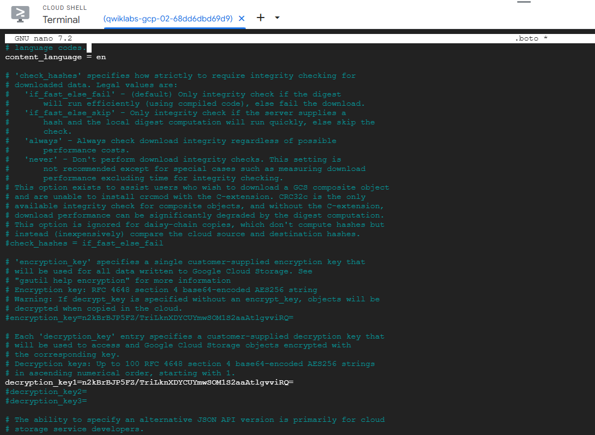

5. Press Ctrl+O, ENTER to save the boto file, and then press Ctrl+X to exit nano.

Generate another CSEK key and add to the boto file

1. Run the following command to generate a new key:

```bash
python3 -c 'import base64; import os; print(base64.encodebytes(os.urandom(32)))'
```

2. Copy the value of the generated key excluding b' and \n' from the command output. Key should be in form of `tmxElCaabWvJqR7uXEWQF39DhWTcDvChzuCmpHe6sb0=`.

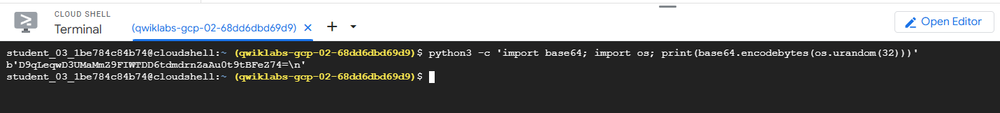

3. To open the boto file, run the following command:

```bash
nano .boto
```

Uncomment encryption and paste the new key value for `encryption_key=`.

5. Result (this is example output):

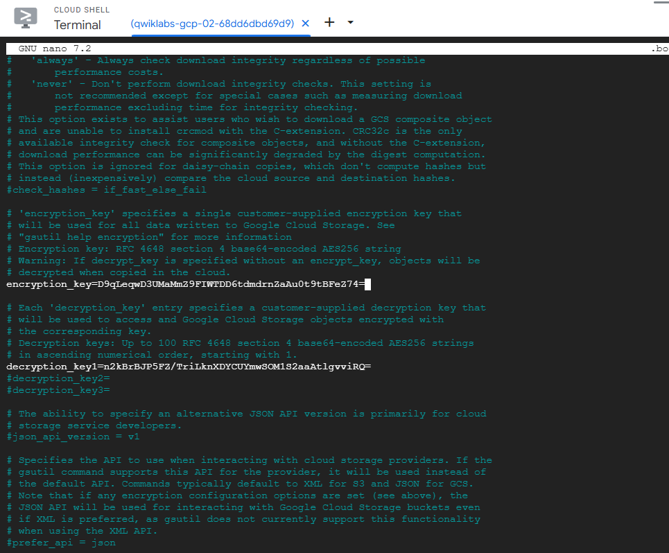

6. Press Ctrl+O, ENTER to save the boto file, and then press Ctrl+X to exit nano.

Rewrite the key for file 1 and comment out the old decrypt key

1. Run the following command:

```bash
gsutil rewrite -k gs://$BUCKET_NAME_1/setup2.html
```

2. To open the boto file, run the following command:

```bash
nano .boto
```

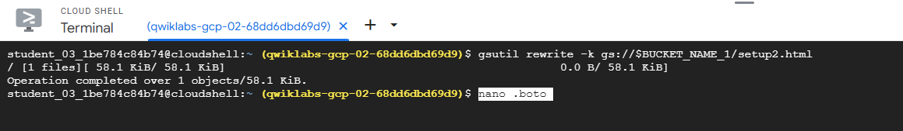

3. Comment out the current decryption_key1 line by adding the # character back in.

4. Result (this is example output):

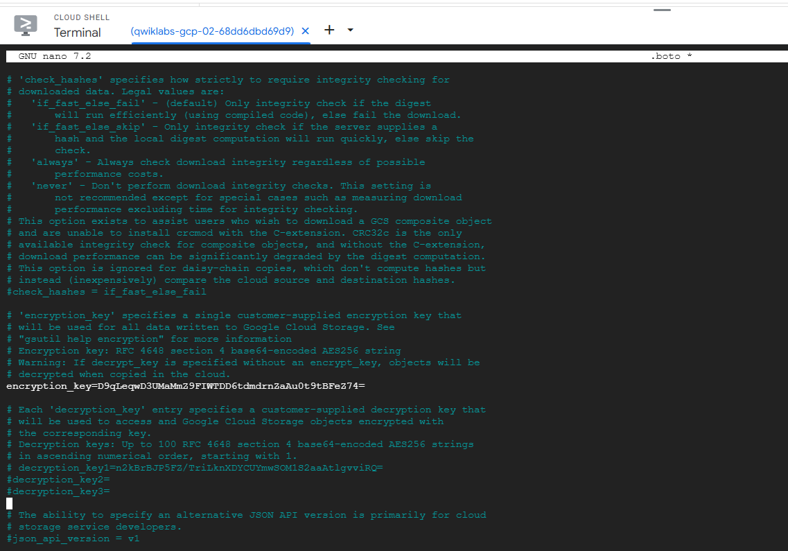

5. Press Ctrl+O, ENTER to save the boto file, and then press Ctrl+X to exit nano.

Download setup 2 and setup3

1. To download setup2.html, run the following command:

```bash
gsutil cp gs://$BUCKET_NAME_1/setup2.html recover2.html
```

2. To download setup3.html, run the following command:

```bash
gsutil cp gs://$BUCKET_NAME_1/setup3.html recover3.html
```

### 5. Enable lifecycle management

View the current lifecycle policy for the bucket

1. Run the following command to view the current lifecycle policy:

```bash
gsutil lifecycle get gs://$BUCKET_NAME_1
```

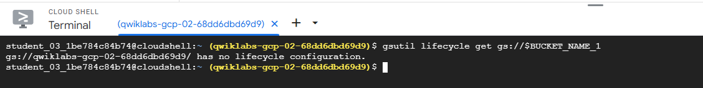

> Note: There is no lifecycle configuration. You create one in the next steps.

Create a JSON lifecycle policy file

1. To create a file named life.json, run the following command:

```bash
nano life.json
```

2. Paste the following value into the life.json file:

```json
{
  "rule": [
    {
      "action": { "type": "Delete" },
      "condition": { "age": 31 }
    }
  ]
}
```

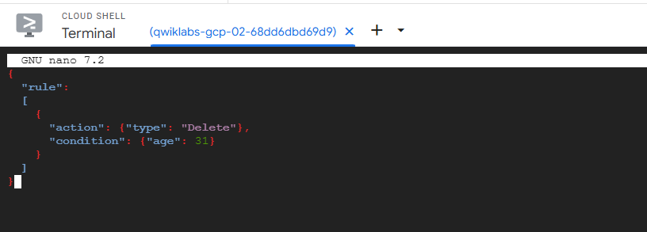

3. Press Ctrl+O, ENTER to save the file, and then press Ctrl+X to exit nano.

Set the policy and verify

1. To set the policy, run the following command:

```bash
gsutil lifecycle set life.json gs://$BUCKET_NAME_1
```

2. To verify the policy, run the following command:

```bash
gsutil lifecycle get gs://$BUCKET_NAME_1
```

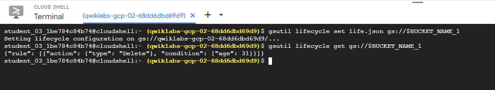

### 6. Enable versioning

View the versioning status for the bucket and enable versioning

1. Run the following command to view the current versioning status for the bucket:

```bash
gsutil versioning get gs://$BUCKET_NAME_1
```

> Note: The Suspended policy means that it is not enabled.

2. To enable versioning, run the following command:

```bash
gsutil versioning set on gs://$BUCKET_NAME_1
```

2. To verify that versioning was enabled, run the following command:

```bash
gsutil versioning get gs://$BUCKET_NAME_1
```

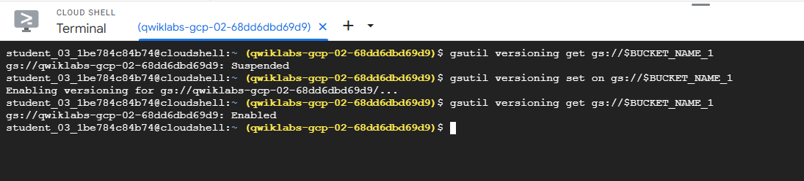

Create several versions of the sample file in the bucket

1. Check the size of the sample file:

```bash
ls -al setup.html
```

2. Open the setup.html file:

```bash
nano setup.html
```

3. Delete any 5 lines from setup.html to change the size of the file.

4. Press Ctrl+O, ENTER to save the file, and then press Ctrl+X to exit nano.

5. Copy the file to the bucket with the -v versioning option:

```bash
gcloud storage cp -v setup.html gs://$BUCKET_NAME_1
```

6. Open the setup.html file:

```bash
nano setup.html
```

7. Delete another 5 lines from setup.html to change the size of the file.

8. Press Ctrl+O, ENTER to save the file, and then press Ctrl+X to exit nano.

9. Copy the file to the bucket with the -v versioning option:

```bash
gcloud storage cp -v setup.html gs://$BUCKET_NAME_1
```

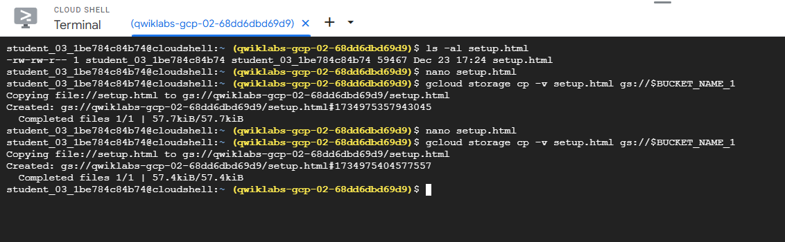

List all versions of the file

1. To list all versions of the file, run the following command:

```bash
gcloud storage ls -a gs://$BUCKET_NAME_1/setup.html
```

2. Highlight and copy the name of the oldest version of the file (the first listed), referred to as [VERSION_NAME] in the next step.

> Note: Make sure to copy the full path of the file, starting with `gs://`

3. Store the version value in the environment variable [VERSION_NAME].

```bash
export VERSION_NAME=<Enter VERSION name here>
```

4. Verify it with echo:

```bash
echo $VERSION_NAME
```

5. Result (this is example output):

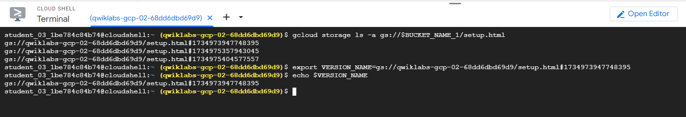

Download the oldest, original version of the file and verify recovery

1. Download the original version of the file:

```bash
gcloud storage cp $VERSION_NAME recovered.txt
```

2. To verify recovery, run the following commands:

```bash
ls -al setup.html

ls -al recovered.txt
```


> Note: You have recovered the original file from the backup version. Notice that the original is bigger than the current version because you deleted lines.

### 7. Synchronize a directory to a bucket

Make a nested directory and sync with a bucket

1. Run the following commands:

```bash
mkdir firstlevel
mkdir ./firstlevel/secondlevel
cp setup.html firstlevel
cp setup.html firstlevel/secondlevel
```

2. To sync the firstlevel directory on the VM with your bucket, run the following command:

```bash
gsutil rsync -r ./firstlevel gs://$BUCKET_NAME_1/firstlevel
```

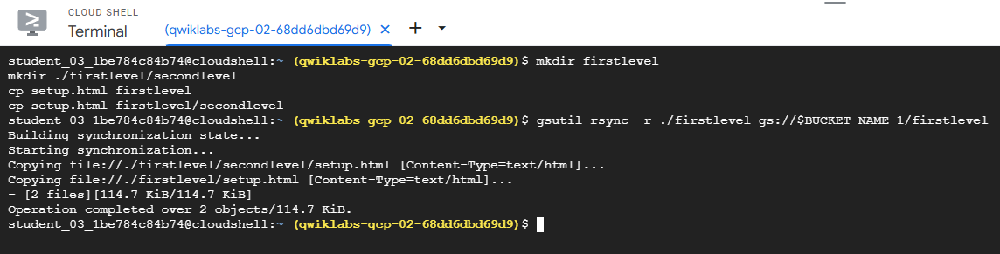

Examine the results

1. In the Cloud Console, on the Navigation menu (Navigation menu icon), click
   Cloud Storage > Buckets.

2. Click [BUCKET_NAME_1]. Notice the subfolders in the bucket.

3. Click on /firstlevel and then on /secondlevel.

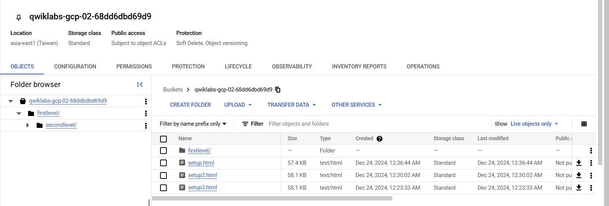

4. Compare what you see in the Cloud Console with the results of the following command:

```bash
gcloud storage ls -r gs://$BUCKET_NAME_1/firstlevel
```

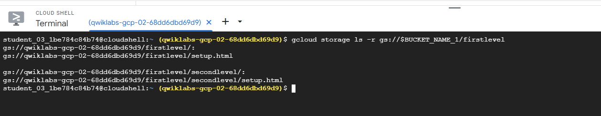

5. Exit Cloud Shell:

```bash
exit
```

### 8. Cross-project sharing

Switch to the second project

1. Open a new incognito tab.

2. Navigate to console.cloud.google.com to open a Cloud Console.

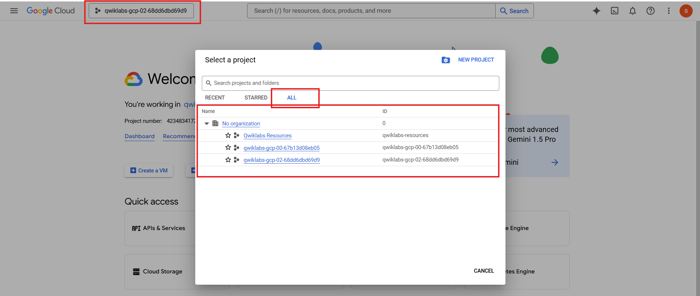

3. Click the project selector dropdown in the title bar.

4. Click All, and then click the second project provided for you in the
   Qwiklabs Connection Details dialog. Remember that the Project ID is a unique name across all Google Cloud projects. The second project ID will be referred to as [PROJECT_ID_2].

Prepare the bucket

1. In the Cloud Console, on the Navigation menu (Navigation menu icon), click
   Cloud Storage > Buckets.

2. Click Create.

3. Specify the following, and leave the remaining settings as their defaults:

| Property       | Value                                                                               |
| -------------- | ----------------------------------------------------------------------------------- |
| Name           | Enter a globally unique name                                                        |
| Location       | type Region                                                                         |
| Region         | REGION                                                                              |
| Access control | Fine-grained (object-level permission in addition to your bucket-level permissions) |

4. Note the bucket name. It will be referred to as [BUCKET_NAME_2] in the following steps.

5. Click Create.

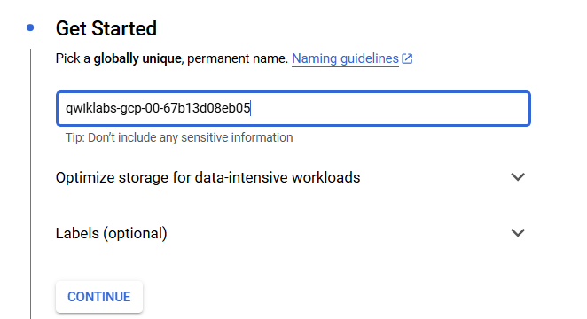

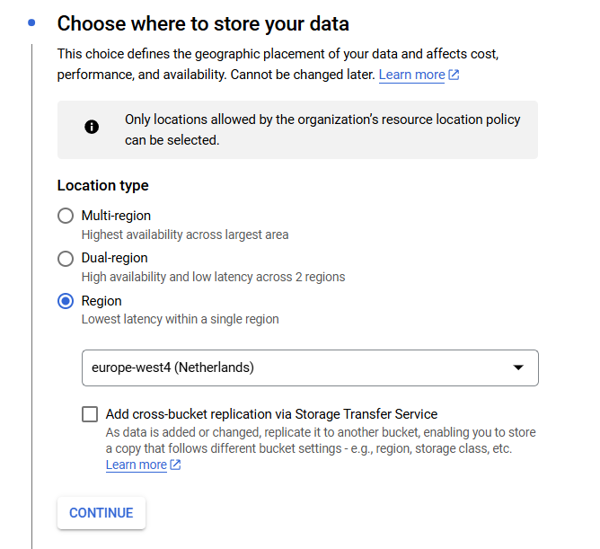

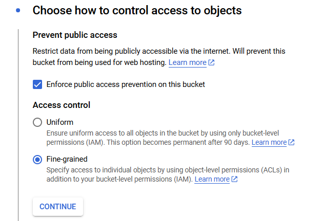

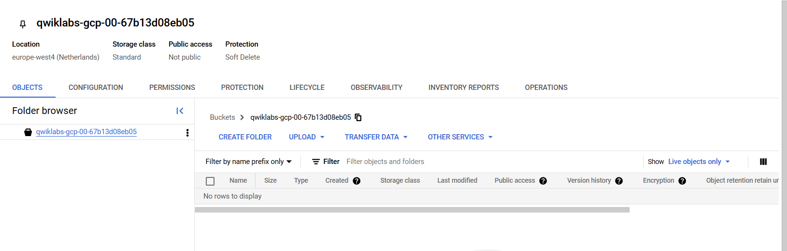

Upload a text file to the bucket

1. Upload a file to [BUCKET_NAME_2]. Any small example file or text file will do.

2. Note the file name (referred to as [FILE_NAME]); you will use it later.

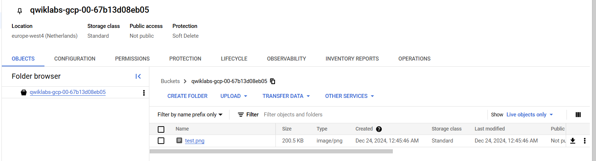

Create an IAM Service Account

1. In the Cloud Console, on the Navigation menu (Navigation menu icon), click IAM & admin > Service accounts.

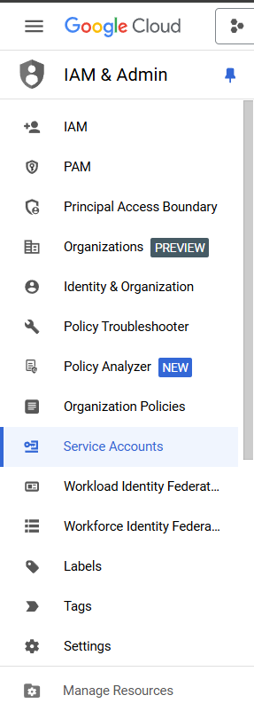

2. Click Create service account.

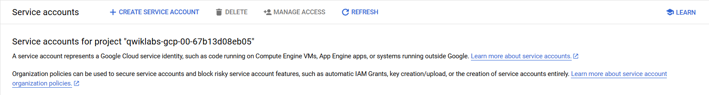

3. On Service account details page, specify the Service account name as `cross-project-storage`.

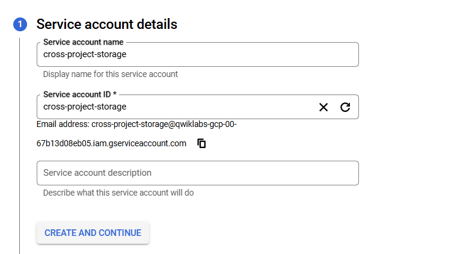

4. Click Create and Continue.

5. On the Service account permissions page, specify the role as `Cloud Storage` > `Storage Object Viewer`.

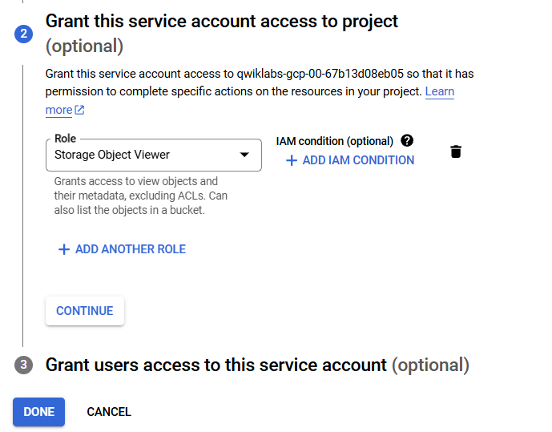

6. Click Continue and then Done.

7. Click the `cross-project-storage` service account to add the JSON key.

8. In Keys tab, click `Add Key` dropdown and select `Create new key`.

9. Select JSON as the key type and click Create. A JSON key file will be downloaded. You will need to find this key file and upload it in into the VM in a later step.

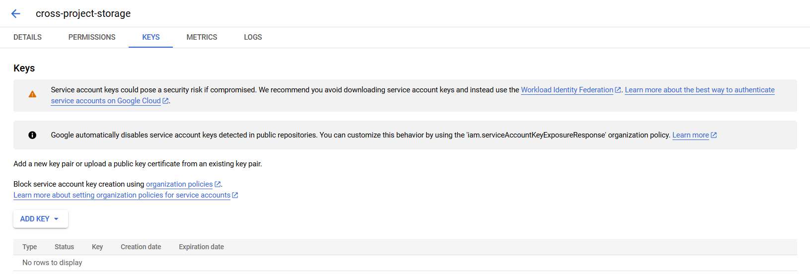

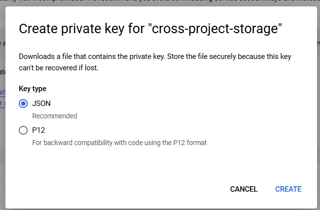

10. Click Close.

11. On your hard drive, rename the JSON key file to `credentials.json`.

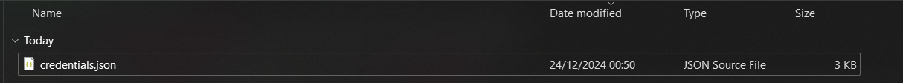

12. In the upper pane, switch back to [PROJECT_ID_1].

Create a VM

1. On the Navigation menu (Navigation menu icon), click Compute Engine > VM instances.

2. Click Create Instance.

3. On the Machine configuration page, specify the following, and leave the remaining settings as their defaults:

| Property     | Value                   |
| ------------ | ----------------------- |
| Name         | Type a name for your VM |
| Region       | region_name             |
| Zone         | zone_name               |
| Series       | E2                      |
| Machine type | e2-medium               |

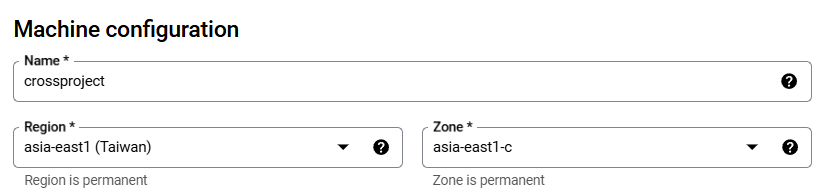

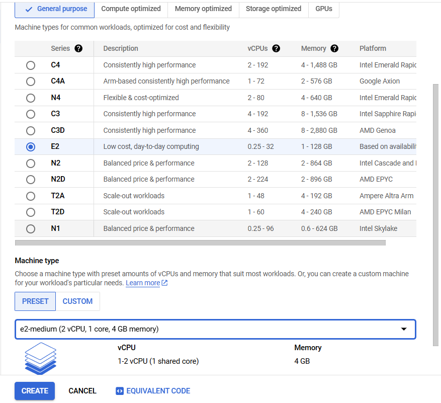

4. Click OS and storage.

5. If the Image shown is not Debian GNU/Linux 12 (bookworm), click Change and select Debian GNU/Linux 12 (bookworm), and then click Select.

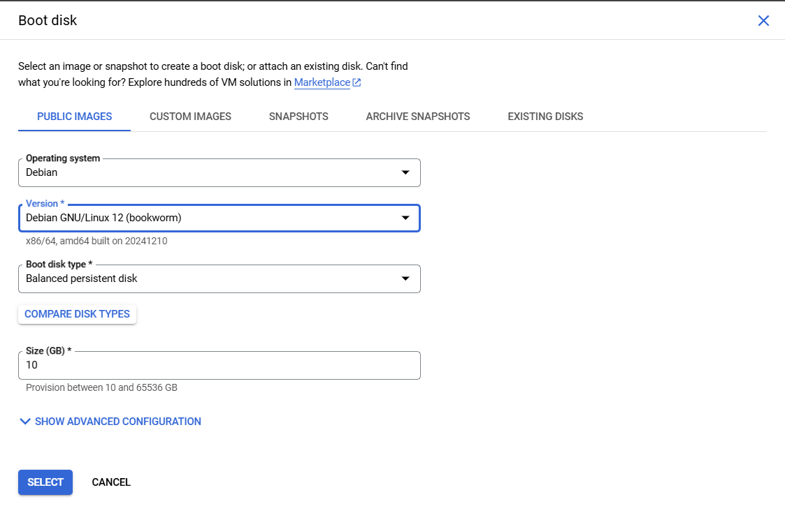

6. Click Create.

SSH to the VM

1. For crossproject, click SSH to launch a terminal and connect.

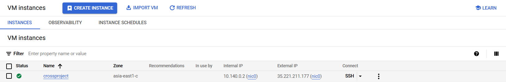

> Note: If the message appears like `Connection via Cloud Identity-Aware Proxy Failed` then click `Connect without Identity-Aware Proxy`.

2. Store [BUCKET_NAME_2] in an environment variable:

```bash
export BUCKET_NAME_2=<enter bucket name 2 here>
```

3. Verify it with echo:

```bash
echo $BUCKET_NAME_2
```

4. Store [FILE_NAME] in an environment variable:

```bash
export FILE_NAME=<enter FILE_NAME here>
```

5. Verify it with echo:

```bash
echo $FILE_NAME
```

6. List the files in [PROJECT_ID_2]:

```bash
gcloud storage ls gs://$BUCKET_NAME_2/
```

7. Result (this is example output):

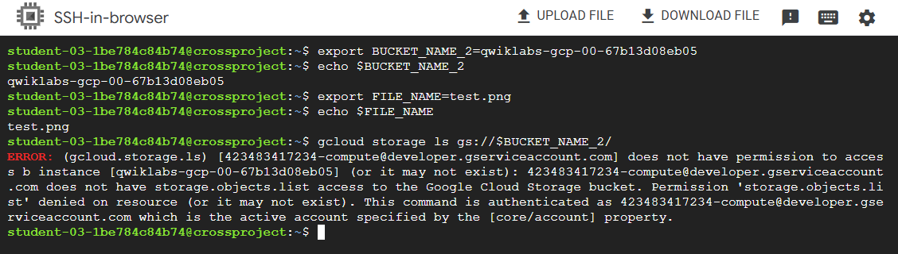

Authorize the VM

1. To upload credentials.json through the SSH VM terminal, click on the up arrow icon in the upper-right corner, and then click `Upload file`.

2. Select credentials.json and upload it.

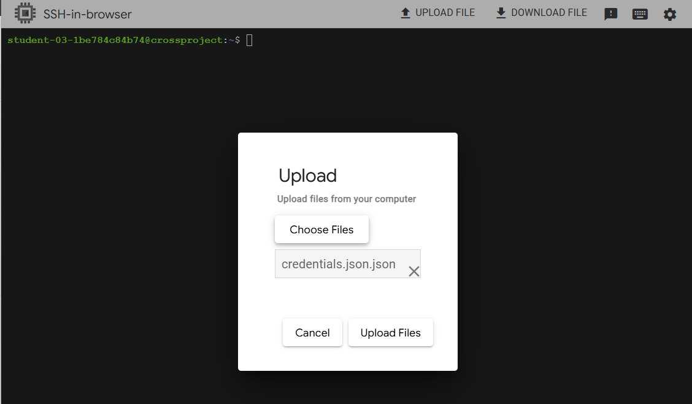

3. Click Close in the File Transfer window.

4. Verify that the JSON file has been uploaded to the VM:

```bash
ls
```

5. Result (this is example output):

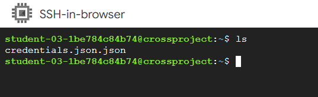

6. Enter the following command in the terminal to authorize the VM to use the Google Cloud API:

```bash
gcloud auth activate-service-account --key-file credentials.json
```

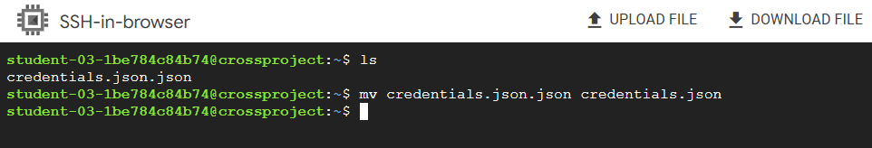

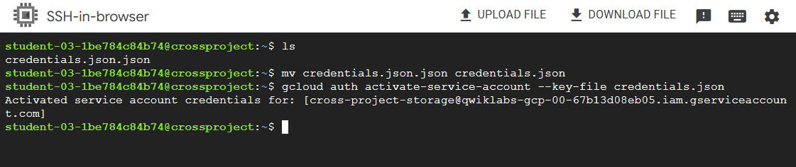

> NOTE : Rename file `mv <nama_file_lama> <nama_file_baru>`

Verify access

1. Retry this command:

```bash
gcloud storage ls gs://$BUCKET_NAME_2/
```

2. Retry this command:

```bash
gcloud storage cat gs://$BUCKET_NAME_2/$FILE_NAME
```

3. Try to copy the credentials file to the bucket:

```bash
gcloud storage cp credentials.json gs://$BUCKET_NAME_2/
```

4. Result (this is example output):

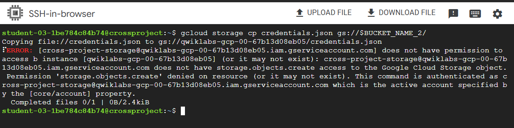

Modify role

1. In the upper pane, switch back to [PROJECT_ID_2].

2. In the Cloud Console, on the Navigation menu (Navigation menu icon), click IAM & admin > IAM.

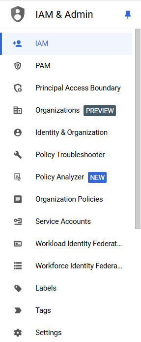

3. Click the pencil icon for the cross-project-storage service account (You might have to scroll to the right to see this icon).

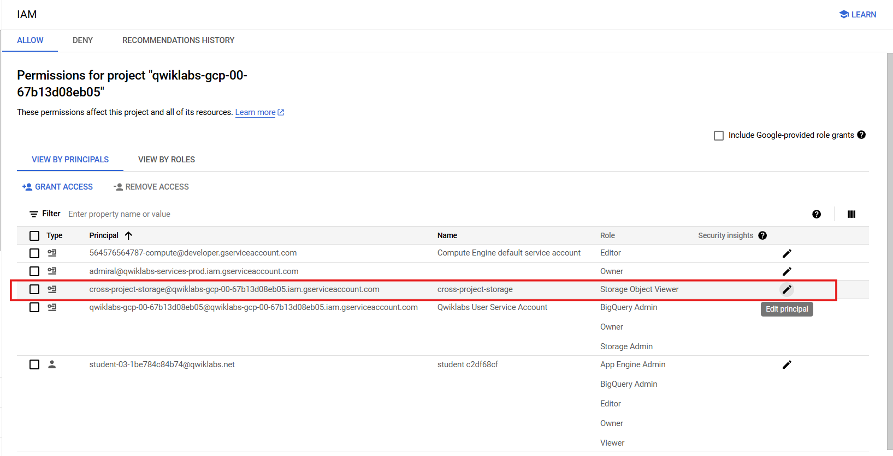

4. Click on the Storage Object Viewer role, and then click Cloud Storage > Storage Object Admin.

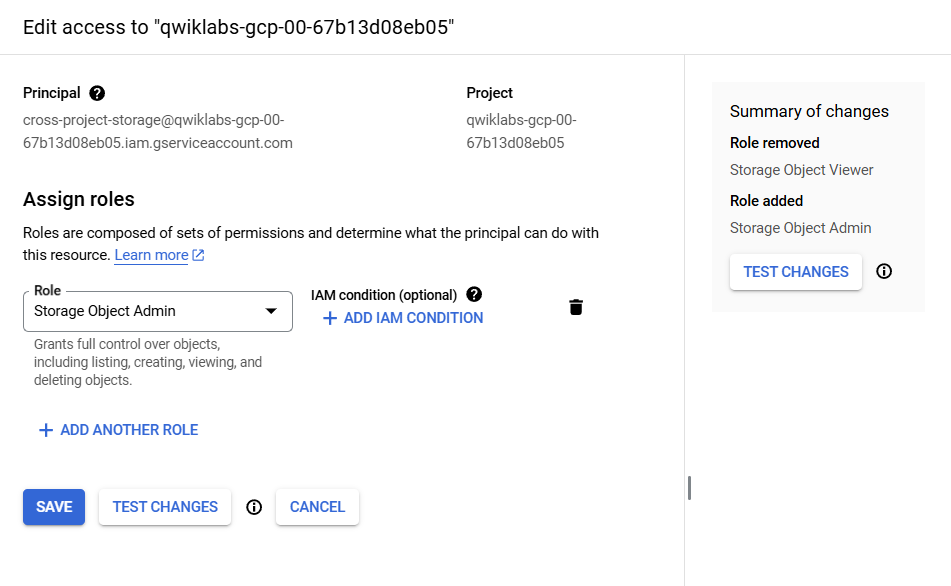

5. Click Save. If you don't click Save, the change will not be made.

Before :


After :

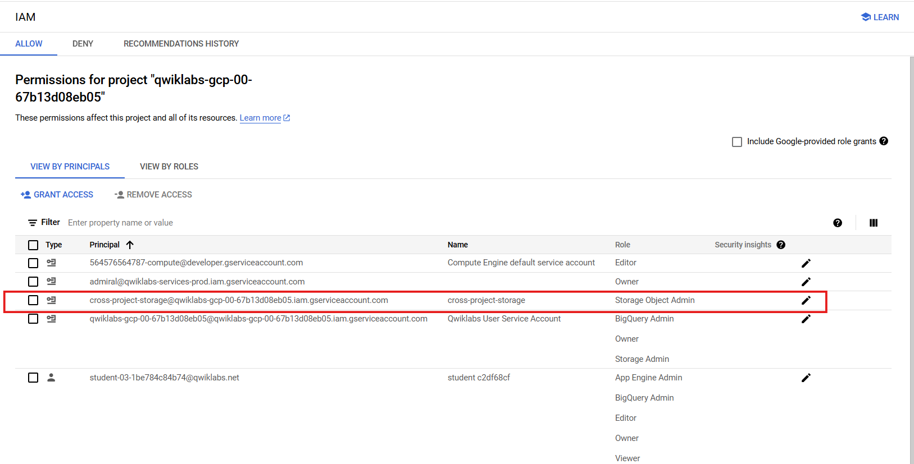

Verify changed access

1. Return to the SSH terminal for crossproject.

2. Copy the credentials file to the bucket:

```bash
gcloud storage cp credentials.json gs://$BUCKET_NAME_2/
```

3. Result (this is example output):

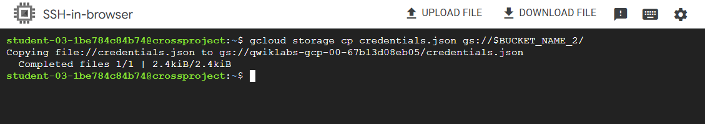
