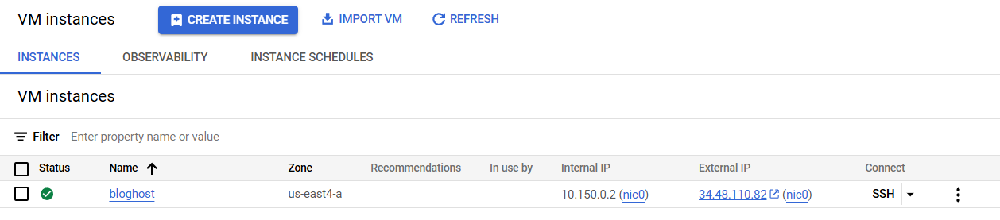
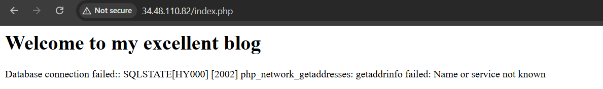
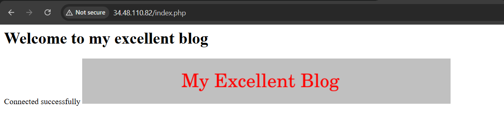

# Getting Started with Cloud Storage and Cloud SQL

### 1. Deploy a web server VM instance

1. In the Google Cloud console, on the Navigation menu, click Compute Engine > VM instances.

2. Click Create Instance.

3. On the Create an Instance page, for Name, type bloghost

4. For Region and Zone, select the region and zone assigned by Qwiklabs.

5. For Machine type, accept the default.

6. For Boot disk, if the Image shown is not Debian GNU/Linux 12, click Change and select Debian GNU/Linux 11 (bullseye).

7. Leave the defaults for Identity and API access unmodified.

8. For Firewall, click Allow HTTP traffic.

9. Click Advanced options to open that section of the dialog.

10. Click Management to open that section of the dialog

11. Scroll down to the Automation section, and enter the following script as the value for Startup script:

```bash
apt-get update
apt-get install apache2 php php-mysql -y
service apache2 restart
```

> **Note**: Be sure to supply that script as the value of the Startup script field. If you accidentally put it into another field, it won't be executed when the VM instance starts.

12. Leave the remaining settings as their defaults, and click Create.



### 2. Create a Cloud Storage bucket using the gcloud storage command line

1. On the Google Cloud console, on the top right toolbar, click the Activate Cloud Shell. If a dialog box appears, click Continue.

2. For convenience, enter your chosen location into an environment variable called LOCATION. Enter one of these commands:

```bash
export LOCATION=ASIA
```

3. In Cloud Shell, the DEVSHELL_PROJECT_ID environment variable contains your project ID. Enter this command to make a bucket named after your project ID:

```bash
gcloud storage buckets create -l $LOCATION gs://$DEVSHELL_PROJECT_ID
```

4. Retrieve a banner image from a publicly accessible Cloud Storage location:

```bash
gcloud storage cp gs://cloud-training/gcpfci/my-excellent-blog.png my-excellent-blog.png
```

5. Copy the banner image to your newly created Cloud Storage bucket:

```bash
gcloud storage cp my-excellent-blog.png gs://$DEVSHELL_PROJECT_ID/my-excellent-blog.png
```

6. Modify the Access Control List of the object you just created so that it's readable by everyone:

```bash
gsutil acl ch -u allUsers:R gs://$DEVSHELL_PROJECT_ID/my-excellent-blog.png
```


### 3. Create the Cloud SQL instance

1. In the Google Cloud console, on the Navigation menu (Navigation menu icon), click SQL.

2. Click Create instance.

3. For Choose a database engine, select Choose MySQL.

4. For Choose a Cloud SQL edition, click Enterprise and then select Sandbox from the dropdown.

5. For Instance ID, type blog-db, and for Root password type a password of your choice.

> Note: Choose a password that you remember. There's no need to obscure the password because you use mechanisms to connect that aren't open access to everyone.

6. Select Single zone and set the region and zone assigned by Qwiklabs.

> Note: This is the same region and zone into which you launched the bloghost instance. The best performance is achieved by placing the client and the database close to each other.

7. Click Create Instance.

8. Click the name of the instance, blog-db, to open its details page.


9. From the SQL instances details page, copy the Public IP address for your SQL instance to a text editor for use later in this lab.

10. Click Users menu on the left-hand side, and then click Add User Account.

11. For User name, type blogdbuser

12. For Password, type a password of your choice. Make a note of it.

13. Click Add to add the user account in the database.


14. Click Connections menu on the left-hand side, and then click Networking tab.

15. Click Add a Network.

> Note: If you're offered the choice between a Private IP connection and a Public IP connection, choose Public IP for purposes of this lab. <br>

> Note: The Add network button may be unavailable if the user account creation is not yet complete.

16. For Name, type web front end

17. For Network, type the external IP address of your bloghost VM instance, followed by /32

The result will look like this:


18. Click Done to finish defining the authorized network.

19. Click Save to save the configuration change.

### 4. Configure an application in a Compute Engine instance to use Cloud SQL

1. On the Navigation menu, click Compute Engine > VM instances.

2. In the VM instances list, click SSH in the row for your VM instance bloghost.

3. In your ssh session on bloghost, change your working directory to the document root of the web server:

```bash
cd /var/www/html
```

4. Use the nano text editor to edit a file called index.php:

```bash
sudo nano index.php
```

5. Paste the content below into the file:

```php
<html>
<head><title>Welcome to my excellent blog</title></head>
<body>
<h1>Welcome to my excellent blog</h1>
<?php
 $dbserver = "CLOUDSQLIP";
$dbuser = "blogdbuser";
$dbpassword = "DBPASSWORD";
// In a production blog, we would not store the MySQL
// password in the document root. Instead, we would store
//  it in a Secret Manger. For more information see
// https://cloud.google.com/sql/docs/postgres/use-secret-manager

 try {
  $conn = new PDO("mysql:host=$dbserver;dbname=mysql", $dbuser, $dbpassword);
  // set the PDO error mode to exception
  $conn->setAttribute(PDO::ATTR_ERRMODE, PDO::ERRMODE_EXCEPTION);
  echo "Connected successfully";
} catch(PDOException $e) {
  echo "Database connection failed:: " . $e->getMessage();
}

?>
</body></html>
```

6. Press Ctrl+O, and then press Enter to save your edited file.

7. Press Ctrl+X to exit the nano text editor.

8. Restart the web server:

```bash
sudo service apache2 restart
```


9. Open a new web browser tab and paste into the address bar your bloghost VM instance's external IP address followed by /index.php. The URL will look like this:

When you load the page, you will see that its content includes an error message beginning with the words:



10. Return to your ssh session on bloghost. Use the nano text editor to edit index.php again.

```bash
sudo nano index.php
```

11. In the nano text editor, replace CLOUDSQLIP with the Cloud SQL instance Public IP address that you noted above. Leave the quotation marks around the value in place.

12. In the nano text editor, replace DBPASSWORD with the Cloud SQL database password that you defined above. Leave the quotation marks around the value in place.

13. Press Ctrl+O, and then press Enter to save your edited file.

14. Press Ctrl+X to exit the nano text editor.


15. Restart the web server:

```bash
sudo service apache2 restart
```

16. Return to the web browser tab in which you opened your bloghost VM instance's external IP address. When you load the page, the following message appears:


### 5. Configure an application in a Compute Engine instance to use a Cloud Storage object

1. In the Google Cloud console, click Cloud Storage > Buckets.

2. Click the bucket that is named after your Google Cloud project.

3. In this bucket, there is an object called my-excellent-blog.png. Copy the URL behind the link icon that appears in that object's Public access column, or behind the words "Public link" if shown.


4. Return to your ssh session on your bloghost VM instance.

5. Enter this command to set your working directory to the document root of the web server:

```bash
cd /var/www/html
```

6. Use the nano text editor to edit index.php:

```bash
sudo nano index.php
```

7. Use the arrow keys to move the cursor to the line that contains the h1 element. Press Enter to open up a new, blank screen line, and then paste the URL you copied earlier into the line.

8. Paste this HTML markup immediately before the URL:

```html

```

The resulting line will look like this:


```html

```

10. Press Ctrl+O, and then press Enter to save your edited file.

11. Press Ctrl+X to exit the nano text editor.

12. Restart the web server:

```bash
sudo service apache2 restart
```

13. Return to the web browser tab in which you opened your bloghost VM instance's external IP address. When you load the page, its content now includes a banner image.


