# Working with Virtual Machines

### 1. Create the VM

1. In the Cloud Console, on the Navigation menu (Navigation menu), click Compute Engine > VM instances.

2. Click Create Instance.

3. Specify the following and leave the remaining settings as their defaults:

| Property                                | Value                               |
| --------------------------------------- | ----------------------------------- |
| Name                                    | Type a name for your VM             |
| Region                                  | region_name                         |
| Zone                                    | zone_name                           |
| Series                                  | E2                                  |
| Machine type                            | e2-standard-2(2 vCPUs, 8 GB memory) |
| Boot disk                               | Debian GNU/Linux 12 (bookworm)      |
| Boot disk type                          | SSD persistent disk                 |
| Identity and API access > Access scopes | Set access for each API             |
| Storage                                 | Read Write                          |

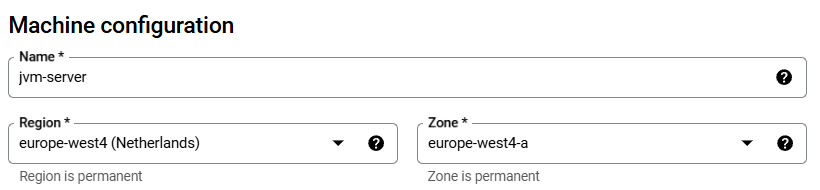

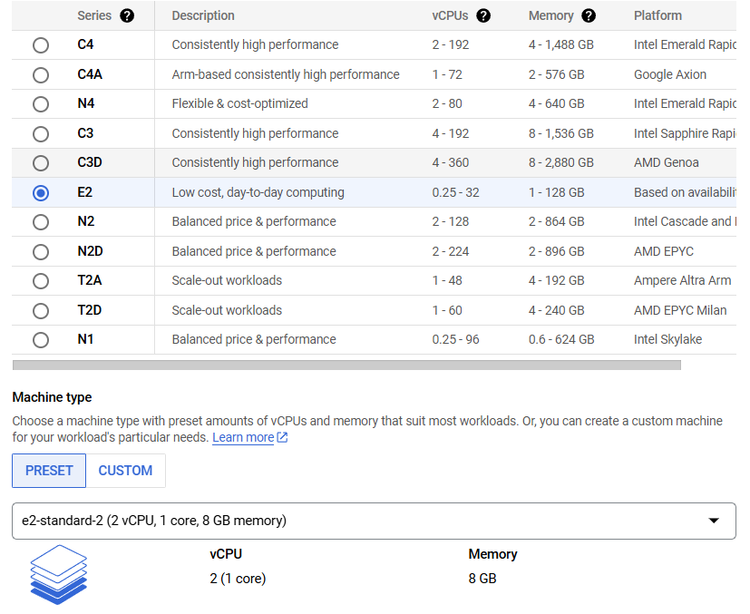

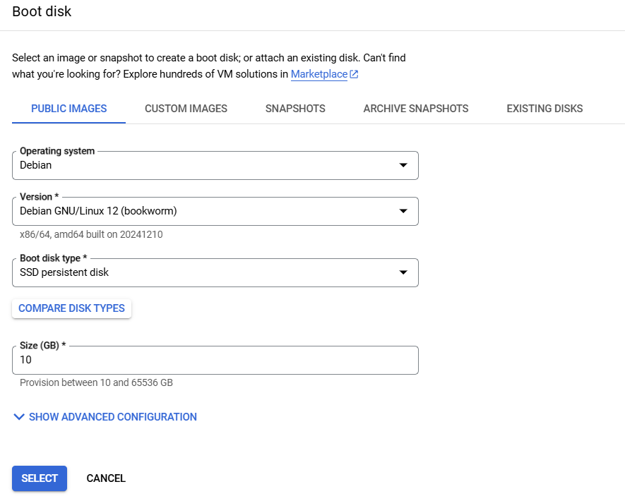

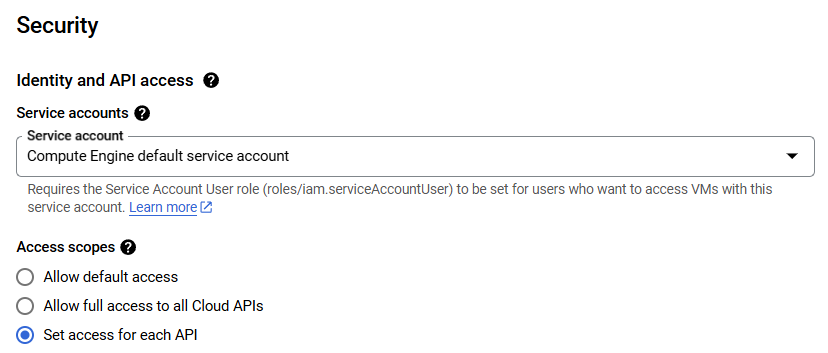

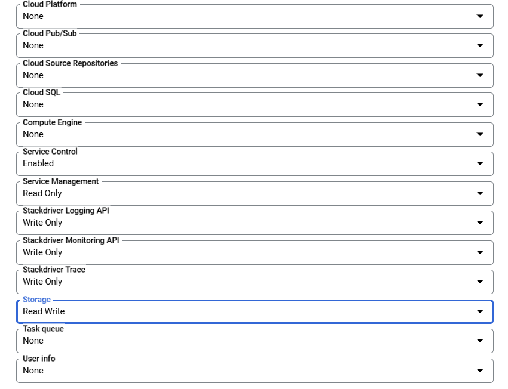

4. Click Advanced options.

5. Click Disks and backups. You will add a disk to be used for game storage.

6. Click Add new disk.

7. Specify the following and leave the remaining settings as their defaults:

| Property         | Value                         |
| ---------------- | ----------------------------- |
| Name             | Type a name for your volume   |
| Disk type        | SSD Persistent Disk           |
| Disk Source type | Blank disk                    |
| Size (GB)        | 50                            |
| Encryption       | Google-managed encryption key |

8. Click Save. This creates the disk and automatically attaches it to the VM when the VM is created.

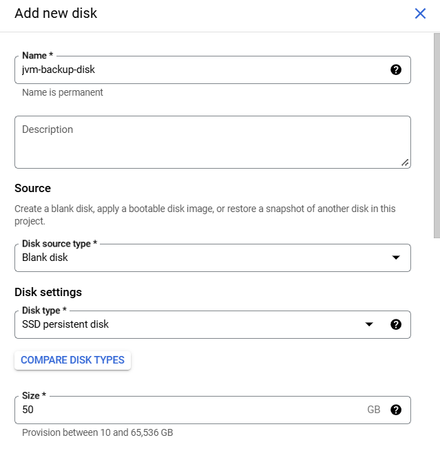

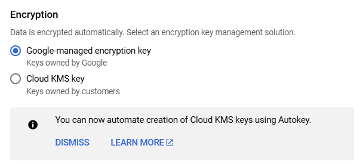

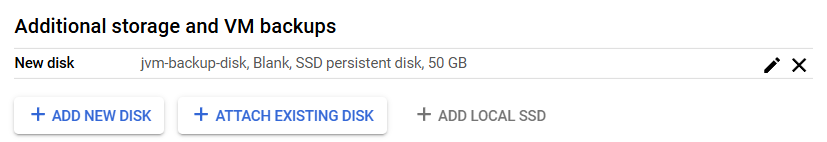

9. Click Networking.

10. Specify the following and leave the remaining settings as their defaults:

| Property              | Value                               |
| --------------------- | ----------------------------------- |
| Network tags          | minecraft-server                    |
| Network interfaces    | Click default to edit the interface |
| External IPv4 address | Reserve Static External IP Address  |
| Name                  | type a name for EIP                 |

11. Click Reserve.

12. Click Done.

13. Click Create.

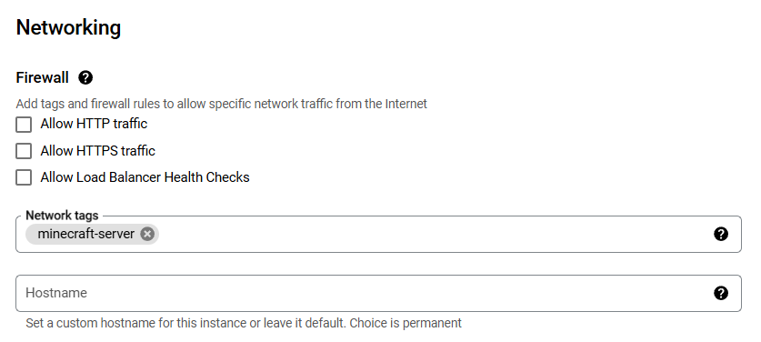

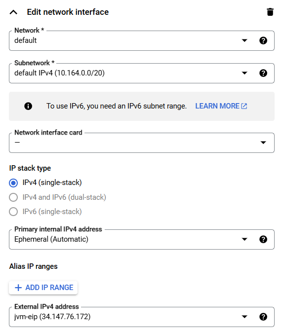

### 2. Prepare the data disk

1. For `vm_name`, click SSH to open a terminal and connect.

2. To create a directory that serves as the mount point for the data disk, run the following command:

```bash
sudo mkdir -p /home/minecraft
```

3. To format the disk, run the following command:

```bash
sudo mkfs.ext4 -F -E lazy_itable_init=0,\
lazy_journal_init=0,discard \
/dev/disk/by-id/google-[new_disk_storage]
```

4. To mount the disk, run the following command:

```bash
sudo mount -o discard,defaults /dev/disk/by-id/google-[new_disk_storage] /home/minecraft
```

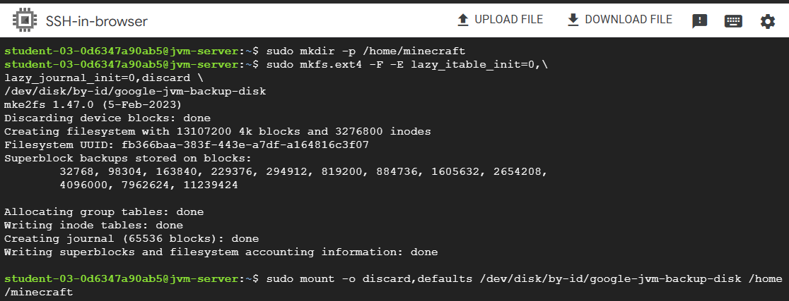
