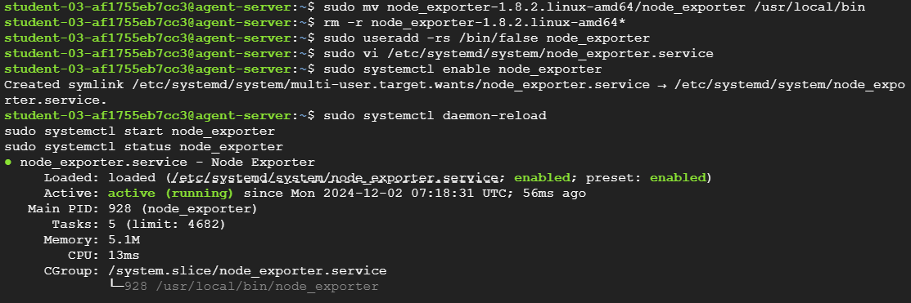
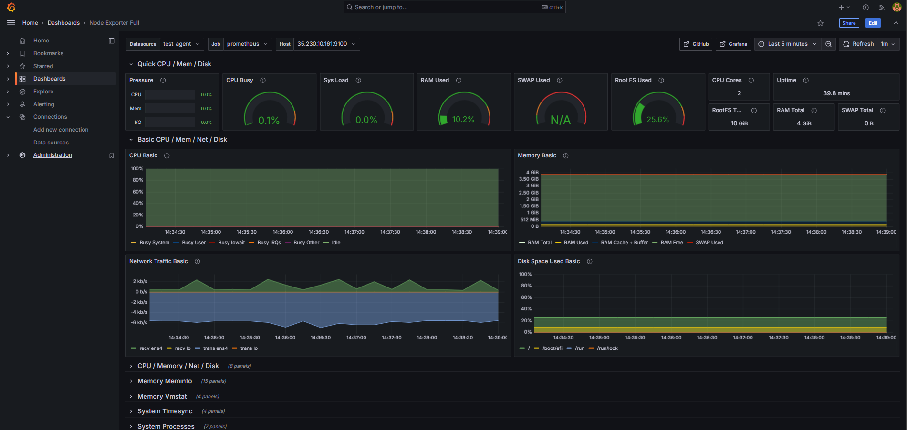

# Installation Promotheus and Grafana on GCP

Prometheus isn’t just a data format; it is also considered an open source systems monitoring and alerting toolkit. That’s because Prometheus is software, not just data.
Prometheus can scrape metric data from software and infrastructure and store it. [More Info](https://grafana.com/docs/grafana/latest/fundamentals/intro-to-prometheus/#:~:text=Prometheus%20isn't%20just%20a,and%20infrastructure%20and%20store%20it.)

### 1. Set up a GCP instance to host the prometheus server and client.


### 2. Install Prometheus

1. Visit the [Prometheus downloads](https://prometheus.io/download/) and make a note of the most recent release. The most recent LTS release is clearly indicated on the site.

2. Use wget to download Prometheus to the monitoring server. The target link has the format https://github.com/prometheus/prometheus/releases/download/v[release]/prometheus-[release].linux-amd64.tar.gz. Replace the string [release] with the actual release to download. For example, the following command downloads release 2.37.6.

```bash
wget https://github.com/prometheus/prometheus/releases/download/v[release]/prometheus-[release].linux-amd64.tar.gz
```


3. Extract the archived Prometheus files.

```bash
tar xvfz prometheus-*.tar.gz
```


4. **(Optional)** After the files have been extracted, delete the archive or move it to a different location for storage.

```bash
rm prometheus-*.tar.gz
```

5. Create two new directories for Prometheus to use. The /etc/prometheus directory stores the Prometheus configuration files. The /var/lib/prometheus directory holds application data.

```bash
sudo mkdir /etc/prometheus /var/lib/prometheus
```

6. Move into the main directory of the extracted prometheus folder. Substitute the name of the actual directory in place of prometheus-[release].linux-amd64.

```bash
cd prometheus-[release].linux-amd64
```

7. Move the prometheus and promtool directories to the /usr/local/bin/ directory. This makes Prometheus accessible to all users.

```bash
sudo mv prometheus promtool /usr/local/bin/
```

8. Move the prometheus.yml YAML configuration file to the /etc/prometheus directory.

```bash
sudo mv prometheus.yml /etc/prometheus/prometheus.yml
```

9. The consoles and console_libraries directories contain the resources necessary to create customized consoles. This feature is more advanced and is not covered in this guide. However, these files should also be moved to the etc/prometheus directory in case they are ever required.

> **Note** <br>
> After these directories are moved over, only the LICENSE and NOTICE files remain in the original directory. Back up these documents to another location and delete the prometheus-releasenum.linux-amd64 directory.

```bash
sudo mv consoles/ console_libraries/ /etc/prometheus/
```

10. Verify that Prometheus is successfully installed using the below command:

```bash
prometheus --version
```


### 3. Configure Prometheus as a Service

1. Create a prometheus user. The following command creates a system user.

```bash
sudo useradd -rs /bin/false prometheus
```

2. Assign ownership of the two directories created in the previous section to the new prometheus user.

```bash
sudo chown -R prometheus: /etc/prometheus /var/lib/prometheus
```

3. To allow Prometheus to run as a service, create a prometheus.service file using the following command:

```bash
sudo vi /etc/systemd/system/prometheus.service
```

Enter the following content into the file:

```bash
[Unit]
Description=Prometheus
Wants=network-online.target
After=network-online.target

[Service]
User=prometheus
Group=prometheus
Type=simple
Restart=on-failure
RestartSec=5s
ExecStart=/usr/local/bin/prometheus \
    --config.file /etc/prometheus/prometheus.yml \
    --storage.tsdb.path /var/lib/prometheus/ \
    --web.console.templates=/etc/prometheus/consoles \
    --web.console.libraries=/etc/prometheus/console_libraries \
    --web.listen-address=0.0.0.0:9090 \
    --web.enable-lifecycle \
    --log.level=info

[Install]
WantedBy=multi-user.target
```

> - The `Wants` and `After` options must be set to `network-online.target`.
> - The `User` and `Group` fields must both be set to `prometheus`.
> - The `ExecStart` parameter explains where to find the `prometheus` executable and defines the default options.
> - The `config.file` option defines the location of the Prometheus configuration file as `/etc/prometheus/prometheus.yml`.
> - `storage.tsdb.path` tells Prometheus to store application data in the `/var/lib/prometheus/` directory.
> - `web.listen-address` is set to `0.0.0.0:9090`, allowing Prometheus to listen for connections on all network interfaces.
> - The `web.enable-lifecycle` option allows users to reload the configuration file without restarting Prometheus.

4. Reload the systemctl daemon.

```bash
sudo systemctl daemon-reload
```

5. (Optional) Use systemctl enable to configure the prometheus service to automatically start when the system boots. If this command is not added, Prometheus must be launched manually.

```bash
sudo systemctl enable prometheus
```

6. Start the prometheus service and review the status command to ensure it is active.

> **Note** <br>
> If the prometheus service fails to start properly, run the command journalctl -u prometheus -f --no-pager and review the output for errors.

```bash
sudo systemctl start prometheus
sudo systemctl status prometheus
```


7. Access the Prometheus web interface and dashboard at http://local_ip_addr:9090. Replace local_ip_addr with the address of the monitoring server. Because Prometheus is using the default configuration file, it does not display much information yet.

8. The default prometheus.yml file contains a directive to scrape the local host. Click Status and Targets to list all the targets. Prometheus should display the local Prometheus service as the only target.


### 4. Install and Configure Node Exporter on the Client

> **Note** <br>
> When Node Exporter is running, its collection of statistics is available on port 9100. This port is accessible on the internet and anyone running Prometheus elsewhere can potentially collect them. If you are using a firewall, you must open port 9100 using the command sudo ufw allow 9100.

1. Consult the [Node Exporter section of the Prometheus downloads page](https://prometheus.io/download/#node_exporter) and determine the latest release.

2. Use wget to download this release. The format for the file is https://github.com/prometheus/node_exporter/releases/download/v[release_num]/node_exporter-[release_num].linux-amd64.tar.gz. Replace [release_num] with the number corresponding to the actual release.

```bash
wget https://github.com/prometheus/node_exporter/releases/download/v[release_num]/node_exporter-[release_num].linux-amd64.tar.gz
```


3. Extract the application.

```bash
tar xvfz node_exporter-*.tar.gz
```


4. Move the executable to usr/local/bin so it is accessible throughout the system.

```bash
sudo mv node_exporter-[release_num].linux-amd64/node_exporter /usr/local/bin
```

5. (Optional) Remove any remaining files.

```bash
rm -r node_exporter-[release_num].linux-amd64*
```

6. There are two ways of running Node Exporter. It can be launched from the terminal using the command node_exporter. Or, it can be activated as a system service. Running it from the terminal is less convenient. But this might not be a problem if the tool is only intended for occasional use. To run Node Exporter manually, use the following command. The terminal outputs details regarding the statistics collection process.

```bash
node_exporter
```

7. It is more convenient to run Node Exporter as a service. To run Node Exporter this way, first, create a node_exporter user.

```bash
sudo useradd -rs /bin/false node_exporter
```

8. Create a service file for systemctl to use. The file must be named node_exporter.service and should have the following format. Most of the fields are similar to those found in prometheus.service, as described in the previous section.

```bash
sudo vi /etc/systemd/system/node_exporter.service
```

```bash
[Unit]
Description=Node Exporter
Wants=network-online.target
After=network-online.target

[Service]
User=node_exporter
Group=node_exporter
Type=simple
Restart=on-failure
RestartSec=5s
ExecStart=/usr/local/bin/node_exporter

[Install]
WantedBy=multi-user.target
```

9. (Optional) If you intend to monitor the client on an ongoing basis, use the systemctl enable command to automatically launch Node Exporter at boot time. This continually exposes the system metrics on port 9100. If Node Exporter is only intended for occasional use, do not use the command below.

```bash
sudo systemctl enable node_exporter
```

10. Reload the systemctl daemon, start Node Exporter, and verify its status. The service should be active.

```bash
sudo systemctl daemon-reload
sudo systemctl start node_exporter
sudo systemctl status node_exporter
```



11. Use a web browser to visit port `9100` on the client node, for example, `http://local_ip_addr:9100`. A page entitled `Node Exporter` is displayed along with a link reading `Metrics`. Click the `Metrics` link and confirm the statistics are being collected. For a detailed explanation of the various statistics, see the [Node Exporter Documentation](https://prometheus.io/docs/guides/node-exporter/).


### 5. Configure Prometheus to Monitor Client Nodes

1. On the monitoring server running Prometheus, open prometheus.yml for editing.

```bash
sudo vi /etc/prometheus/prometheus.yml
```

2. Locate the section entitled `scrape_configs`, which contains a list of jobs. It currently lists a single job named `prometheus`. This job monitors the local `Prometheus` task on port `9090`. Beneath the `prometheus` job, add a second job having the `job_name` of `remote_collector`. Include the following information.

> - A scrape_interval of 10s.
> - Inside static_configs in the targets attribute, add a bracketed list of the IP addresses to monitor. Separate each entry using a comma.
> - Append the port number :9100 to each IP address.
> - To enable monitoring of the local server, add an entry for localhost:9100 to the list.

The entry should resemble the following example. Replace remote_addr with the actual IP address of the client.

```bash
- job_name: "remote_collector"
  scrape_interval: 10s
  static_configs:
    - targets: ["remote_addr:9100"]
```


3. To immediately refresh Prometheus, restart the prometheus service.

```bash
sudo systemctl restart prometheus
```

4. Using a web browser, revisit the Prometheus web portal at port 9090 on the monitoring server. Select Status and then Targets. A second link for the remote_collector job is displayed, leading to port 9100 on the client. Click the link to review the statistics.


### 6. Install and Deploy the Grafana Server

1. Install some required utilities using apt.

```bash
sudo apt-get install -y apt-transport-https software-properties-common
```

2. Import the Grafana GPG key.

```bash
sudo wget -q -O /usr/share/keyrings/grafana.key https://apt.grafana.com/gpg.key
```

3. Add the Grafana “stable releases” repository.

```bash
echo "deb [signed-by=/usr/share/keyrings/grafana.key] https://apt.grafana.com stable main" | sudo tee -a /etc/apt/sources.list.d/grafana.list
```

4. Update the packages in the repository, including the new Grafana package.

```bash
sudo apt-get update
```

5. Install the open-source version of Grafana.

> **Note** <br>
> To install the Enterprise edition of Grafana, use the command sudo apt-get install grafana-enterprise instead.

```bash
sudo apt-get install grafana
```

6. Reload the systemctl daemon.

```bash
sudo systemctl daemon-reload
```

7. Enable and start the Grafana server. Using systemctl enable configures the server to launch Grafana when the system boots.

```bash
sudo systemctl enable grafana-server.service
sudo systemctl start grafana-server
```

8. Verify the status of the Grafana server and ensure it is in the active state.

```bash
sudo systemctl status grafana-server
```


### 7. Integrate Grafana and Prometheus

1. Using a web browser, visit port `3000` of the monitoring server. For example, enter `http://local_ip_addr:3000`, replacing `local_ip_addr` with the actual IP address. Grafana displays the login page. Use the user name `admin` and the default password `admin`. Change the password to a more secure value when prompted to do so.


2. After a successful password change, Grafana displays the Grafana Dashboard.


3. To add Prometheus as a data source, click the gear symbol, standing for Configuration, then select Data Sources.

4. At the next display, click the Add data source button.


5. Choose Prometheus as the data source.


6. For a local Prometheus source, as described in this guide, set the URL to `http://localhost:9090`. Most of the other settings can remain at the default values. However, a non-default `Timeout` value can be added here.

7. When satisfied with the settings, select the Save & test button at the bottom of the screen.

8. If all settings are correct, Grafana confirms the Data source is working.

### 8. Import a Grafana Dashboard

> **Note** <br>
> To create a custom dashboard, click on the `Dashboard` button, which resembles four squares. Then select `+ New Dashboard`. Consult the Grafana guide to [Building a Dashboard](https://grafana.com/docs/grafana/latest/getting-started/build-first-dashboard/) for additional information.

1. Visit the [Grafana Dashboard Library](https://grafana.com/grafana/dashboards/). Enter `Node exporter` as the search term.

2. Select the entry for `Node Exporter Full`.

3. Make a note of the ID number or use the button to copy the ID to the clipboard. The ID of this board is currently `1860`.

4. Return to the Grafana dashboard. Select the `Dashboard` icon, consisting of four squares, and choose `+ Import`.

5. In the `Import via grafana.com box`, enter the ID `1860` from the previous step. Then select the `Load` button.

6. At the next screen, confirm the import details. Choose Prometheus as the data source and click the Import button.

7. The `Node Exporter Full` dashboard takes effect immediately. It displays the performance metrics and state of the client node, including the Memory, RAM, and CPU details. Several drop-down menus at the top of the screen allow users to select the host to observe and the time period to highlight.

The following example demonstrates how a client reacts when stressed by a demanding Python program. The `CPU Busy` widget indicates how the CPU is pinned near the maximum. If this occurs during normal operating conditions, it potentially indicates more CPU power is required.


