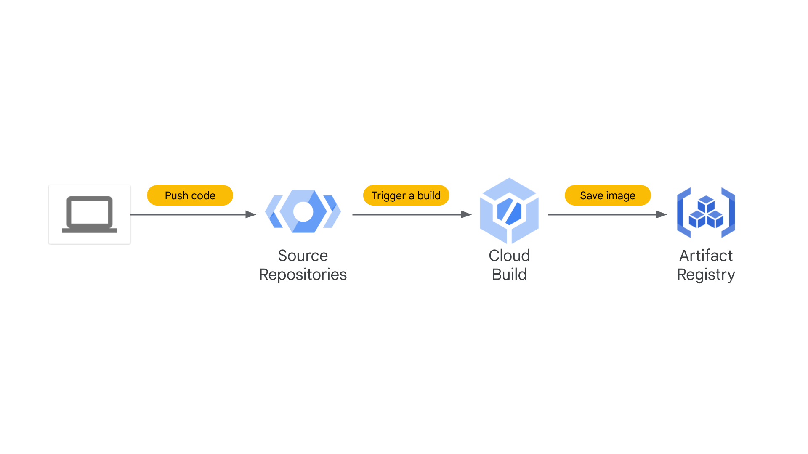

# Building a DevOps Pipeline



### 1. Create a Git repository

1. On the Google Cloud console title bar, type Source Repositories in the Search field, then click Source Repositories in the Products & Pages section.

2. Click Add repository.

3. Select Create new repository and click Continue.

4. Name the repository devops-repo.

5. Select your current project ID from the list.

6. Click Create.

7. Click Cloud Console, and in the new tab click Activate Cloud Shell (Cloud Shell icon).

8. If prompted, click Continue.

9. Enter the following command in Cloud Shell to create a folder called gcp-course:

```bash
mkdir gcp-course
```

10. Change to the folder you just created:

```bash
cd gcp-course
```

11. Now clone the empty repository you just created. If prompted, click Authorize:

```bash
gcloud source repos clone devops-repo
```

> Note: You may see a warning that you have cloned an empty repository. That is expected at this point.

12. The previous command created an empty folder called devops-repo. Change to that folder:

```bash
cd devops-repo
```

### 2. Create a simple Python application

1. In Cloud Shell, click Open Editor (Editor icon) to open the code editor.

2. Select the gcp-course > devops-repo folder in the explorer tree on the left.

3. Click on devops-repo.

4. Click New File.

5. Name the file main.py and press Enter.

6. Paste the following code into the file you just created:

```python
from flask import Flask, render_template, request

app = Flask(__name__)

@app.route("/")
def main():
    model = {"title": "Hello DevOps Fans."}
    return render_template('index.html', model=model)

if __name__ == "__main__":
    app.run(host='0.0.0.0', port=8080, debug=True, threaded=True)
```

7. To save your changes. Press CTRL + S.

8. Click on the devops-repo folder.

9. Click New Folder.

10. Name the folder templates and press Enter.

11. Right-click on the templates folder and create a new file called layout.html.

12. Add the following code and save the file as you did before:

```html
<!DOCTYPE html>
<html lang="en">
  <head>
    <title>{{model.title}}</title>
    <!-- Bootstrap CSS -->
    <link
      rel="stylesheet"
      href="https://stackpath.bootstrapcdn.com/bootstrap/4.4.1/css/bootstrap.min.css"
    />
  </head>
  <body>
    <div class="container">
      

      <footer></footer>
    </div>
  </body>
</html>
```

13. Also in the templates folder, add another new file called index.html.

14. Add the following code and save the file as you did before:

```js


<div class="jumbotron">
  <div class="container">
    <h1>{{model.title}}</h1>
  </div>
</div>

```

15. In Python, application prerequisites are managed using pip. Now you will add a file that lists the requirements for this application.

16. In the devops-repo folder (not the templates folder), create a New File and add the following to that file and save it as requirements.txt:

```bash
Flask>=2.0.3
```

17. You have some files now, so save them to the repository. First, you need to add all the files you created to your local Git repo. Click Open Terminal and in Cloud Shell, enter the following code:

```bash
cd ~/gcp-course/devops-repo
git add --all
```

18. To commit changes to the repository, you have to identify yourself. Enter the following commands, but with your information (you can just use your Gmail address or any other email address):

```bash
git config --global user.email "you@example.com"
git config --global user.name "Your Name"
```

19. Now, commit the changes locally:

```bash
git commit -a -m "Initial Commit"
```

20. You committed the changes locally, but have not updated the Git repository you created in Cloud Source Repositories. Enter the following command to push your changes to the cloud:

```bash
git push origin master
```

21. Refresh the Cloud Source Repositories web page. You should see the files you just created.

### 3. Define a Docker build

The first step to using Docker is to create a file called Dockerfile. This file defines how a Docker container is constructed. You will do that now.

1. Click Open Editor, and expand the gcp-course/devops-repo folder. With the devops-repo folder selected, click New File and name the new file Dockerfile.

The file Dockerfile is used to define how the container is built.

2. At the top of the file, enter the following:

```bash
FROM python:3.9
```
