# Building a DevOps Pipeline


### 1. Create a Git repository

1. On the Google Cloud console title bar, type Source Repositories in the Search field, then click Source Repositories in the Products & Pages section.

2. Click Add repository.

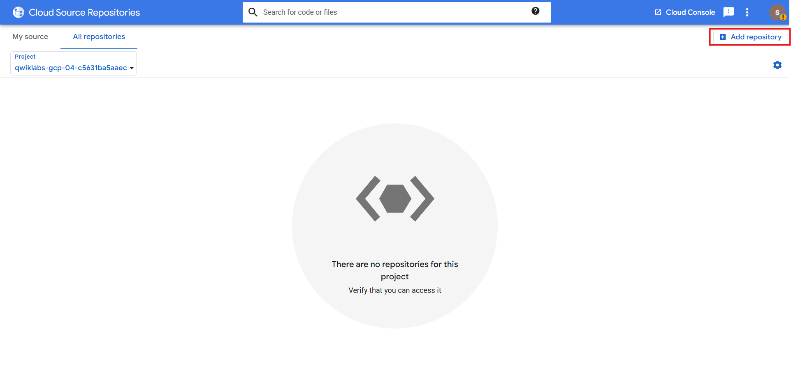

3. Select Create new repository and click Continue.

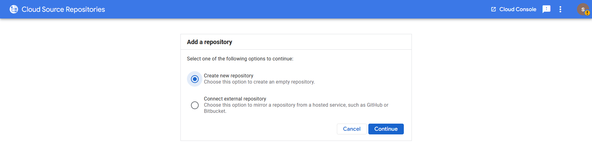

4. Name the repository `devops-repo`.

5. Select your current project ID from the list.

6. Click Create.

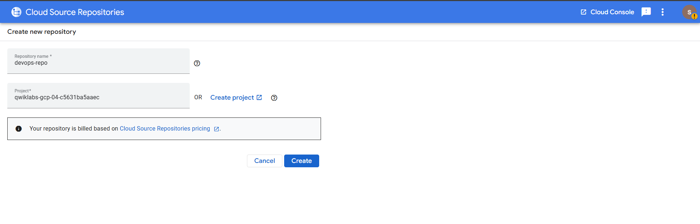

7. Click Cloud Console, and in the new tab click Activate Cloud Shell.

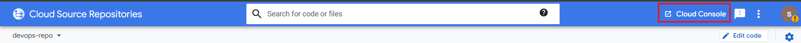

8. If prompted, click Continue.

9. Enter the following command in Cloud Shell to create a folder called `gcp-course`:

```bash
mkdir gcp-course
```

10. Change to the folder you just created:

```bash
cd gcp-course
```

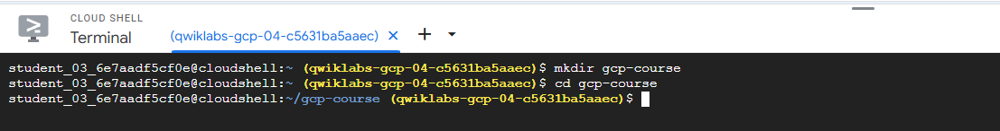

11. Now clone the empty repository you just created. If prompted, click Authorize:

```bash
gcloud source repos clone devops-repo
```

> Note: You may see a warning that you have cloned an empty repository. That is expected at this point.

12. The previous command created an empty folder called devops-repo. Change to that folder:

```bash
cd devops-repo
```

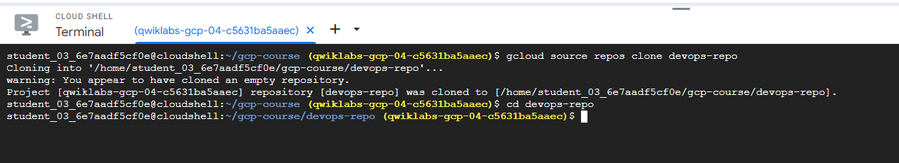

### 2. Create a simple Python application

1. In Cloud Shell, click Open Editor (Editor icon) to open the code editor.

2. Select the gcp-course > devops-repo folder in the explorer tree on the left.

3. Click on devops-repo.

4. Click New File.

5. Name the file `main.py` and press Enter.

6. Paste the following code into the file you just created:

```python
from flask import Flask, render_template, request

app = Flask(__name__)

@app.route("/")
def main():
    model = {"title": "Hello DevOps Fans."}
    return render_template('index.html', model=model)

if __name__ == "__main__":
    app.run(host='0.0.0.0', port=8080, debug=True, threaded=True)
```

7. To save your changes. Press CTRL + S.

8. Click on the `devops-repo` folder.

9. Click New Folder.

10. Name the folder `templates` and press Enter.

11. Right-click on the `templates` folder and create a new file called `layout.html`.

12. Add the following code and save the file as you did before:

```html
<!DOCTYPE html>
<html lang="en">
  <head>
    <title>{{model.title}}</title>
    <!-- Bootstrap CSS -->
    <link
      rel="stylesheet"
      href="https://stackpath.bootstrapcdn.com/bootstrap/4.4.1/css/bootstrap.min.css"
    />
  </head>
  <body>
    <div class="container">
      

      <footer></footer>
    </div>
  </body>
</html>
```

13. Also in the `templates` folder, add another new file called `index.html`.

14. Add the following code and save the file as you did before:

```js


<div class="jumbotron">
  <div class="container">
    <h1>{{model.title}}</h1>
  </div>
</div>

```

15. In Python, application prerequisites are managed using pip. Now you will add a file that lists the requirements for this application.

16. In the `devops-repo` folder (not the templates folder), create a New File and add the following to that file and save it as `requirements.txt`:

```bash
Flask>=2.0.3
```

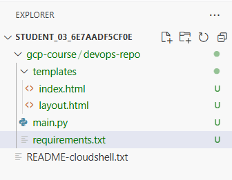

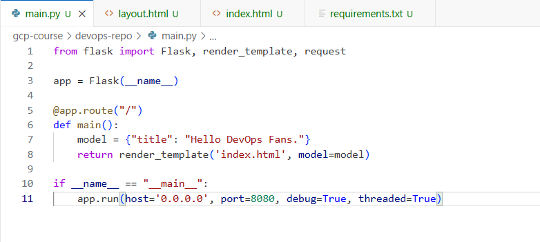

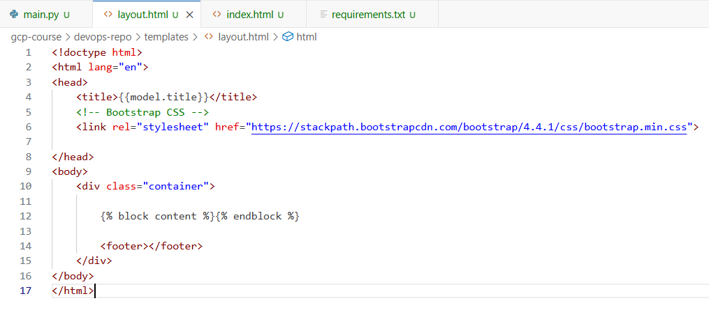

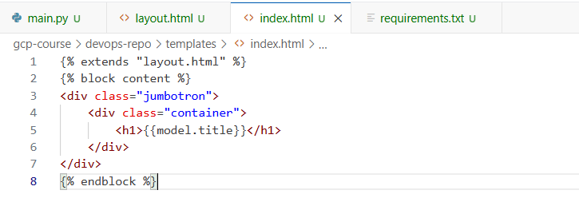


17. You have some files now, so save them to the repository. First, you need to add all the files you created to your local Git repo. Click Open Terminal and in Cloud Shell, enter the following code:

```bash
cd ~/gcp-course/devops-repo
git add --all
```

18. To commit changes to the repository, you have to identify yourself. Enter the following commands, but with your information (you can just use your Gmail address or any other email address):

```bash
git config --global user.email "you@example.com"
git config --global user.name "Your Name"
```

19. Now, commit the changes locally:

```bash
git commit -a -m "Initial Commit"
```

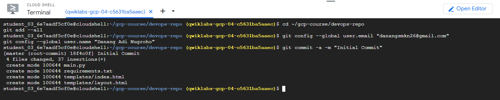

20. You committed the changes locally, but have not updated the Git repository you created in Cloud Source Repositories. Enter the following command to push your changes to the cloud:

```bash
git push origin master
```

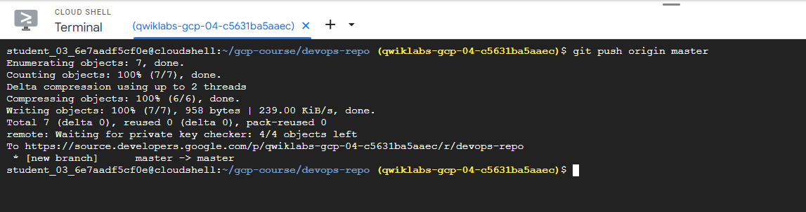

21. Refresh the `Cloud Source Repositories` web page. You should see the files you just created.

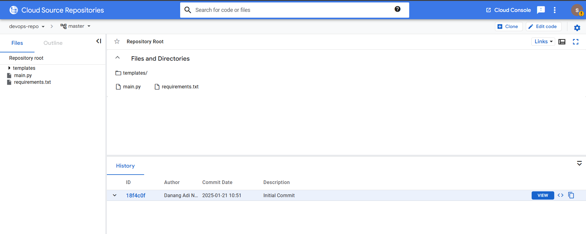

### 3. Define a Docker build

The first step to using Docker is to create a file called `Dockerfile`. This file defines how a Docker container is constructed. You will do that now.

1. Click `Open Editor`, and expand the `gcp-course/devops-repo` folder. With the `devops-repo` folder selected, click New File and name the new file `Dockerfile`.

The file Dockerfile is used to define how the container is built.

2. At the top of the file, enter the following:

```bash
FROM python:3.9
```

3. Enter the following:

```bash
WORKDIR /app
COPY . .
```

These lines copy the source code from the current folder into the /app folder in the container image.

4. Enter the following:

```bash
RUN pip install gunicorn
RUN pip install -r requirements.txt
```

5. Enter the following:

```bash
ENV PORT=80
CMD exec gunicorn --bind :$PORT --workers 1 --threads 8 main:app
```

6. Verify that the completed file looks as follows and save it:

```bash
FROM python:3.9
WORKDIR /app
COPY . .
RUN pip install gunicorn
RUN pip install -r requirements.txt
ENV PORT=80
CMD exec gunicorn --bind :$PORT --workers 1 --threads 8 main:app
```

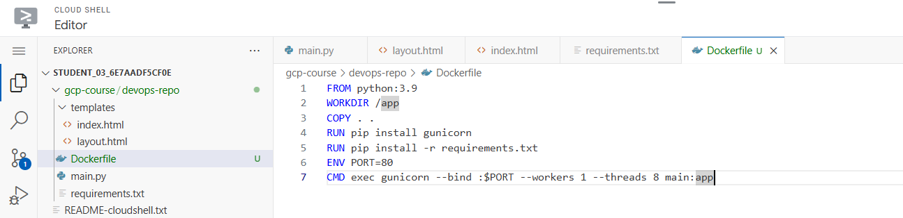

### 4. Manage Docker images with Cloud Build and Artifact Registry

The Docker image has to be built and then stored somewhere. You will use Cloud Build and Artifact Registry.

1. Click Open Terminal to return to Cloud Shell. Make sure you are in the right folder:

```bash
cd ~/gcp-course/devops-repo
```

2. The Cloud Shell environment variable DEVSHELL_PROJECT_ID automatically has your current project ID stored. The project ID is required to store images in Artifact Registry. Enter the following command to view your project ID:

```bash
echo $DEVSHELL_PROJECT_ID
```

3. Enter the following command to create an Artifact Registry repository named devops-repo:

```bash
gcloud artifacts repositories create devops-repo \
    --repository-format=docker \
    --location="REGION"
```

4. To configure Docker to authenticate to the Artifact Registry Docker repository, enter the following command:

```bash
gcloud auth configure-docker "REGION"-docker.pkg.dev
```

5. To use Cloud Build to create the image and store it in Artifact Registry, type the following command:

```bash
gcloud builds submit --tag "REGION"-docker.pkg.dev/$DEVSHELL_PROJECT_ID/devops-repo/devops-image:v0.1 .
```


6. On the Google Cloud console title bar, type Artifact Registry in the Search field, then click Artifact Registry in the Products & Pages section.

7. Click on the Pin icon next to Artifact Registry.

8. Click devops-repo.

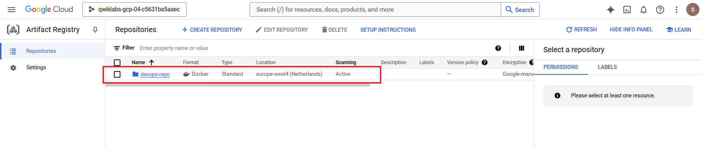

9. Click devops-image. Your image should be listed.

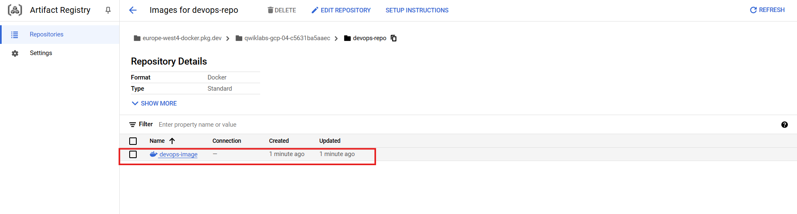

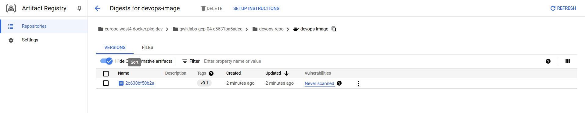

10. On the Google Cloud console title bar, type Cloud Build in the Search field, then click Cloud Build in the Products & Pages section.

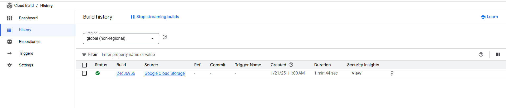

11. Click on the Pin icon next to Cloud Build.

12. Your build should be listed in the history.

You will now try running this image from a Compute Engine virtual machine.

13. On the Navigation menu, click Compute Engine > VM Instance.

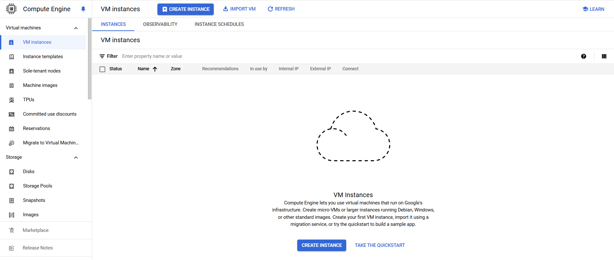

14. Click Create Instance to create a VM.

15. On the Create an instance page, specify the following, and leave the remaining settings as their defaults:

| Property        | Value                                                                                     |
| --------------- | ----------------------------------------------------------------------------------------- |
| Container       | Click DEPLOY CONTAINER                                                                    |
| Container image | '`Lab Region`-docker.pkg.dev/`Project ID`/devops-repo/devops-image:v0.1` and click SELECT |
| Firewall        | Allow HTTP traffic                                                                        |

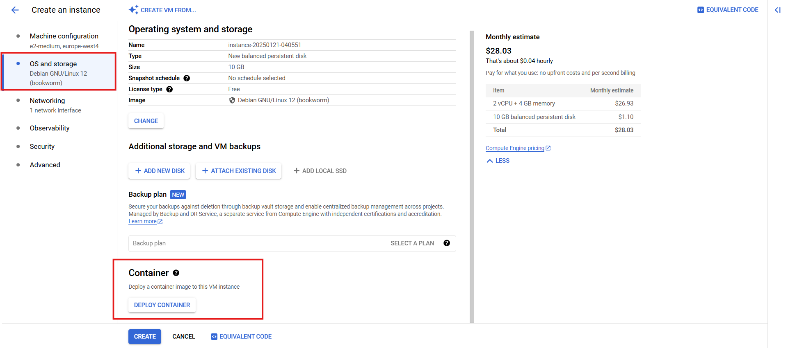

> See Container Image
>
> `europe-west4-docker.pkg.dev/qwiklabs-gcp-04-c5631ba5aaec/devops-repo/devops-image:v0.1`

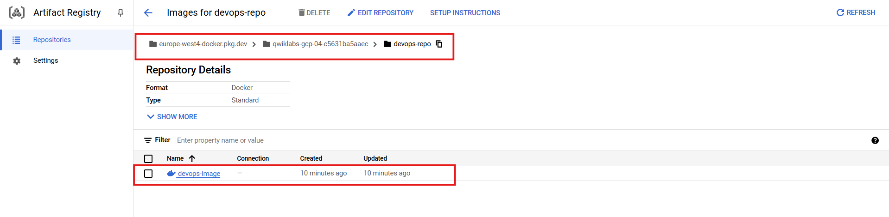

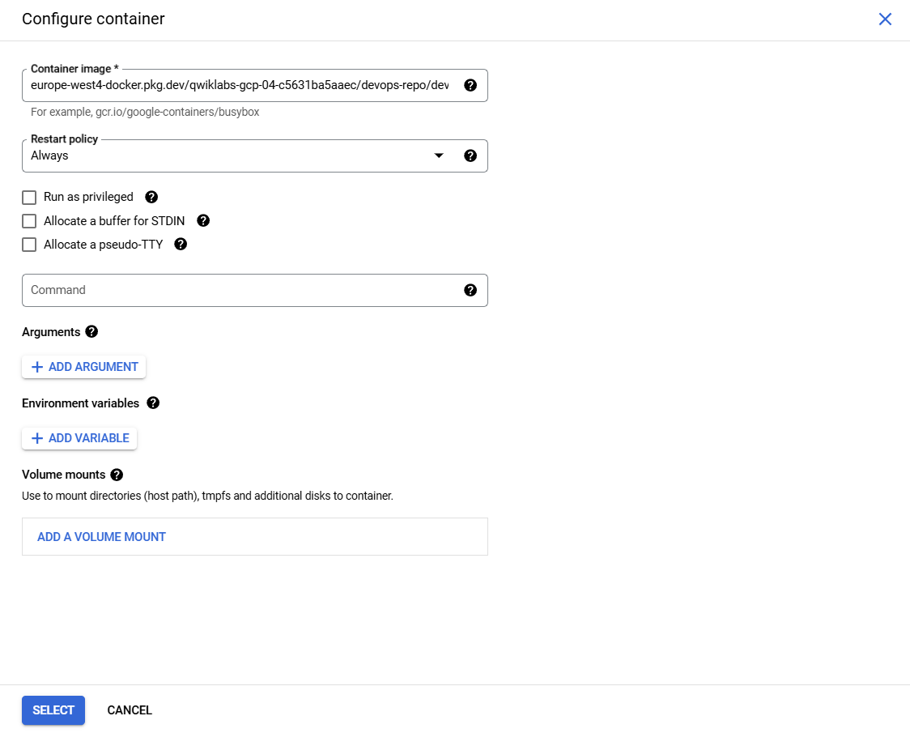

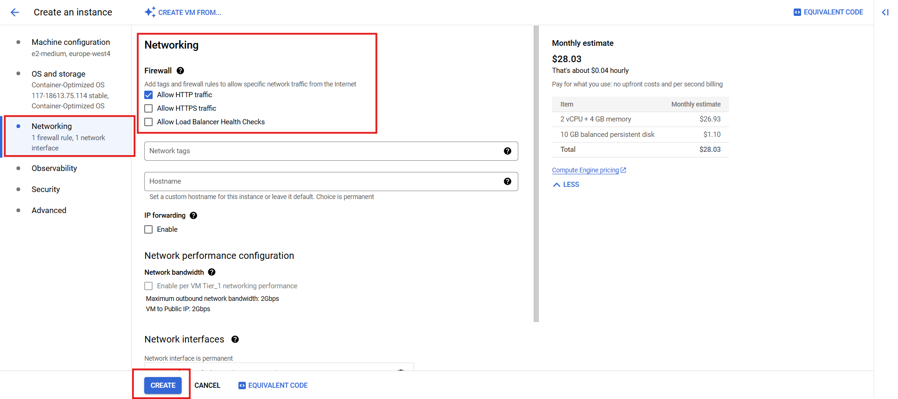

16. Click Create.

17. Once the VM starts, click the VM's external IP address. A browser tab opens and the page displays `Hello DevOps Fans`.

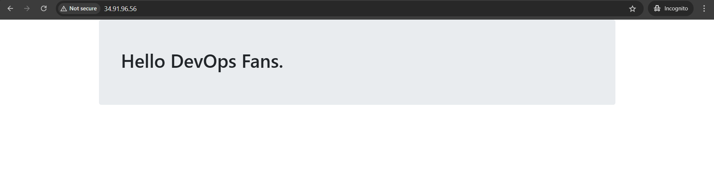

> Note: You might have to wait a minute or so after the VM is created for the Docker container to start.

18. You will now save your changes to your Git repository. In Cloud Shell, enter the following to make sure you are in the right folder and add your new Dockerfile to Git:

```bash
cd ~/gcp-course/devops-repo
git add --all
```

19. Commit your changes locally:

```bash
git commit -am "Added Docker Support"
```

20. Push your changes to Cloud Source Repositories:

```bash
git push origin master
```

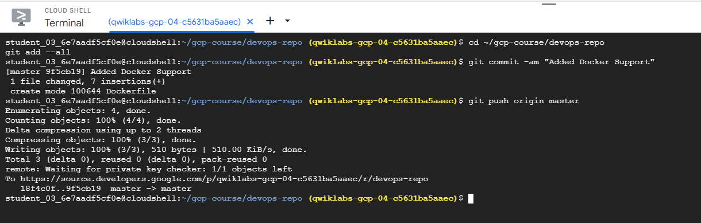

21. Return to Cloud Source Repositories and verify that your changes were added to source control.

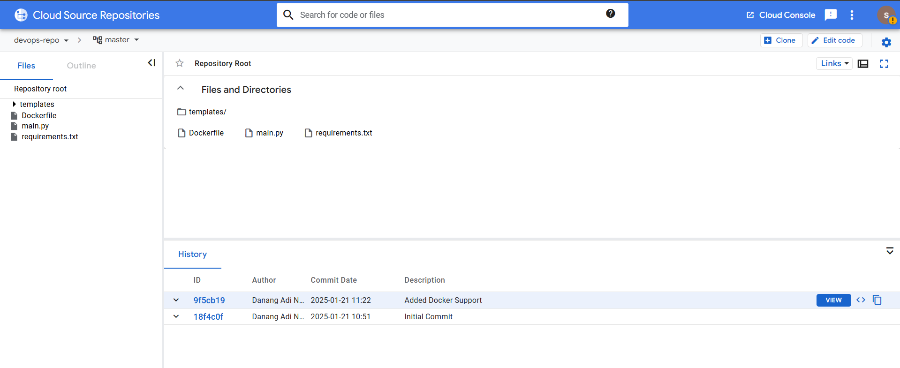

### 5. Automate builds with triggers

1. On the Navigation menu, click Cloud Build. The Build history page should open, and one or more builds should be in your history.

2. Click Settings.

3. From Service account dropdown, select `Project ID`@`Project ID`.iam.gserviceaccount.com

4. Enable the Set as Preferred Service Account option. Set the status of the Cloud Build service to Enabled.

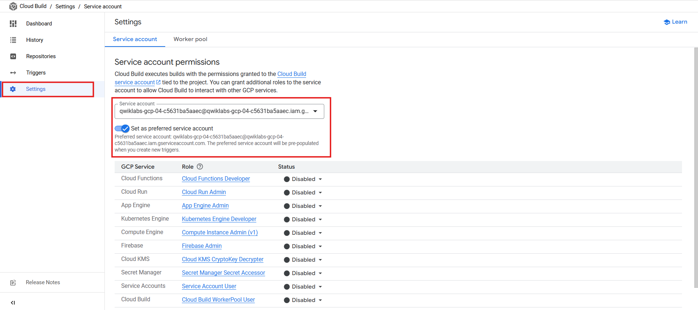

5. Go to Triggers in the left navigation and click Create trigger.

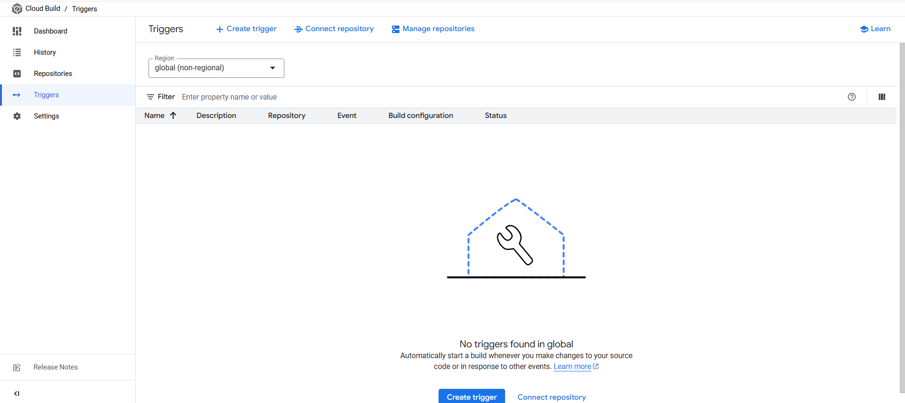

6. Specify the following:

| Property           | Value                                         |
| ------------------ | --------------------------------------------- |
| Name               | devops-trigger                                |
| Region             | `Lab Region`                                  |
| Repository         | devops-repo(Cloud Source Repositories)        |
| Branch             | .\*(any branch)                               |
| Configuration Type | Cloud Build configuration file (yaml or json) |
| Location           | Inline                                        |

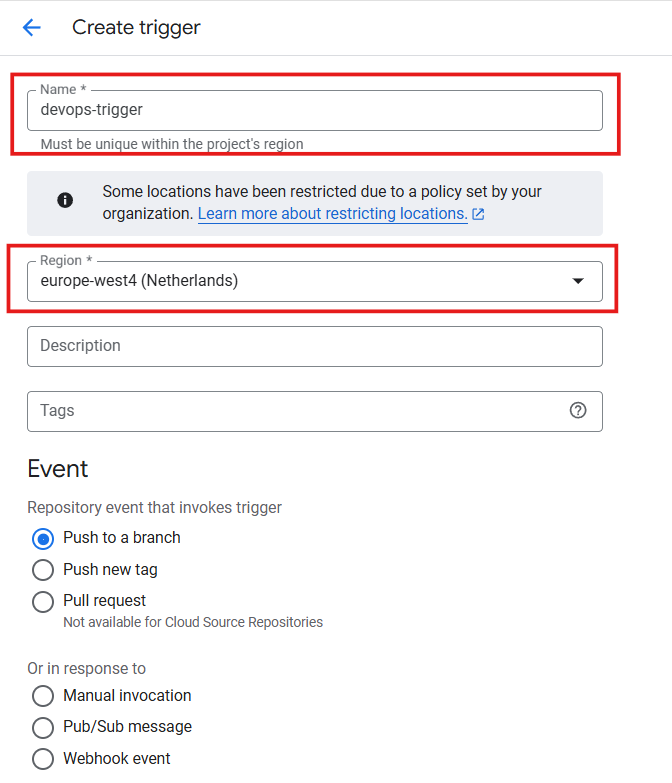

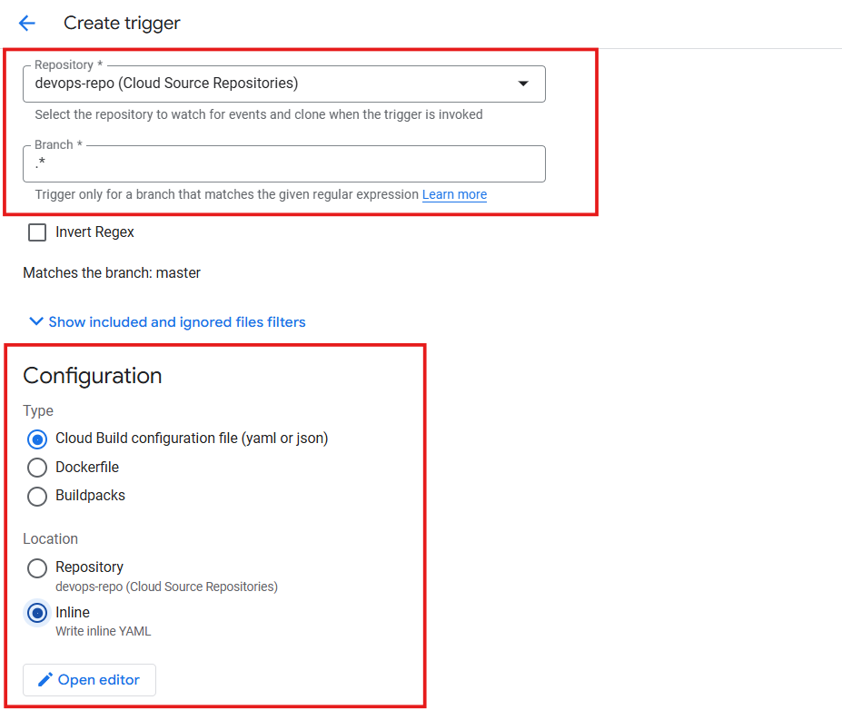

7. Click Open Editor and replace the code with the code mentioned below and click Done.

```bash
steps:
  - name: 'gcr.io/cloud-builders/docker'
    args: ['build', '-t', 'REGION-docker.pkg.dev/Project ID/devops-repo/devops-image:$COMMIT_SHA', '.']
images:
  - 'REGION-docker.pkg.dev/Project ID/devops-repo/devops-image:$COMMIT_SHA'
options:
  logging: CLOUD_LOGGING_ONLY
```

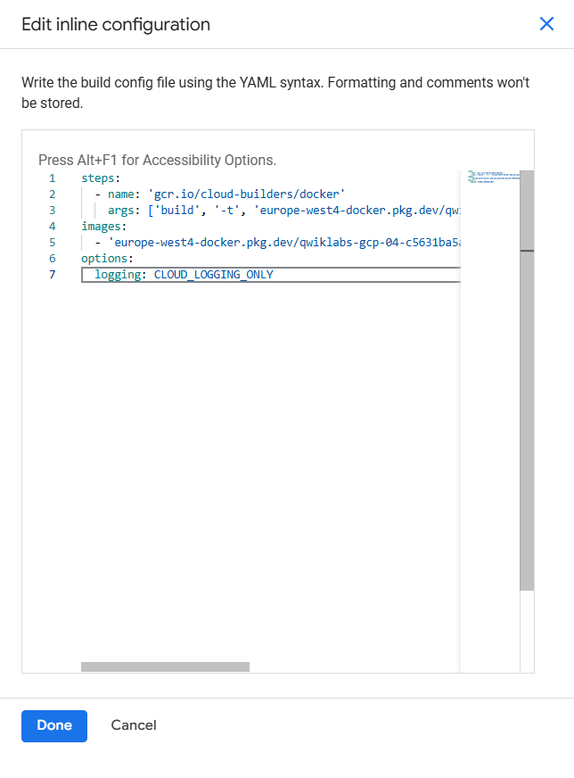

8. For Service account select the service account starting with your project-id that look similar to (Project ID@Project ID.iam.gserviceaccount.com) and and click Create.

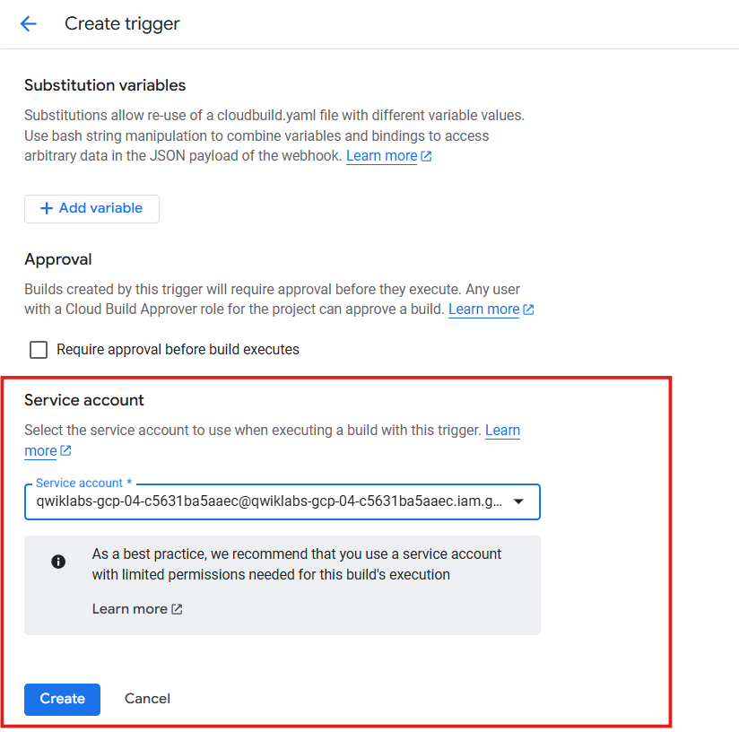

9. To test the trigger, click Run and then Run trigger.


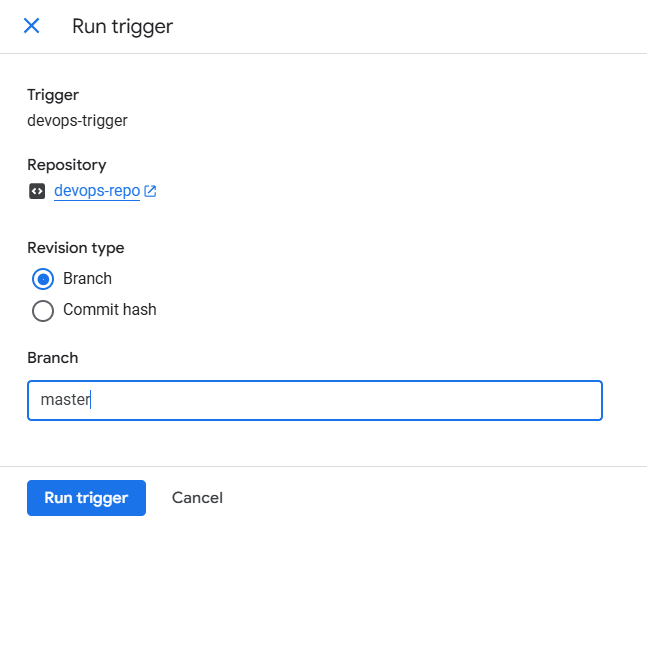

10. Click the History link and you should see a build running. Wait for the build to finish, and then click the link to it to see its details.

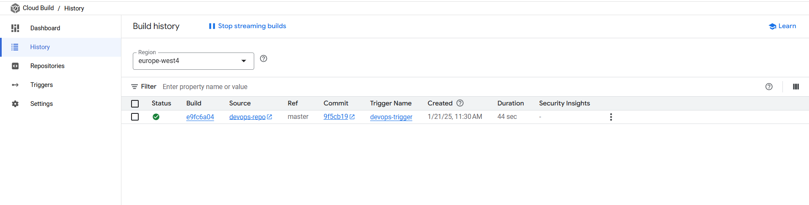

11. Scroll down and look at the logs. The output of the build here is what you would have seen if you were running it on your machine.

12. Return to the Artifact Registry service. You should see a new image in the devops-repo > devops-image folder.

13. Return to the Cloud Shell Code Editor. Find the file main.py in the gcp-course/devops-repo folder.

14. In the main() function, change the title property to "Hello Build Trigger." as shown below:

```py
@app.route("/")
def main():
    model = {"title":  "Hello Build Trigger."}
    return render_template("index.html", model=model)
```

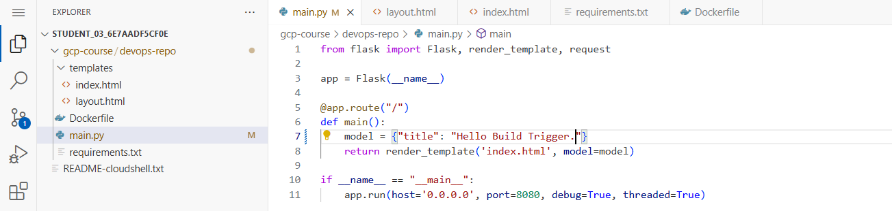

15. Commit the change with the following command:

```bash
cd ~/gcp-course/devops-repo
git commit -a -m "Testing Build Trigger"
```

16. Enter the following to push your changes to Cloud Source Repositories:

```bash
git push origin master
```

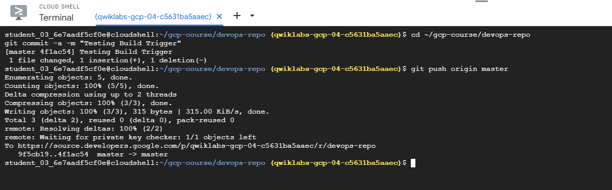

17. Return to the Cloud Console and the Cloud Build service. You should see another build running.

### 6. Test your build changes

1. When the build completes, click on it to see its details.

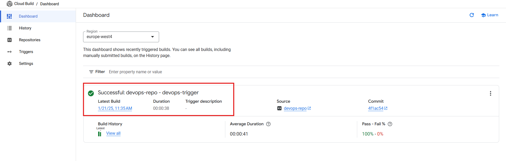

2. Click Execution Details

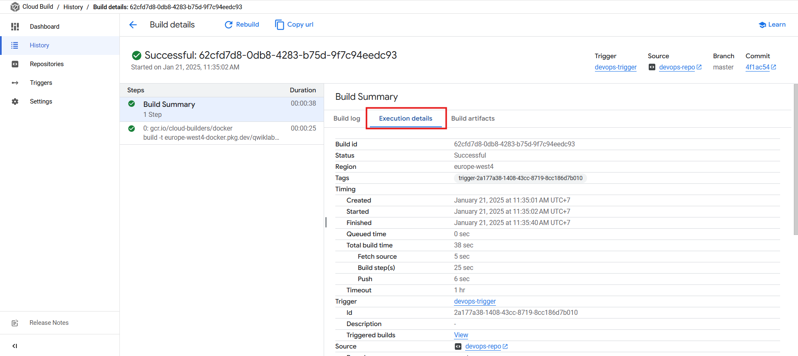

3. Click the Image name. This redirects you to the image page in Artifact Registry.

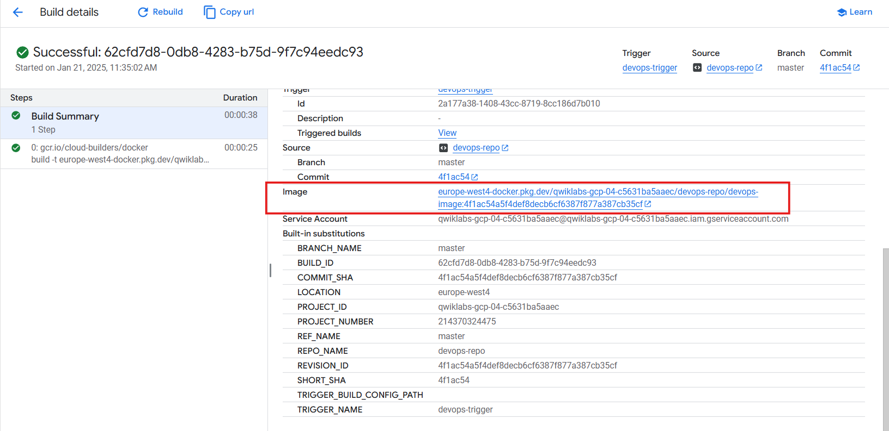

4. At the top of the pane, click copy next to the image name. You will need this for the next steps. The format will look as follows.

```bash
Lab Region-docker.pkg.dev/Project ID/devops-demo/devops-image@sha256:8aede81a8b6ba1a90d4d808f509d05ddbb1cee60a50ebcf0cee46e1df9a54810
```

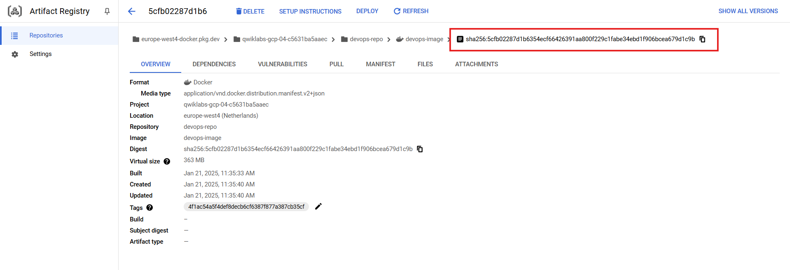

> Note: Do not use the image name located in Digest.

5. Go to the Compute Engine service. As you did earlier, create a new virtual machine to test this image. Click DEPLOY CONTAINER and paste the image you just copied.

6. Select Allow HTTP traffic.

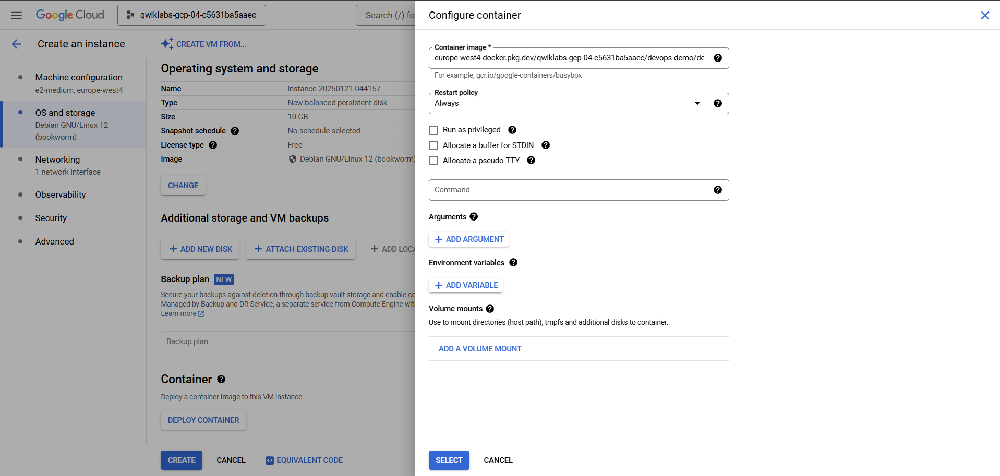

7. When the machine is created, test your change by making a request to the VM's external IP address in your browser. Your new message should be displayed.

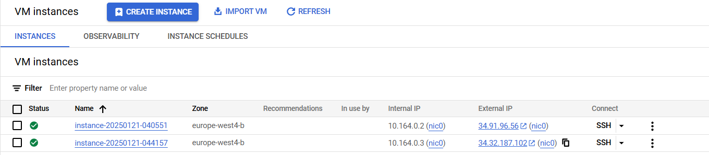

> Note: You might have to wait a few minutes after the VM is created for the Docker container to start.
