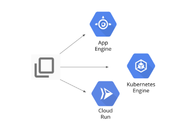

# Deploying Apps to Google Cloud



### 1. Create a simple Python application

You need some source code to manage. So, you will create a simple Python Flask web application. The application will be only slightly better than "hello world", but it will be good enough to test the pipeline you will build.

1. In the Cloud Console, click Activate Cloud Shell (Activate Cloud Shell icon).

2. If prompted, click Continue.

3.9. Enter the following command in Cloud Shell to create a folder called gcp-course:

```bash
mkdir gcp-course
```

3. Change to the folder you just created:

```bash
cd gcp-course
```

4. Create a folder called deploying-apps-to-gcp:

```bash
mkdir deploying-apps-to-gcp
```

5. Change to the folder you just created:

```bash
cd deploying-apps-to-gcp
```

6. In Cloud Shell, click Open Editor (Editor icon) to open the code editor. If prompted click Open in a new window.

7. Select the gcp-course > deploying-apps-to-gcp folder in the explorer tree on the left.

8. Click on deploying-apps-to-gcp.

9. Click New File.

10. Name the file main.py and press Enter.

11. Paste the following code into the file you just created:

```py
from flask import Flask, render_template, request

app = Flask(__name__)

@app.route("/")
def main():
    model = {"title": "Hello GCP."}
    return render_template('index.html', model=model)

if __name__ == "__main__":
    app.run(host='0.0.0.0', port=8080, debug=True, threaded=True)
```

12. To save your changes. Press CTRL + S.

13. Click on the deploying-apps-to-gcp folder.

14. Click New Folder.

15. Name the folder templates and press Enter.

16. Right-click on the templates folder and create a new file called layout.html.

17. Add the following code and save the file as you did before:

```html
<!DOCTYPE html>
<html lang="en">
  <head>
    <title>{{model.title}}</title>
    <!-- Bootstrap CSS -->
    <link
      rel="stylesheet"
      href="https://stackpath.bootstrapcdn.com/bootstrap/4.4.1/css/bootstrap.min.css"
    />
  </head>
  <body>
    <div class="container">
      

      <footer></footer>
    </div>
  </body>
</html>
```

18. Also in the templates folder, add another new file called index.html.

19. Add the following code and save the file as you did before:

```py


<div class="jumbotron">
    <div class="container">
        <h1>{{model.title}}</h1>
    </div>
</div>

```

20. In Python, application prerequisites are managed using pip. Now you will add a file that lists the requirements for this application.

21. In the deploying-apps-to-gcp folder (not the templates folder), create a New File and add the following to that file and save it as requirements.txt:

```bash
Flask==2.0.3
itsdangerous==2.0.1
Jinja2==3.0.3
werkzeug==2.2.2
```

### 2. Define a Docker build'

The first step to using Docker is to create a file called Dockerfile. This file defines how a Docker container is constructed. You will do that now.

1. In the deploying-apps-to-gcp folder, click New File and name the new file Dockerfile.

The file Dockerfile is used to define how the container is built.

2. Add the following:

```bash
FROM python:3.9
WORKDIR /app
COPY . .
RUN pip install gunicorn
RUN pip install -r requirements.txt
ENV PORT=8080
CMD exec gunicorn --bind :$PORT --workers 1 --threads 8 main:app
```

3. To test the program, type the following command to build a Docker container of the image:

```bash
docker build -t test-python .
```

4. To run the Docker image, type the following command:

```bash
docker run --rm -p 8080:8080 test-python
```

5. To see the program running, click Web Preview (Web Preview icon) in the toolbar of Google Cloud Shell. Then, select Preview on port 8080.

The program should be displayed in a new browser tab.

6. In Cloud Shell, type Ctrl+C to stop the program.

### 3. Deploy to App Engine

1. In Cloud Shell, click Open Editor (Cloud Shell Editor icon), then click Open in a new window if required.

2. Select the gcp-course/deploying-apps-to-gcp folder in the explorer tree on the left.

3. Click New File, name the file app.yaml, and then press Enter.

4. Paste the following into the file you just created:

```bash
runtime: python39
```

5. Save your changes.

6. In a project, an App Engine application has to be created. This is done just once using the gcloud app create command and specifying the region where you want the app to be created. Click Open Terminal and type the following command. If prompted, click Authorize:

```bash
gcloud app create --region=Region
```

7. Now deploy your app with the following command:

```bash
gcloud app deploy --version=one --quiet
```

8. On the Google Cloud console title bar, type App Engine in the Search field, then click App Engine in the Search Results section.

9. In the upper-right corner of the dashboard is a link to your application, similar to this:

> Note: By default, the URL to an App Engine application is in the form of `https://project-id.appspot.com`.

10. Click on the link to test your program.

11. Make a change to the program to see how easy the App Engine makes managing versions.

12. In the code editor, expand the /deploying-apps-to-gcp folder in the navigation pane on the left. Then, click main.py to open it.

13. In the main() function, change the title to Hello App Engine as shown below:

```py
@app.route("/")
def main():
    model = {"title" "Hello App Engine"}
    return render_template('index.html', model=model)
```

14. Click File > Save in the code editor toolbar to save your change.

15. Now, deploy version two with the following command:

```bash
gcloud app deploy --version=two --no-promote --quiet
```

> Note: The `--no-promote` parameter tells App Engine to continue serving requests with the old version. This allows you to test the new version before putting it into production.

16. When the command completes, return to the App Engine dashboard. Click the link again, and version one will still be returned. It should return `Hello GCP`. This is because of the `--no-promote` parameter in the previous command.

17. On the left, click the Versions tab. Notice that two versions are listed.

18. Click on the version two link to test it. It should return `Hello App Engine`.

19. To migrate production traffic to version two, click Split Traffic at the top. Change the version to two, and click Save.

20. Give it a minute to complete. Refresh the browser tab that earlier returned `Hello GCP`. It should now return the new version.

### 4. Deploy to Kubernetes Engine with Cloud Build and Artifact Registry

1. On the Navigation menu, click Kubernetes Engine. If a message appears saying the Kubernetes API is being initialized, wait for it to complete.

2. Click Create Cluster then click Switch to Standard Cluster confirm Switch to Standard Cluster.

3. Click Zonal for Location type and then select the zone `Zone`. Accept all the other variables as default then click Create. It will take a couple of minutes for the Kubernetes Engine cluster to be created. When the cluster is ready, a green check appears.

4. Click the three dots to the right of the cluster and then click Connect.

5. In the Connect to the cluster screen, click Run in Cloud Shell. This opens Cloud Shell with the connect command entered automatically.

6. Press Enter to connect to the cluster.

7. To test your connection, type the following command:

```bash
kubectl get nodes
```

8. In Cloud Shell, click Open Editor.

9. Expand the gcp-course/deploying-apps-to-gcp folder in the navigation pane on the left. Then,
   click main.py to open it.

10. In the main() function, change the title to Hello Kubernetes Engine as shown below:

```py
@app.route("/")
def main():
    model = {"title" "Hello Kubernetes Engine"}
    return render_template('index.html', model=model)
```

11. Save your change.

12. Add a file named `kubernetes-config.yaml` to the `gcp-course/deploying-apps-to-gcp` folder.

13. Paste the following code in that file to configure the application:

```bash
---
apiVersion: apps/v1
kind: Deployment
metadata:
  name: devops-deployment
  labels:
    app: devops
    tier: frontend
spec:
  replicas: 3
  selector:
    matchLabels:
      app: devops
      tier: frontend
  template:
    metadata:
      labels:
        app: devops
        tier: frontend
    spec:
      containers:
      - name: devops-demo
        image: <YOUR IMAGE PATH HERE>
        ports:
        - containerPort: 8080

---
apiVersion: v1
kind: Service
metadata:
  name: devops-deployment-lb
  labels:
    app: devops
    tier: frontend-lb
spec:
  type: LoadBalancer
  ports:
  - port: 80
    targetPort: 8080
  selector:
    app: devops
    tier: frontend
```

> Note: In the first section of the YAML file above, you are configuring a deployment. In this case, you are deploying 3 instances of your Python web app. Notice the image attribute. You will update this value with your image in a minute after you build it. In the second section, you are configuring a service of the type "load balancer". The load balancer will have a public IP address. Users will access your application through the load balancer.
>
> For more information on Kubernetes deployments and services, see the links below:
>
> - [Kubernetes Deployments page](https://kubernetes.io/docs/concepts/workloads/controllers/deployment/)
> - [Kubernetes Create an External Load Balancer page](https://kubernetes.io/docs/tasks/access-application-cluster/create-external-load-balancer/)

14. In Cloud Shell type the following command to create an Artifact Registry repository named devops-demo:

```bash
gcloud artifacts repositories create devops-demo \
    --repository-format=docker \
    --location="REGION"
```

15. To configure Docker to authenticate to the Artifact Registry Docker repository, type the following command:

```bash
gcloud auth configure-docker "REGION"-docker.pkg.dev
```

16. To use Kubernetes Engine, you need to build a Docker image. Type the following commands to use Cloud Build to create the image and store it in Artifact Registry:

```bash
cd ~/gcp-course/deploying-apps-to-gcp
gcloud builds submit --tag "REGION"-docker.pkg.dev/$DEVSHELL_PROJECT_ID/devops-demo/devops-image:v0.2 .
```

17. When the previous command completes, the image name will be listed in the output. The image name is in the form `REGION`-docker.pkg.dev/PROJECT_ID/devops-demo/devops-image:v0.2.

18. Highlight your image name and copy it to the clipboard. Paste that value in the kubernetes-config.yaml file, overwriting the string <YOUR IMAGE PATH HERE>.

You should see something similar to below:

```bash
spec:
  containers:
  - name: devops-demo
    image: "REGION"-docker.pkg.dev/PROJECT_ID/devops-demo/devops-image:v0.2
    ports:
```

19. Type the following Kubernetes command to deploy your application:

```bash
kubectl apply -f kubernetes-config.yaml
```

20. In the configuration file, three replicas of the application were specified. Type the following command to see whether three instances have been created:

```bash
kubectl get pods
```

Make sure all the pods are ready. If they aren't, wait a few seconds and try again.

21. A load balancer was also added in the configuration file. Type the following command to see whether it was created:

```bash
kubectl get services
```

You should see something similar to below:

If the load balancer's external IP address says "pending", wait a few seconds and try again.

22. When you have an external IP, open a browser tab and make a request to it. It should return Hello Kubernetes Engine. It might take a few seconds to be ready.

### 5. Deploy to Cloud Run

1. Open the Cloud Shell code editor and expand the `gcp-course/deploying-apps-to-gcp` folder in the navigation pane on the left. Then, click main.py to open it.

2. In the main() function, change the title to `Hello Cloud Run` as shown below:

```py
@app.route("/")
def main():
    model = {"title" "Hello Cloud Run"}
    return render_template('index.html', model=model)
```

3. Save your change.

4. To use Cloud Run, you need to build a Docker image. In Cloud Shell, type the following commands to use Cloud Build to create the image and store it in Artifact Registry:

```bash
cd ~/gcp-course/deploying-apps-to-gcp
gcloud builds submit --tag "REGION"-docker.pkg.dev/$DEVSHELL_PROJECT_ID/devops-demo/cloud-run-image:v0.1 .
```

5. When the build completes, on the Google Cloud console title bar, type Cloud Run in the Search field, then click Cloud Run in the Products & Pages section.

6. Click Create service. This enables the Cloud Run API.

7. Click the Select link in the `Container image` URL text box and then click Artifact Registry. In the resulting dialog, expand Region-docker.pkg.dev/$DEVSHELL_PROJECT_ID/devops-demo > cloud-run-image and select the image listed. Then click Select.

8. In Service name, type hello-cloud-run and select region `REGION`.

9. For Authentication, select Allow unauthenticated invocations.

10. In Container(s), Volumes, Networking, Security, select Default in the Execution environment section.

11. In Revision scaling, set the Maximum number of instances to 6. Leave the rest as defaults.

12. Finally, click Create.

13. It shouldn't take long for the service to deploy. When a green check appears, click on the URL that is automatically generated for the application. It should return `Hello Cloud Run`.
