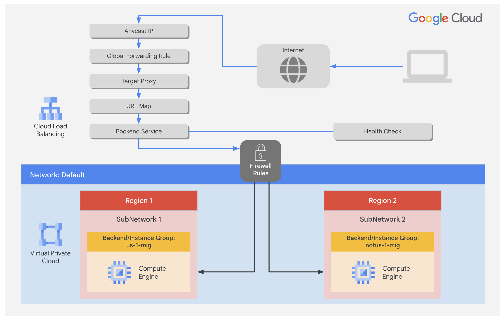

# Configure an Application Load Balancer with Autoscaling



### 1. Configure a health check firewall rule

Health checks determine which instances of a Application Load Balancer (HTTP) can receive new connections. The health check probes to your load-balanced instances come from addresses in the ranges 130.211.0.0/22 and 35.191.0.0/16. Your firewall rules must allow these connections.

#### Create the health check rule

Create a firewall rule to allow health checks.

1. In the Cloud Console, on the Navigation menu (Navigation menu icon), click VPC network > Firewall.
   Notice the existing ICMP, internal, RDP, and SSH firewall rules.

2. Each Google Cloud project starts with the default network and these firewall rules.

3. Click Create Firewall Rule.

4. Specify the following, and leave the remaining settings as their defaults:

| Property            | Value                            |
| ------------------- | -------------------------------- |
| Name                | fw-allow-health-checks           |
| Network             | default                          |
| Targets             | Specified target tags            |
| Target tags         | allow-health-checks              |
| Source filter       | IPv4 ranges                      |
| Source IPv4 ranges  | 130.211.0.0/22 and 35.191.0.0/16 |
| Protocols and ports | Specified protocols and ports    |

> Note: Make sure to include the /22 and /16 in the Source IP ranges.

4. Select tcp and specify port 80.

5. Click Create.

### 2. Create a NAT configuration using Cloud Router

#### Create the Cloud Router instance

1. On the Google Cloud console title bar, type Network services in the Search field, then click Network services in the Network management tools section.

2. On the Network service page, click Pin next to Network services.

3. Click Cloud NAT.

4. Click Get started to configure a NAT gateway.

5. Specify the following, and leave the remaining settings as their defaults:

| Property     | Value      |
| ------------ | ---------- |
| Gateway name | nat-config |
| Network      | default    |
| Region       | `Region 1` |

6. Click Cloud Router, and select Create new router.

7. For Name, type nat-router-us1.

8. Click Create.

9. In Create a NAT gateway, click Create.

> Note: Wait until the NAT Gateway Status changes to Running before moving onto the next task.

### 3. Create a custom image for a web server

#### Create a VM

1. In the Cloud Console, on the Navigation menu (Navigation menu icon), click Compute Engine > VM instances.

2. Click Create Instance.

3. Specify the following, and leave the remaining settings as their defaults:

| Property | Value      |
| -------- | ---------- |
| Name     | webserver  |
| Region   | `Region 1` |
| Zone     | `Zone 1`   |

4. Click OS and storage, and then click Change.

5. Click Show Advanced Configuration.

6. For Deletion rule, select Keep boot disk.

7. Click Select.

8. Click Networking.

   - For Network tags, type allow-health-checks.
   - For Network interfaces , click default.
   - For External IPv4 address dropdown, select None.

9. Click Done.

10. Click Create.

#### Customize the VM

1. For webserver, click SSH to launch a terminal and connect.

2. If prompted allow SSH-in-browser to connect to VMs, click Authorize.

3. To install Apache2, run the following commands:

```bash
sudo apt-get update
sudo apt-get install -y apache2
```

4. To start the Apache server, run the following command:

```bash
sudo service apache2 start
```

5. To test the default page for the Apache2 server, run the following command:

```bash
curl localhost
```

The default page for the Apache2 server should be displayed.

#### Set the Apache service to start at boot

The software installation was successful. However, when a new VM is created using this image, the freshly booted VM does not have the Apache web server running. Use the following command to set the Apache service to automatically start on boot. Then test it to make sure it works.

1. In the webserver SSH terminal, set the service to start on boot:

```bash
sudo update-rc.d apache2 enable
```

2. In the Cloud Console, select webserver, and then click More actions [:].

3. Click Reset.

4. In the confirmation dialog, click Reset.

> Note: Reset will stop and reboot the machine. It keeps the same IPs and the same persistent boot disk, but memory is wiped. Therefore, if the Apache service is available after the reset, the update-rc command was successful.

5. Check the server by connecting via SSH to the VM and entering the following command:

```bash
sudo service apache2 status
```

> Note: If you see the Connection via Cloud Identity-Aware Proxy Failed popup, click Retry.

6. The result should show Started The Apache HTTP Server.

#### Prepare the disk to create a custom image

Verify that the boot disk will not be deleted when the instance is deleted.

1. On the VM instances page, click webserver to view the VM instance details.

2. For Storage > Boot disk, verify that When deleting instance is set to Keep disk.

3. Return to the VM instances page, select webserver, and then click More actions[:].

4. Click Delete.

5. In the confirmation dialog, click Delete.

6. In the left pane, click Disks and verify that the webserver disk exists.

#### Create the custom image

1. In the left pane, click Images.

2. Click Create image.

3. Specify the following, and leave the remaining settings as their defaults:

| Property    | Value       |
| ----------- | ----------- |
| Name        | mywebserver |
| Source      | Disk        |
| Source disk | webserver   |

4. Click Create.

> Note: You have created a custom image that multiple identical webservers can be started from. At this point, you could delete the webserver disk.
