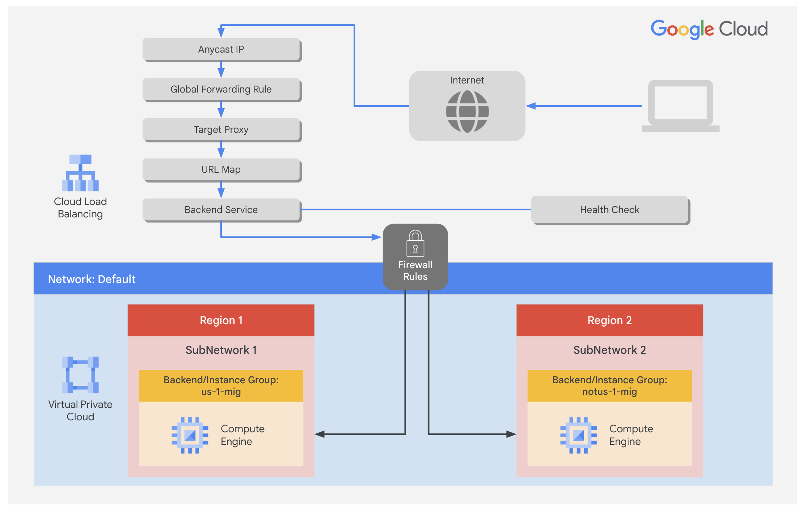
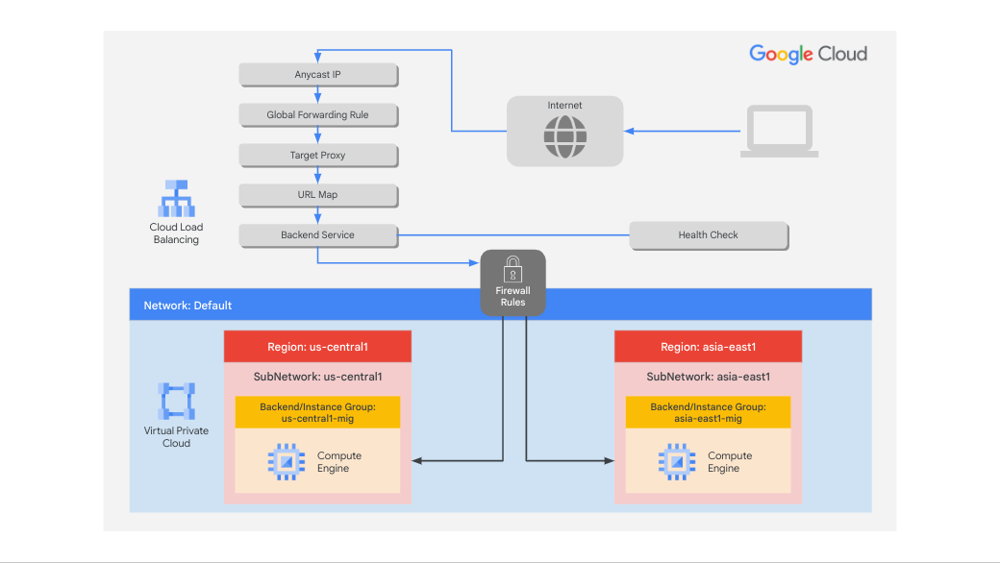

# Configure an Application Load Balancer with Autoscaling



### 1. Configure a health check firewall rule

Health checks determine which instances of a Application Load Balancer (HTTP) can receive new connections. The health check probes to your load-balanced instances come from addresses in the ranges 130.211.0.0/22 and 35.191.0.0/16. Your firewall rules must allow these connections.

#### Create the health check rule

Create a firewall rule to allow health checks.

1. In the Cloud Console, on the Navigation menu (Navigation menu icon), click VPC network > Firewall.
   Notice the existing ICMP, internal, RDP, and SSH firewall rules.

2. Each Google Cloud project starts with the default network and these firewall rules.

3. Click Create Firewall Rule.

4. Specify the following, and leave the remaining settings as their defaults:

| Property            | Value                            |
| ------------------- | -------------------------------- |
| Name                | fw-allow-health-checks           |
| Network             | default                          |
| Targets             | Specified target tags            |
| Target tags         | allow-health-checks              |
| Source filter       | IPv4 ranges                      |
| Source IPv4 ranges  | 130.211.0.0/22 and 35.191.0.0/16 |
| Protocols and ports | Specified protocols and ports    |

> Note: Make sure to include the /22 and /16 in the Source IP ranges.

4. Select tcp and specify port 80.

5. Click Create.

### 2. Create a NAT configuration using Cloud Router

#### Create the Cloud Router instance

1. On the Google Cloud console title bar, type Network services in the Search field, then click Network services in the Network management tools section.

2. On the Network service page, click Pin next to Network services.

3. Click Cloud NAT.

4. Click Get started to configure a NAT gateway.

5. Specify the following, and leave the remaining settings as their defaults:

| Property     | Value      |
| ------------ | ---------- |
| Gateway name | nat-config |
| Network      | default    |
| Region       | `Region 1` |

6. Click Cloud Router, and select Create new router.

7. For Name, type nat-router-us1.

8. Click Create.

9. In Create a NAT gateway, click Create.

> Note: Wait until the NAT Gateway Status changes to Running before moving onto the next task.

### 3. Create a custom image/image for a web server

#### Create a VM

1. In the Cloud Console, on the Navigation menu (Navigation menu icon), click Compute Engine > VM instances.

2. Click Create Instance.

3. Specify the following, and leave the remaining settings as their defaults:

| Property | Value      |
| -------- | ---------- |
| Name     | webserver  |
| Region   | `Region 1` |
| Zone     | `Zone 1`   |

4. Click OS and storage, and then click Change.

5. Click Show Advanced Configuration.

6. For Deletion rule, select Keep boot disk.

7. Click Select.

8. Click Networking.

   - For Network tags, type allow-health-checks.
   - For Network interfaces , click default.
   - For External IPv4 address dropdown, select None.

9. Click Done.

10. Click Create.

#### Customize the VM

1. For webserver, click SSH to launch a terminal and connect.

2. If prompted allow SSH-in-browser to connect to VMs, click Authorize.

3. To install Apache2, run the following commands:

```bash
sudo apt-get update
sudo apt-get install -y apache2
```

4. To start the Apache server, run the following command:

```bash
sudo service apache2 start
```

5. To test the default page for the Apache2 server, run the following command:

```bash
curl localhost
```

The default page for the Apache2 server should be displayed.

#### Set the Apache service to start at boot

The software installation was successful. However, when a new VM is created using this image/image, the freshly booted VM does not have the Apache web server running. Use the following command to set the Apache service to automatically start on boot. Then test it to make sure it works.

1. In the webserver SSH terminal, set the service to start on boot:

```bash
sudo update-rc.d apache2 enable
```

2. In the Cloud Console, select webserver, and then click More actions [:].

3. Click Reset.

4. In the confirmation dialog, click Reset.

> Note: Reset will stop and reboot the machine. It keeps the same IPs and the same persistent boot disk, but memory is wiped. Therefore, if the Apache service is available after the reset, the update-rc command was successful.

5. Check the server by connecting via SSH to the VM and entering the following command:

```bash
sudo service apache2 status
```

> Note: If you see the Connection via Cloud Identity-Aware Proxy Failed popup, click Retry.

6. The result should show Started The Apache HTTP Server.

#### Prepare the disk to create a custom image/image

Verify that the boot disk will not be deleted when the instance is deleted.

1. On the VM instances page, click webserver to view the VM instance details.

2. For Storage > Boot disk, verify that When deleting instance is set to Keep disk.

3. Return to the VM instances page, select webserver, and then click More actions[:].

4. Click Delete.

5. In the confirmation dialog, click Delete.

6. In the left pane, click Disks and verify that the webserver disk exists.

#### Create the custom image/image

1. In the left pane, click Images.

2. Click Create image/image.

3. Specify the following, and leave the remaining settings as their defaults:

| Property    | Value       |
| ----------- | ----------- |
| Name        | mywebserver |
| Source      | Disk        |
| Source disk | webserver   |

4. Click Create.

> Note: You have created a custom image/image that multiple identical webservers can be started from. At this point, you could delete the webserver disk.

### 4. Configure an instance template and create instance groups

#### Configure the instance template

An instance template is an API resource that you can use to create VM instances and managed instance groups. Instance templates define the machine type, boot disk image/image, subnet, labels, and other instance properties.

1. In the Cloud Console, on the Navigation menu (Navigation menu icon), click Compute Engine > Instance templates.

2. Click Create Instance Template.

3. For Name, type mywebserver-template.

4. For Location, select Global.

5. For Series, select E2.

6. For Machine type > Shared-core, select e2-micro (2 vCPU, 1 core, 1 GB memory).

7. For Boot disk, click Change.

8. Click Custom images, for Source project for images make sure that Qwiklabs project ID is selected.

9. For Image, Select mywebserver.

10. Click Select.

11. Click Advanced options.

12. Click Networking.

    - For Network tags, type allow-health-checks.
    - For Network interfaces , click default.
    - For External IPv4 IP dropdown, select None.
    - Click Done.

13. Click Create.

#### Create the health check for managed instance groups

1. On the Navigation menu, click Compute Engine > Health checks.

2. Click Create health check.

3. Specify the following, and leave the remaining settings as their defaults:

| Property | Value             |
| -------- | ----------------- |
| Name     | http-health-check |
| Protocol | TCP               |
| Port     | 80                |

4. Click Create.

#### Create the managed instance groups

Create a managed instance group in `Region 1` and one in `Region 2`.

1. On the Navigation menu, click Compute Engine > Instance groups.

2. Click Create Instance Group.

3. Specify the following, and leave the remaining settings as their defaults:

| Property          | Value                |
| ----------------- | -------------------- |
| Name              | us-1-mig             |
| Instance template | mywebserver-template |
| Location          | Multiple zones       |
| Region            | Region 1             |

4. For Autoscaling, enter Minimum number of instances 1 and Maximum number of instances 2.

5. For Autoscaling signals, click on the CPU utilization.

6. For Signal type, select HTTP load balancing utilization.

7. Enter Target HTTP load balancing utilization to 80.

8. Click Done.

9. Click Initialization period and set to 60 seconds.

> Note: Managed instance groups offer autoscaling capabilities that allow you to automatically add or remove instances from a managed instance group based on increases or decreases in load. Autoscaling helps your applications gracefully handle increases in traffic and reduces cost when the need for resources is lower. You just define the autoscaling policy, and the autoscaler performs automatic scaling based on the measured load.

10. In Autohealing, for health check type `http-health-check`

11. Select http-health-check (TCP)

12. For Initial delay, type 60. This is how long the Instance Group waits after initializing the boot-up of a VM before it tries a health check. You don't want to wait 5 minutes for this during the lab, so you set it to 1 minute.

13. Click Create.

14. Click Confirm in the dialog window.

> Note: Wait a few minutes for the Instance Group to be created before repeating the same procedure for notus-1-mig in Region 2 Click Refresh until the Status changes to Transforming.

> Note: If a warning window appears, or you see a red exclamation mark to the left of the instance group after creation stating There is no backend service attached to the instance group. Ignore this; you will configure the load balancer with a backend service in the next section of the lab.

15. Click Create Instance Group.

16. Specify the following, and leave the remaining settings as their defaults:

| Property                                  | Value                           |
| ----------------------------------------- | ------------------------------- |
| Name                                      | notus-1-mig                     |
| Instance template                         | mywebserver-template            |
| Location                                  | Multiple zones                  |
| Region                                    | `Region 2`                      |
| Autoscaling > Minimum number of instances | 1                               |
| Autoscaling > Maximum number of instances | 2                               |
| Autoscaling signals > Signal Type         | HTTP load balancing utilization |
| Target HTTP load balancing utilization    | 80                              |
| Initialization period                     | 60                              |

17. For Health check, select http-health-check (TCP).

18. For Initial delay, type 60.

19. Click Create.

20. Click Confirm in the dialog window.

#### Verify the backends

Verify that VM instances are being created in both regions.

- On the Navigation menu, click Compute Engine > VM instances.
  Notice the instances that start with us-1-mig and notus-1-mig. These instances are part of the managed instance groups.

### 5. Configure the Application Load Balancer (HTTP)

Configure the Application Load Balancer (HTTP) to balance traffic between the two backends (`us-1-mig in Region 1` and `notus-1-mig in Region 2`) as illustrated in the network diagram:



#### Start the configuration

1. On the Navigation menu, click Network Services > Load balancing.

2. Click Create Load Balancer.

3. For Type of load balancer, select Application Load Balancer (HTTP/HTTPS), click Next.

4. For Public facing or internal, select Public facing (external), click Next.

5. For Global or single region deployment, select Best for global workloads, click Next.

6. For Load balancer generation, select Global external Application Load Balancer, click Next.

7. For Create load balance, click Configure.

8. For Load Balancer Name, type http-lb.

#### Configure the frontend

The host and path rules determine how your traffic will be directed. For example, you could direct video traffic to one backend and direct static traffic to another backend. However, you are not configuring the host and path rules in this lab.

1. Click Frontend configuration.

2. Specify the following, and leave the remaining settings as their defaults:

| Property   | Value     |
| ---------- | --------- |
| Protocol   | HTTP      |
| IP version | IPv4      |
| IP address | Ephemeral |
| Port       | 80        |

3. Click Done.

4. Click Add Frontend IP and Port.

5. Specify the following, and leave the remaining settings as their defaults:

| Property   | Value         |
| ---------- | ------------- |
| Protocol   | HTTP          |
| IP version | IPv6          |
| IP address | Auto-allocate |
| Port       | 80            |

6. Click Done.

#### Configure the backend

Backend services direct incoming traffic to one or more attached backends. Each backend is composed of an instance group and additional serving capacity metadata.

1. Click Backend Configuration.

2. Click Backend services & backend buckets > Create a Backend Service.

3. Specify the following, and leave the remaining settings as their defaults:

| Property       | Value          |
| -------------- | -------------- |
| Name           | http-backend   |
| Backend type   | Instance group |
| Instance group | us-1-mig       |
| Port numbers   | 80             |
| Balancing mode | Rate           |
| Maximum RPS    | 50             |
| Capacity       | 100            |

> Note: This configuration means that the load balancer attempts to keep each instance of us-1-mig at or below 50 requests per second (RPS).

4. Click Done.

5. Click Add Backend.

6. Specify the following, and leave the remaining settings as their defaults:

| Property                    | Value (select option as specified) |
| --------------------------- | ---------------------------------- |
| Instance group              | notus-1-mig                        |
| Port numbers                | 80                                 |
| Balancing mode              | Utilization                        |
| Maximum backend utilization | 80                                 |
| Capacity                    | 100                                |

> Note: This configuration means that the load balancer attempts to keep each instance of notus-1-mig at or below 80% CPU utilization.

7. Click Done.

8. For Health Check, select http-health-check.

9. Click check for the Enable logging checkbox.

10. Specify Sample rate as 1.

11. Click Create.

12. Click OK.

#### Review and create the HTTP load balancer

1. Click Review and finalize.

2. Review the Backend services and Frontend.

3. Click Create. Wait for the load balancer to be created.

4. Click on the name of the load balancer (http-lb).

5. Note the IPv4 and IPv6 addresses of the load balancer for the next task. They will be referred to as [LB_IP_v4] and [LB_IP_v6], respectively.

> Note: The IPv6 address is the one in hexadecimal format.

### 6. Stress test the Application Load Balancer (HTTP)

#### Access the Application Load Balancer (HTTP)

1. On the Google Cloud console title bar, click Activate Cloud Shell (Activate Cloud Shell icon).

2. If prompted, click Continue.

3. To check the status of the load balancer, run the following command, replace [LB_IP_v4] with the IPv4 address of the load balancer:

```bash
LB_IP=[LB_IP_v4]
while [ -z "$RESULT" ] ;
do
  echo "Waiting for Load Balancer";
  sleep 5;
  RESULT=$(curl -m1 -s $LB_IP | grep Apache);
done
```

> Note: Once the load balancer is ready, the command will exit.

4. Open a new tab in your browser and navigate to http://[LB_IP_v4]. Make sure to replace [LB_IP_v4] with the IPv4 address of the load balancer.

> Note: If you get a pop-up as EXTERNAL_IP doesn’t support a secure connection click Continue to site

#### Stress test the Application Load Balancer (HTTP)

Create a new VM to simulate a load on the Application Load Balancer (HTTP). Then determine whether traffic is balanced across both backends when the load is high.

1. In the Cloud Console, on the Navigation menu (Navigation menu icon), click Compute Engine > VM instances.

2. Click Create instance.

3. Specify the following, and leave the remaining settings as their defaults:

| Property | Value (type value or select option as specified) |
| -------- | ------------------------------------------------ |
| Name     | stress-test                                      |
| Region   | A region different but closer to Region 1        |
| Zone     | A zone from the region                           |

4. For Series, select E2.

5. For Machine type, select e2-micro (2 vCPU, 1 core, 1 GB memory).

> Note: Because a region in US is closer to Region 1 than to notus-1, traffic should be forwarded only to us-1-mig (unless the load is too high).

6. Click OS and storage, and then click Change.

7. Click Custom Images.

8. Click Custom Images, then for Source project for images make sure that Qwiklabs project ID is selected.

9. For Image, select mywebserver.

10. Click Select.

11. Click Create.

12. Wait for the stress-test instance to be created.

13. For stress-test, click SSH to launch a terminal and connect.

14. If prompted allow SSH-in-browser to connect to VMs, click Authorize.

15. To create an environment variable for your load balancer IP address, run the following command:

```bash
export LB_IP=<Enter your [LB_IP_v4] here>
```

16. Verify it with echo:

```bash
echo $LB_IP
```

17. To place a load on the load balancer, run the following command:

```bash
ab -n 500000 -c 1000 http://$LB_IP/
```

18. In the Cloud Console, on the Navigation menu (Navigation menu icon), click Network Services > Load balancing.

19. Click http-lb.

20. Click Monitoring.

21. Monitor the Frontend Location (Total inbound traffic) between North America and the two backends for a couple of minutes.

> Note: At first, traffic should just be directed to us-1-mig, but as the RPS increases, traffic is also directed to notus-1-mig. This demonstrates that by default traffic is forwarded to the closest backend, but if the load is very high, traffic can be distributed across the backends.

22. In the Cloud Console, on the Navigation menu (Navigation menu icon), click Compute Engine > Instance groups.

23. Click on us-1-mig to open the instance group page.

24. Click Monitoring to monitor the number of instances and LB capacity.

25. Repeat the same for the notus-1-mig instance group.

> Note: Depending on the load, you might see the backends scale to accommodate the load.
