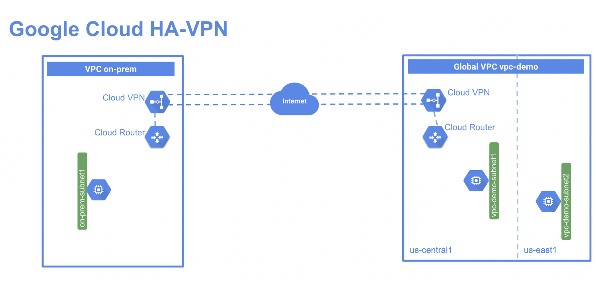

# Configuring Google Cloud HA VPN



### 1. Set up a Global VPC environment

1. In Cloud Shell, create a VPC network called vpc-demo:

```bash
gcloud compute networks create vpc-demo --subnet-mode custom
```

The output should look similar to this:

2. In Cloud Shell, create subnet `vpc-demo-subnet1` in the region `REGION 1`:

```bash
gcloud compute networks subnets create vpc-demo-subnet1 \
--network vpc-demo --range 10.1.1.0/24 --region "REGION"
```

3. Create subnet `vpc-demo-subnet2` in the region `REGION 2`:

```bash
gcloud compute networks subnets create vpc-demo-subnet2 \
--network vpc-demo --range 10.2.1.0/24 --region REGION 2
```

4. Create a firewall rule to allow all custom traffic within the network:

```bash
gcloud compute firewall-rules create vpc-demo-allow-custom \
  --network vpc-demo \
  --allow tcp:0-65535,udp:0-65535,icmp \
  --source-ranges 10.0.0.0/8
```

The output should look similar to this:

5. Create a firewall rule to allow SSH, ICMP traffic from anywhere:

```bash
gcloud compute firewall-rules create vpc-demo-allow-ssh-icmp \
    --network vpc-demo \
    --allow tcp:22,icmp
```

6. Create a VM instance `vpc-demo-instance1` in zone `ZONE 1`:

```bash
gcloud compute instances create vpc-demo-instance1 --machine-type=e2-medium --zone "ZONE" --subnet vpc-demo-subnet1
```

The output should look similar to this:

7. Create a VM instance `vpc-demo-instance`2 in zone `ZONE 2`:

```bash
gcloud compute instances create vpc-demo-instance2 --machine-type=e2-medium --zone ZONE2 --subnet vpc-demo-subnet2
```

### 2. Set up a simulated on-premises environment

1. In Cloud Shell, create a VPC network called `on-prem`:

```bash
gcloud compute networks create on-prem --subnet-mode custom
```

The output should look similar to this:

2. Create a subnet called `on-prem-subnet1`:

```bash
gcloud compute networks subnets create on-prem-subnet1 \
--network on-prem --range 192.168.1.0/24 --region "REGION"
```

3. Create a firewall rule to allow all custom traffic within the network:

```bash
gcloud compute firewall-rules create on-prem-allow-custom \
  --network on-prem \
  --allow tcp:0-65535,udp:0-65535,icmp \
  --source-ranges 192.168.0.0/16
```

4. Create a firewall rule to allow SSH, RDP, HTTP, and ICMP traffic to the instances:

```bash
gcloud compute firewall-rules create on-prem-allow-ssh-icmp \
    --network on-prem \
    --allow tcp:22,icmp
```

5. Create an instance called `on-prem-instance1` in the region `REGION 1`.

> Note: In the below command replace with a zone in `REGION 1` but different from the one used to create the `vpc-demo-instance1 in the vpc-demo-subnet1`.

```bash
gcloud compute instances create on-prem-instance1 --machine-type=e2-medium --zone zone_name --subnet on-prem-subnet1
```

### 3. Set up an HA VPN gateway

1. In Cloud Shell, create an HA VPN in the vpc-demo network:

```bash
gcloud compute vpn-gateways create vpc-demo-vpn-gw1 --network vpc-demo --region "REGION"
```

The output should look similar to this:

2. Create an HA VPN in the on-prem network:

```bash
gcloud compute vpn-gateways create on-prem-vpn-gw1 --network on-prem --region "REGION"
```

3. View details of the vpc-demo-vpn-gw1 gateway to verify its settings:

```bash
gcloud compute vpn-gateways describe vpc-demo-vpn-gw1 --region "REGION"
```

The output should look similar to this:

4. View details of the on-prem-vpn-gw1 vpn-gateway to verify its settings:

```bash
gcloud compute vpn-gateways describe on-prem-vpn-gw1 --region "Region"
```

The output should look similar to this:

Create cloud routers

1. Create a cloud router in the vpc-demo network:

```bash
gcloud compute routers create vpc-demo-router1 \
    --region "REGION" \
    --network vpc-demo \
    --asn 65001
```

The output should look similar to this:

2. Create a cloud router in the on-prem network:

```bash
gcloud compute routers create on-prem-router1 \
    --region "REGION" \
    --network on-prem \
    --asn 65002
```

### 4. Create two VPN tunnels

In this task you create VPN tunnels between the two gateways. For HA VPN setup, you add two tunnels from each gateway to the remote setup. You create a tunnel on `interface0` and connect to `interface0` on the remote gateway. Next, you create another tunnel on `interface1` and connect to `interface1` on the remote gateway.4

When you run HA VPN tunnels between two Google Cloud VPCs, you need to make sure that the tunnel on `interface0` is connected to `interface0` on the remote VPN gateway. Similarly, the tunnel on `interface1` must be connected to `interface1` on the remote VPN gateway.

> Note: In your own environment, if you run HA VPN to a remote VPN gateway on-premises for a customer, you can connect in one of the following ways:
> Two on-premises VPN gateway devices: Each of the tunnels from each interface on the Cloud VPN gateway must be connected to its own peer gateway.
> A single on-premises VPN gateway device with two interfaces: Each of the tunnels from each interface on the Cloud VPN gateway must be connected to its own interface on the peer gateway.
> A single on-premises VPN gateway device with a single interface: Both of the tunnels from each interface on the Cloud VPN gateway must be connected to the same interface on the peer gateway.
