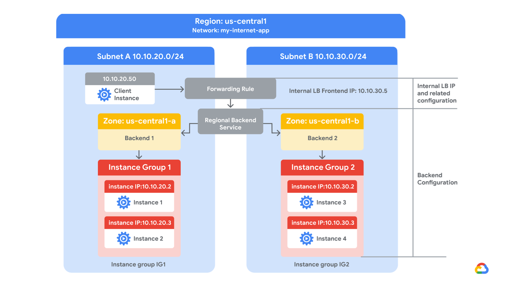

# Configure an Internal Network Load Balancer



### 1. Configure internal traffic and health check firewall rules

Configure firewall rules to allow internal traffic connectivity from sources in the 10.10.0.0/16 range. This rule allows incoming traffic from any client located in the subnet.

Health checks determine which instances of a load balancer can receive new connections. For Application Load Balancing (HTTP), the health check probes to your load-balanced instances come from addresses in the ranges 130.211.0.0/22 and 35.191.0.0/16. Your firewall rules must allow these connections.

#### Explore the my-internal-app network

The network my-internal-app with subnet-a and subnet-b and firewall rules for RDP, SSH, and ICMP traffic have been configured for you.

- In the Cloud Console, on the Navigation menu, click VPC network > VPC networks.
  Notice the my-internal-app network with its subnets: subnet-a and subnet-b.

- Each Google Cloud project starts with the default network. In addition, the my-internal-app network has been created for you as part of your network diagram.

- You will create the managed instance groups in subnet-a and subnet-b. Both subnets are in the `Region` region because an internal Network Load Balancer is a regional service. The managed instance groups will be in different zones, making your service immune to zonal failures.

#### Create the firewall rule to allow traffic from any sources in the 10.10.0.0/16 range

Create a firewall rule to allow traffic in the 10.10.0.0/16 subnet.

1. On the Navigation menu, click VPC network > Firewall.
   Notice the app-allow-icmp and app-allow-ssh-rdp firewall rules. These firewall rules have been created for you.

2. Click Create Firewall Rule.


3. Specify the following, and leave the remaining settings as their defaults.

| Property            | Value (type value or select option as specified) |
| ------------------- | ------------------------------------------------ |
| Name                | fw-allow-lb-access                               |
| Network             | my-internal-app                                  |
| Targets             | Specified target tags                            |
| Target tags         | backend-service                                  |
| Source filter       | IPv4 ranges                                      |
| Source IPv4 ranges  | 10.10.0.0/16                                     |
| Protocols and ports | Allow all                                        |

> Note: Make sure to include the /16 in the Source IPv4 ranges.


4. Click Create.

#### Create the health check rule

Create a firewall rule to allow health checks.

1. On the Navigation menu (Navigation menu icon), click VPC network > Firewall.

2. Click Create Firewall Rule.


3. Specify the following, and leave the remaining settings as their defaults.

| Property            | Value (type value or select option as specified) |
| ------------------- | ------------------------------------------------ |
| Name                | fw-allow-health-checks                           |
| Network             | my-internal-app                                  |
| Targets             | Specified target tags                            |
| Target tags         | backend-service                                  |
| Source filter       | IPv4 Ranges                                      |
| Source IPv4 ranges  | 130.211.0.0/22 and 35.191.0.0/16                 |
| Protocols and ports | Specified protocols and ports                    |

> Note: Make sure to include the /22 and /16 in the Source IPv4 ranges.

4. For tcp, check the checkbox and specify port 80.


5. Click Create.

### 2. Create a NAT configuration using Cloud Router

#### Create the Cloud Router instance

1. On the Google Cloud console title bar, type Network services in the Search field, then click Network services in the Products & Page section.

2. On the Network service page, click Pin next to Network services.


3. Click Cloud NAT.

4. Click Get started to configure a NAT gateway.


5. Specify the following, and leave the remaining settings as their defaults.

| Property     | Value (type value or select option as specified) |
| ------------ | ------------------------------------------------ |
| Gateway name | nat-config                                       |
| Network      | my-internal-app                                  |
| Region       | `Region`                                         |


6. Click Cloud Router, and select Create new router.


7. For Name, type nat-router-`Region`.

8. Click Create.


9. In Create Cloud NAT gateway, click Create.

### 3. Configure instance templates and create instance groups

1. On the Navigation menu, click Compute Engine > VM instances.
   Notice the instances that start with instance-group-1 and instance-group-2.

2. Select the SSH button next to instance-group-1 to SSH into the VM.

3. If prompted allow SSH-in-browser to connect to VMs, click Authorize.

4. Run the following command to re-run the instance's startup script:

```bash
sudo google_metadata_script_runner startup
```


5. Repeat the previous steps for instance-group-2.


6. Wait for both startup scripts to finish executing, then close the SSH terminal to each VM. The output of the startup script should state the following:

#### Verify the backends

Verify that VM instances are being created in both subnets and create a utility VM to access the backends' HTTP sites.

1. On the Navigation menu, click Compute Engine > VM instances.
   Notice the instances that start with instance-group-1 and instance-group-2.
   These instances are in separate zones, and their internal IP addresses are part of the subnet-a and subnet-b CIDR blocks.

2. Click Create Instance.

3. For the **Machine configuration**page, specify the following, and leave the remaining settings as their defaults:

| Property     | Value                           |
| ------------ | ------------------------------- |
| Name         | utility-vm                      |
| Region       | `Region`                        |
| Zone         | `Zone 3`                        |
| Series       | E2                              |
| Machine type | e2-medium (2 vCPU, 4 GB memory) |


4. Click OS and storage.

5. If the Image shown is not Debian GNU/Linux 12 (bookworm), click Change and select Debian GNU/Linux 12 (bookworm), and then click Select.


6. Click Networking.

7. For Network interfaces, click the dropdown to edit the network interface.

8. Specify the following, and leave the remaining settings as their defaults.

| Property                      | Value              |
| ----------------------------- | ------------------ |
| Network                       | my-internal-app    |
| Subnetwork                    | subnet-a           |
| Primary internal IPv4 address | Ephemeral (Custom) |
| Custom ephemeral IP address   | 10.10.20.50        |
| External IPv4 address         | None               |

9. Click Done.


10. Click Create.

11. Note that the internal IP addresses for the backends are 10.10.20.2 and 10.10.30.2.

> Note: If these IP addresses are different, replace them in the two curl commands below.

12. For utility-vm, click SSH to launch a terminal and connect.

13. If prompted allow SSH-in-browser to connect to VMs, click Authorize.

14. To verify the welcome page for instance-group-1-xxxx, run the following command:

```bash
curl 10.10.20.2
```


The output should look like this: 


15. To verify the welcome page for instance-group-2-xxxx, run the following command:

```bash
curl 10.10.30.2
```


The output should look like this.

16. Close the SSH terminal to utility-vm:

```bash
exit
```

### 4. Configure the internal Network Load Balancer

Configure the internal Network Load Balancer to balance traffic between the two backends (`instance-group-1 in Zone 1` and `instance-group-2 in Zone 2`), as illustrated in the network diagram.


#### Start the configuration

1. In the Cloud Console, on the Navigation menu, click Network services > Load balancing.

2. Click Create load balancer.


3. For Type of load balancer, select Network Load Balancer (TCP/UDP/SSL), click Next.


4. For Proxy or passthrough, select Passthrough load balancer and click Next.


5. For Public facing or internal, select Internal and click Next.


6. For Create load balance, click Configure.


7. For Load balancer name, type my-ilb.

8. For Region, type `Region`.

9. For Network, select my-internal-app from the dropdown.


#### Configure the regional backend service

The backend service monitors instance groups and prevents them from exceeding configured usage.

1. Click Backend configuration.

2. Specify the following, and leave the remaining settings as their defaults.

| Property       | Value                       |
| -------------- | --------------------------- |
| Instance group | instance-group-1 (`Zone 1`) |

3. Click Done.


4. Click Add a backend.

5. For Instance group, select instance-group-2 (`Zone 2`).

6. Click Done.


7. For Health Check, select Create a health check.

8. Specify the following, and leave the remaining settings as their defaults.

| Property            | Value               |
| ------------------- | ------------------- |
| Name                | my-ilb-health-check |
| Protocol            | TCP                 |
| Port                | 80                  |
| Check interval      | 10 sec              |
| Timeout             | 5 sec               |
| Healthy threshold   | 2                   |
| Unhealthy threshold | 3                   |


> Note: Health checks determine which instances can receive new connections. This HTTP health check polls instances every 10 seconds, waits up to 5 seconds for a response, and treats 2 successful or 3 failed attempts as healthy threshold or unhealthy threshold, respectively.

9. Click Save.

10. Verify that there is a blue checkmark next to Backend configuration in the Cloud Console. If there isn't, double-check that you have completed all the steps above.

#### Configure the frontend

The frontend forwards traffic to the backend.

1. Click Frontend configuration.

2. Specify the following, and leave the remaining settings as their defaults.

| Property                         | Value             |
| -------------------------------- | ----------------- |
| Subnetwork                       | subnet-b          |
| Internal IP purpose > IP address | Create IP address |


3. Specify the following, and leave the remaining settings as their defaults.

| Property          | Value         |
| ----------------- | ------------- |
| Name              | my-ilb-ip     |
| Static IP address | Let me choose |
| Custom IP address | 10.10.30.5    |

4. Click Reserve.


5. Under Ports, for Port number, type 80.

6. Click Done.


#### Review and create the internal Network Load Lalancer

1. Click Review and finalize.

2. Review the Backend and Frontend.

3. Click Create.


### 5. Test the internal Network Load Balancer

Verify that the my-ilb IP address forwards traffic to instance-group-1 in `Zone 1` and instance-group-2 in `Zone 2`.

#### Access the internal Network Load Balancer

1. On the Navigation menu, click Compute Engine > VM instances.

2. For utility-vm, click SSH to launch a terminal and connect.

3. If prompted allow SSH-in-browser to connect to VMs, click Authorize.

4. To verify that the internal Network Load Balancer forwards traffic, run the following command:

```bash
curl 10.10.30.5
```

5. Run the same command a couple of times:

```bash
curl 10.10.30.5
curl 10.10.30.5
curl 10.10.30.5
curl 10.10.30.5
curl 10.10.30.5
curl 10.10.30.5
curl 10.10.30.5
curl 10.10.30.5
curl 10.10.30.5
curl 10.10.30.5
```

You should be able to see responses from instance-group-1 in `Zone 1` and instance-group-2 in `Zone 2`. If not, run the command again.
